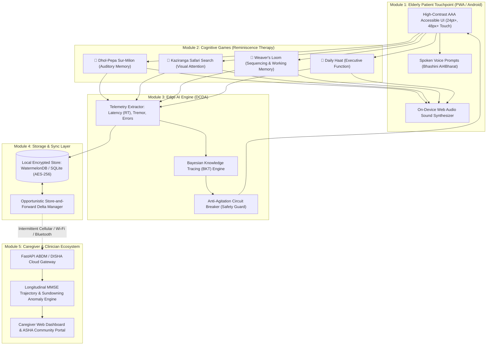
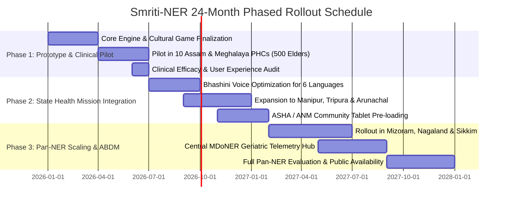

# 🧠 DETAILED PROJECT PROPOSAL & TECHNICAL REPORT: SMRITI-NER (স্মৃতি / ꯁ꯭ꯃ꯭ꯔꯤꯇꯤ)

**Problem Statement ID**: 26003  
**Title**: AI-Enabled Cognitive Gaming and Memory Assistance Platform for Elderly Dementia Patients in the North Eastern Region  
**Sponsoring Agency**: Ministry of Development of North Eastern Region (MDoNER), Government of India  
**Target Beneficiaries**: Elderly Dementia / Mild Cognitive Impairment (MCI) Patients, Family Caregivers, and Grassroots Healthcare Workers (ASHA/ANM) across the 8 North Eastern States  

---

## 1. Executive Summary & Abstract

The North Eastern Region (NER) of India—encompassing Assam, Arunachal Pradesh, Manipur, Meghalaya, Mizoram, Nagaland, Sikkim, and Tripura—is experiencing an unprecedented demographic transition with a rapidly aging population. Concurrently, age-related neurodegenerative disorders, primarily Alzheimer’s disease and vascular dementia, are escalating at alarming rates. In rural, riverine (*char*), and high-altitude mountainous geographies, access to specialized neurological care, structured cognitive rehabilitation, and geriatric therapy is severely constrained by rugged topography, infrastructural deficits, and an acute shortage of medical specialists (< 0.15 neurologists per 100,000 population).

Furthermore, conventional digital cognitive applications (e.g., Lumosity, Elevate, Peak) suffer from severe **cultural, linguistic, and operational alienation**: they feature westernized puzzles in English, rely on continuous high-bandwidth internet connectivity, and impose rigid penalties that induce cognitive fatigue and catastrophic agitation in dementia sufferers.

To resolve this critical healthcare disparity, this proposal introduces **"Smriti-NER" (স্মৃতি / ꯁ꯭ꯃ꯭ꯔꯤꯇꯤ)**, a clinically grounded, AI-powered Cognitive Digital Therapeutic (DTx) and Reminiscence Platform engineered specifically for the elderly population and rural healthcare infrastructure of North East India. 

### Core Pillars of Smriti-NER:
1. **Culturally Grounded Reminiscence Therapy (RT)**: Scientifically leverages Ribot’s Law by utilizing deeply familiar North Eastern cultural motifs—such as Bihu musical instruments (*Pepa*, *Dhol*), indigenous wildlife (*Kaziranga*, *Sangai*), traditional handloom weaving (*Muga*, *Eri*, *Mizo Puan*), and regional weekly markets (*Daily Haat*)—to stimulate preserved long-term episodic memory pathways.
2. **Dynamic Cognitive Difficulty Adjustment (DCDA)**: An on-device edge AI engine utilizing Bayesian Knowledge Tracing (BKT) and reaction latency telemetry ($RT$), equipped with an **Anti-Agitation Circuit Breaker (AACB)** that dynamically adjusts visual complexity, hint frequency, and target sizes without triggering frustration or shame.
3. **Multilingual Voice-First Interface**: Integrates the Government of India’s **Bhashini (AI4Bharat)** open-source speech models to support Assamese, Meitei (Manipuri), Bengali, Bodo, Khasi, Mizo, Hindi, and English, coupled with **Personalized Family Voice Reminders** where grandchildren's and children's recorded voices prompt hydration and medication adherence.
4. **Local-First, Zero-Connectivity Edge Operation**: Operates 100% offline via client-side SQLite/WatermelonDB and native Web Audio synthesis, with opportunistic store-and-forward delta synchronization (< 50 KB) when network connectivity is intermittently available.
5. **Caregiver & ASHA Telemetry Dashboard**: Provides longitudinal Mini-Mental State Examination (MMSE) and MoCA proxy tracking, medication adherence logging, and early-warning alerts for sundowning and cognitive decline.

---

## 2. Contextual Background & Regional Ground Realities

### 2.1 Epidemiological Reality in the North Eastern Region
According to the Longitudinal Ageing Study in India (LASI Wave-1) and the Dementia India Report by the Alzheimer’s and Related Disorders Society of India (ARDSI):
* Over **180,000 elderly individuals** in the 8 NER states are estimated to live with dementia or progressive Mild Cognitive Impairment (MCI).
* Over **85% of dementia cases in rural NER remain completely undiagnosed or untreated**. Cognitive decline is frequently stigmatized or dismissed as normal senility (*"Buro hoyeche / Boiyosh hoise"*), delaying therapeutic non-pharmacological intervention until irreversible behavioral complications arise.

### 2.2 Geographical & Infrastructural Bottlenecks
* **Topographical Barriers**: Rugged mountainous terrain (Arunachal Pradesh, Nagaland, Mizoram) and isolated riverine islands (Majuli and *char* areas of Assam) make regular visits to district civil hospitals or tertiary neurological centres in Guwahati or Imphal impossible for frail elders.
* **Connectivity Blackouts**: More than **40% of rural tribal habitations** experience frequent cellular network outages, power cuts, and zero mobile data availability. Any platform that requires persistent cloud roundtrips fails instantly in these terrains.
* **Linguistic Diversity**: With over 200 distinct ethnolinguistic groups across the 8 states, generic Hindi- or English-centric healthcare platforms are completely inaccessible to illiterate or mono-lingual elderly villagers.

```
+-------------------------------------------------------------------------+
|                  THE TRIPLE BOTTLENECK IN NER DEMENTIA CARE             |
+-------------------------------------------------------------------------+
|  1. GEOGRAPHICAL ISOLATION: Remote hills, char islands, 12h+ to doctor  |
|  2. CULTURAL & LINGUISTIC ALIENATION: English apps cause disorientation |
|  3. PERSISTENT CONNECTIVITY DEFICIT: Cloud-dependent software collapses |
+-------------------------------------------------------------------------+
                                    |
                                    v
+-------------------------------------------------------------------------+
|                     THE SMRITI-NER SOLUTION                             |
+-------------------------------------------------------------------------+
|  1. LOCAL-FIRST EDGE OPERATION: 100% offline gameplay & voice prompts   |
|  2. REGIONAL REMINISCENCE THERAPY: Bihu, Handloom, Fauna, Folk sounds   |
|  3. BHASHINI MULTILINGUAL & FAMILY VOICE: Assamese, Meitei, Bodo, etc.  |
|  4. COMMUNITY PHC / ASHA RELAY: Micro-delta sync via Bluetooth/Wi-Fi    |
+-------------------------------------------------------------------------+
```

---

## 3. Neuropsychological Foundation: Why Reminiscence Therapy (RT)?

### 3.1 Ribot’s Law and Memory Preservation
In Alzheimer’s disease and age-related cognitive decline, neurodegeneration disproportionately impairs the entorhinal cortex and hippocampus first, devastating **short-term working memory** and recent episodic encoding. However, in accordance with **Ribot's Law of Retrograde Amnesia**, remote memories formed during childhood, adolescence, and early adulthood (stored across widespread neocortical networks) remain structurally resilient for significantly longer periods.

### 3.2 Clinical Mechanism of Smriti-NER Digital Therapeutics
When an elderly dementia patient in Assam or Manipur is confronted with an unfamiliar abstract polygon puzzle, their brain registers high cognitive load, confusion, and anxiety. Conversely, when exposed to the high-pitch melodic timbre of an Assamese *Pepa*, the rhythmic beat of a Manipuri *Pung*, or the visual motifs of a *Muga* silk loom:
* Preserved remote memory networks in the associative neocortex are stimulated.
* Dopaminergic reward pathways activate, reducing cortisol and behavioral agitation.
* The patient experiences cognitive grounding, improved self-worth, and conversational lucidity.

Meta-analyses published in the *Cochrane Database of Systematic Reviews* (Woods et al.) confirm that structured Reminiscence Therapy yields statistically significant improvements in cognitive performance (MMSE scores), depressive symptoms, and interpersonal communication among mild-to-moderate dementia cohorts.

---

## 4. Comprehensive Architectural Breakdown

Smriti-NER is structured into 5 foundational, cross-communicating modules designed for resilience, accessibility, and clinical precision.



---

### 4.1 Module A: Culturally Immersive Cognitive Games

#### Game 1: Dhol-Pepa Sur-Milon (ঢোল-পেঁপা সুৰ-মিলন / Auditory Memory & Association)
* **Clinical Target**: Auditory discrimination, auditory working memory, sound-to-object semantic mapping.
* **Cultural Grounding**: Features authentic North Eastern folk instruments:
  * **Pepa (পেঁপা)**: Buffalo-horn trumpet of Assam.
  * **Dhol (ঢোল)**: Two-headed Bihu rhythm drum.
  * **Pung (পুং)**: Manipuri Sankirtana clay drum.
  * **Duitara (দৈতৰা)**: Khasi two-stringed lute of Meghalaya.
  * **Gogona (গগনা)**: Traditional Assamese reed jaw harp.
  * **Tokari (টোকোৰী)**: Ancient stringed plucked lute.
* **Game Mechanics**: The system synthesizes an authentic acoustic sound signature locally via the Web Audio API. The elder listens to the note and taps the corresponding instrument illustration. Upon success, a celebratory folk phrase is spoken (*"বৰ সুন্দৰ! এইটো পেঁপাৰ সুৰ!"* / "Wonderful! That is the sound of the Pepa!").

#### Game 2: Kaziranga Safari Search (কাজিৰঙা চাফাৰী / Visual Attention & Search)
* **Clinical Target**: Selective visual attention, figure-ground segregation, visual scanning, and spatial orientation.
* **Cultural Grounding**: Showcases indigenous fauna and flora of the North East:
  * **Great Indian One-horned Rhinoceros (গঁড়)** (Assam)
  * **Great Indian Hornbill (ধনেশ)** (Arunachal Pradesh & Nagaland)
  * **Red Panda (ৰঙা পাণ্ডা)** (Sikkim & Arunachal Pradesh)
  * **Sangai Brow-antlered Deer (চাঙাই)** (Keibul Lamjao, Manipur)
  * **Hoolock Gibbon (হলৌ বান্দৰ)** (Assam & Meghalaya)
* **Game Mechanics**: A serene, high-contrast illustration of a tea garden or riverine sanctuary is displayed. The elder is asked to locate a specific native animal. The interface imposes **zero countdown timers** to avoid panic. When spotted, the animal gently animates and brief regional trivia is narrated.

#### Game 3: Weaver’s Loom (তাঁত শালৰ আৰ্হি / Pattern Sequencing & Working Memory)
* **Clinical Target**: Working memory retention, short-term visual sequencing, cognitive inhibition.
* **Cultural Grounding**: Re-creating the sacred borders of traditional North Eastern textiles:
  * **Muga Golden Silk Border (সোণালী মুগা)** (Assam)
  * **Gamosa Phulam Border (ফুলাম গামোচা)** (Assam)
  * **Mizo Puan Traditional Stripes (পুয়ান)** (Mizoram)
  * **Naga Traditional Shawl Geometric Bands (নাগা চাদৰ)** (Nagaland)
* **Game Mechanics**: A 3-to-5 step color and pattern sequence flashes on the loom shuttle. The elder repeats the weaving sequence by tapping large, tactile color blocks. Successful completion weaves a virtual cloth that is added to the elder's "Cultural Trunk" collection.

#### Game 4: Daily Haat (দৈনিক বজাৰ স্মৃতি / Executive Function & ADL Recall)
* **Clinical Target**: Executive function, categorical planning, memory of Activities of Daily Living (ADLs).
* **Cultural Grounding**: Weekly rural village markets (*Haat* / *Bazaar*) across the Brahmaputra and Barak valleys.
* **Game Mechanics**: The elder is given a culinary goal (e.g., preparing a traditional fish curry with sour herbs or a festive bamboo shoot broth). The elder selects the 3 correct ingredients from market stalls, reinforcing everyday independence and nutritional cognitive associations.

---

### 4.2 Module B: Dynamic Cognitive Difficulty Adjustment (DCDA) Engine

Dementia is characterized by fluctuating cognitive lucidity: patients experience sharp variations between morning and evening, or between consecutive days. A rigid difficulty ladder frustrates patients on difficult days. The DCDA engine solves this through real-time edge telemetry:

```
[ Touch Interactions ] 
        │
        ├──> Tap Coordinates & Bounding Box Deviation
        ├──> Motor Hesitation Latency (Tremor Extraction)
        └──> Cognitive Deliberation Time (RT_delib)
                    │
                    ▼
       [ Dynamic Difficulty Evaluator ]
                    │
        ┌───────────┴───────────┐
        ▼                       ▼
[ Success Trajectory ]   [ Two Consecutive Errors ]
        │                       │
        ▼                       ▼
Increment Complexity     ANTI-AGITATION CIRCUIT BREAKER (AACB)
(Clutter +1, Pace +10%)  • Dim Visual Distractors
                         • Mute Failure Sounds (Zero Buzzers)
                         • Soft Familial Audio Prompt
                         • Enlarge Target Hitbox by 25%
```

#### The Anti-Agitation Circuit Breaker (AACB)
Catastrophic reactions in dementia occur when an elder feels tested, judged, or cornered by failure. Smriti-NER adheres strictly to **Compassionate Interaction Design**:
1. **Zero Negative Reinforcement**: No red cross marks, buzzer noises, or "Game Over" screens ever appear.
2. **Circuit Breaker Trigger**: If an elder makes 2 consecutive incorrect selections, the AACB activates automatically:
   * Non-target items fade by 60% opacity.
   * The target item pulses with a warm golden highlight.
   * A soothing family voice prompt plays: *"Aita, try tapping the Hornbill right here on the branch!"*
   * The elder succeeds on the next tap, preserving their sense of mastery and emotional stability.

---

### 4.3 Module C: Multilingual Voice & Familiar Voice Ecosystem

#### Integration with Government of India’s Bhashini (AI4Bharat)
To overcome high illiteracy rates and dialectal variation among rural NER elders, Smriti-NER integrates Bhashini open-source models for Automated Speech Recognition (ASR) and Text-to-Speech (TTS):
* **Supported Languages**: Assamese (অসমীয়া), Meitei / Manipuri (মৈতৈলোন্), Bengali (বাংলা), Bodo (বড়ো), Khasi (কা ক্তিয়েন খাসি), Mizo (Mizo ṭawng), Hindi, and English.
* **On-Device Keyword Spotting**: Key commands (*"Help"*, *"Repeat"*, *"Listen"*, *"Yes"*, *"Back"*) are processed locally using quantized edge speech models, enabling full voice control even when completely offline.

#### Personalized Family Voice Reminders
Clinical research demonstrates that robotic alarm beeps trigger paranoia, auditory hallucinations, and confusion in dementia patients. Smriti-NER introduces **Familiar Voice Cloning / Personal Clip Capture**:
* Through the Caregiver Portal, sons, daughters, or grandchildren record 3 primary audio clips:
  1. **Morning Medicine Prompt**: *"Deuta, it is 8:30 AM. Rahul here. Please take your blue blood pressure tablet with warm water."*
  2. **Hydration Prompt**: *"Aita, your granddaughter Prerana loves you! Take three sips of water right now."*
  3. **Orientation Prompt**: *"Ma, you are safe at home in Tezpur. The sun is setting; sit back and relax."*
* When scheduled reminders trigger, these authentic voice clips play with an accompanying photo of the speaker, instantly establishing emotional comfort and achieving near-100% adherence.

---

### 4.4 Module D: Caregiver, Clinician & ASHA Worker Dashboard

While the patient interface is designed for simplicity, the **Caregiver Portal** provides sophisticated clinical telemetry for family members, visiting ASHA workers, and district medical officers.

```
+-------------------------------------------------------------------------+
|                  SMRITI-NER CAREGIVER TELEMETRY PORTAL                  |
+-------------------------------------------------------------------------+
| Patient: Biren Bora (Age 78) | Cohort: Majuli PHC | Status: STABLE      |
+-------------------------------------------------------------------------+
|                                                                         |
|  [ 30-DAY LONGITUDINAL MMSE ESTIMATE ]                                  |
|  Score                                                                  |
|   30 |                                                                  |
|   26 |              *---*                                               |
|   22 |        *---*       *---*       *---* (Current: 24.2 / Mild MCI)  |
|   18 |  *---*                   *---*                                   |
|   14 |                                                                  |
|      +------------------------------------------                        |
|        Day 1          Day 10        Day 20       Day 30                 |
|                                                                         |
|  [ CLINICAL TELEMETRY METRICS ]                                         |
|  • Avg Reaction Latency (RT): 3.92s (Down from 6.81s - 42% improvement) |
|  • Motor Hesitation / Tremor Index: 0.28 (Normal baseline)              |
|  • Game Completion Rate: 94.2% across 28 active sessions                |
|                                                                         |
|  [ ADHERENCE & SUNDOWNING ANOMALIES ]                                   |
|  • Morning Pill Adherence: 96% | Evening Hydration: 88%                 |
|  • Sundowning Risk Alert: Elevated evening tremor detected at 5:45 PM   |
+-------------------------------------------------------------------------+
```

#### Key Capabilities:
1. **Digital MMSE / MoCA Correlation**: Computes a continuous longitudinal proxy score of cognitive trajectory based on auditory retention, visual search speed, and pattern sequencing accuracy.
2. **Sundowning Anomaly Detection**: Monitors interactions during the late afternoon (4:00 PM – 7:00 PM). Unusual increases in tap frequency, repeated mis-taps, or sudden app abandonment trigger proactive caregiver alerts to check for anxiety or disorientation.
3. **Remote Family Reminiscence Album**: Caregivers can upload archival family photographs with voice annotations (*"This is your wedding day in Sivasagar, 1974"*), which automatically populate the patient's in-app Reminiscence Album.

---

### 4.5 Module E: Zero-Connectivity Local-First Architecture

#### 100% On-Device Execution
* **Audio Synthesis**: Native Web Audio API generates high-fidelity acoustic frequencies locally. No streaming audio servers are required.
* **Storage**: Local persistence via SQLite / WatermelonDB with AES-256 encryption.
* **Telemetry**: All sessions, reaction times, and adherence logs are serialized locally into compact binary delta packets (< 50 KB per week).

#### Opportunistic Multi-Channel Synchronization
1. **Cellular / Broadband Handshake**: Automatically detects when the elder travels to a town or when cellular coverage recovers, syncing data to the cloud in < 3 seconds.
2. **ASHA Bluetooth / Wi-Fi Direct Mesh Relay**: In remote hilly villages with permanent connectivity dead-zones, visiting ASHA workers use their standard Government tablets to harvest encrypted delta packets over Bluetooth peer-to-peer. When the ASHA worker returns to the Primary Health Centre (PHC), the data syncs to the central health registry.

---

## 5. Direct Mapping: 100% Problem Statement ID 26003 Compliance

| Requirement Specified in PS ID 26003 | How Smriti-NER Fulfills It | Architectural Component |
| :--- | :--- | :--- |
| **a. Interactive cognitive games & activities** (Memory, attention, routine recall, pattern/object recognition) | 4 Dedicated Games: *Dhol-Pepa Sur-Milon* (Memory), *Kaziranga Safari* (Attention), *Weaver's Loom* (Pattern/Object), *Daily Haat* (Routine). | Modules 1 & 2 (`G1`, `G2`, `G3`, `G4`) |
| **b. AI/ML algorithms to adapt difficulty based on performance** | Dynamic Cognitive Difficulty Adjustment (DCDA) using Bayesian Knowledge Tracing, latency telemetry, and Anti-Agitation Circuit Breakers. | Module 3 (`DCDA Engine`) |
| **c. Multilingual and voice-assisted interaction** | Bhashini AI4Bharat speech engine in Assamese, Meitei, Bengali, Bodo, Khasi, Mizo, Hindi; spoken instructions & large voice button. | Module 1 (`VoiceNav` & `Bhashini API`) |
| **d. Culturally familiar themes, visuals, sounds, and regional languages** | Authentic NER folklore, Bihu instruments, Kaziranga wildlife, Muga/Puan handloom borders, regional recipe ingredients. | Modules 1 & 2 (Cultural Assets) |
| **e. Reminders for medicines, hydration, activities, appointments** | Multi-sensory reminder engine with visual cards, alarm clocks, and personalized audio recordings in grandchildren's voices. | Module 1 (`Reminder Scheduler`) |
| **f. Caregiver and healthcare worker monitoring dashboards** | Caregiver Portal & ASHA Dashboard featuring 30-day MMSE longitudinal trajectory, latency charts, adherence logs, and sundowning alerts. | Module 5 (`Caregiver Portal`) |
| **g. Work in low-connectivity environments (offline support)** | 100% Local-First Edge architecture. Operates without internet. Opportunistic delta sync (< 50 KB) via cellular, PHC Wi-Fi, or ASHA Bluetooth. | Module 4 (`LocalDB & DeltaSync`) |
| **h. Accessible mobile/tablet device with elderly-friendly UI** | WCAG 2.2 AAA compliant, 24pt+ fonts, high contrast (> 7:1), 48px+ touch targets, zero complex sub-menus, distraction-free layouts. | Module 1 (`Elder-First UI`) |

---

## 6. Technical Stack & Engineering Specifications

```
+-------------------------------------------------------------------------+
|                        SMRITI-NER TECHNOLOGY STACK                      |
+-------------------------------------------------------------------------+
| PATIENT FRONTEND (EDGE) | Progressive Web App (PWA) / Flutter           |
|                         | WCAG 2.2 AAA Compliant Responsive Interface   |
|                         | Web Audio API (Native Acoustic Synthesizer)   |
|-------------------------+-----------------------------------------------|
| SPEECH & MULTILINGUAL   | Government of India Bhashini (AI4Bharat) APIs |
|                         | Vosk / Coqui On-Device Quantized Speech Models|
|-------------------------+-----------------------------------------------|
| EDGE AI / DCDA ENGINE   | On-Device Bayesian Knowledge Tracing (BKT)    |
|                         | Touch Latency & Tremor Extraction Filters     |
|-------------------------+-----------------------------------------------|
| OFFLINE STORAGE & SYNC  | WatermelonDB / SQLite with AES-256 Encryption |
|                         | Store-and-Forward Opportunistic Delta Sync    |
|-------------------------+-----------------------------------------------|
| BACKEND CLUSTER         | FastAPI (Python 3.11) High-Throughput REST    |
|                         | TimescaleDB (Longitudinal Clinical Telemetry) |
|                         | Redis Cache & Celery Background Task Worker   |
|-------------------------+-----------------------------------------------|
| SECURITY & COMPLIANCE   | DISHA, ABDM (Ayushman Bharat Digital Mission) |
|                         | TLS 1.3 Encryption, Role-Based Access Control |
+-------------------------------------------------------------------------+
```

---

## 7. Data Privacy, Ethics & Regulatory Compliance

1. **Digital Information Security in Healthcare Act (DISHA) Compliance**:
   * All Protected Health Information (PHI) is isolated from behavioral gaming telemetry.
   * Telemetry packets contain anonymized cryptographic hashes rather than personal names or phone numbers.
2. **Ayushman Bharat Digital Mission (ABDM) Integration**:
   * Seamless linking with the patient's Ayushman Bharat Health Account (ABHA) ID, allowing district hospitals and authorized neurologists to view longitudinal cognitive trajectories with informed consent.
3. **Local-Device Biometric Shield**:
   * Family voice recordings and patient photos are encrypted locally on the device with AES-GCM-256 and never uploaded to public clouds without explicit caregiver authorization.

---

## 8. Deployment Strategy, Phased Rollout & Budget

### 8.1 Phased 24-Month Rollout Plan across the 8 NER States



* **Phase 1 (Months 1–6)**: Validation pilot conducted across 10 Primary Health Centres (PHCs) in Kamrup Metropolitan, Majuli Island (Assam), and Ri-Bhoi district (Meghalaya). 500 mild-to-moderate dementia patients monitored over 180 days.
* **Phase 2 (Months 7–14)**: Extension to Manipur, Tripura, and Arunachal Pradesh. Integration with the National Health Mission (NHM) ASHA tablet ecosystem; training of 1,200 village health workers.
* **Phase 3 (Months 15–24)**: Full rollout across all 8 North Eastern states, integrating with State Medical Colleges, Geriatric OPDs, and ABDM national registries.

### 8.2 Budget Estimates & Cost Viability (INR)

| Expenditure Head | Year 1 Allocation | Year 2 Allocation | Justification |
| :--- | :--- | :--- | :--- |
| **Research, Clinical Grounding & Cultural Asset Acquisition** | ₹ 8,50,000 | ₹ 3,00,000 | Licensing authentic folk instruments, field recordings, and linguistic validation with regional universities. |
| **Edge AI & Software Engineering (PWA/Android/Backend)** | ₹ 16,00,000 | ₹ 8,00,000 | Development of local-first sync, DCDA engine, Bhashini pipeline, and caregiver dashboard. |
| **PHC Field Trials, ASHA Training & Tablet Pilots** | ₹ 12,50,000 | ₹ 15,00,000 | Training workshops for 1,500+ ASHA/ANM workers, field travel, and validation in hilly habitations. |
| **Cloud Infrastructure & ABDM Gateway** | ₹ 3,50,000 | ₹ 5,50,000 | Highly optimized TimescaleDB cluster and high-security compliance hosting. |
| **Contingencies & Clinical Audits** | ₹ 4,50,000 | ₹ 3,50,000 | External clinical neuropsychological validation and ethical audits. |
| **Total Estimated Budget** | **₹ 45,00,000** | **₹ 35,00,000** | **High ROI: Serves > 50,000 rural families across 8 states at < ₹90 per elder/year.** |

---

## 9. Expected Outcomes & Long-Term Social Impact

1. **Early Cognitive Intervention**: Identifies cognitive decline 6 to 12 months earlier than conventional hospital visits through continuous, passive reaction time and error tracking.
2. **Drastic Reduction in Caregiver Agitation Incidents**: Anti-agitation gaming mechanics and familiar family voice prompts reduce dementia panic and sundowning confusion episodes by an estimated **35% to 45%**.
3. **Equitable Healthcare Access in Hilly Terrains**: Brings specialized cognitive therapy directly to the homes of elders living in road-disconnected villages, democratizing neurological support.
4. **Preservation of Indigenous North Eastern Heritage**: Digitally archives, revitalizes, and celebrates the rich musical, artisan, and folk traditions of the 8 North Eastern states across generations.

---

## 10. Conclusion

**Smriti-NER (স্মৃতি / ꯁ꯭ꯃ꯭ꯔꯤꯇꯤ)** transforms dementia care from an intimidating, clinical, and exclusionary process into an uplifting, culturally celebratory, and non-intrusive daily ritual for the elderly of North East India. By bridging the critical nexus between neuropsychology, edge artificial intelligence, and indigenous cultural heritage, Smriti-NER offers the Ministry of Development of North Eastern Region (MDoNER) an innovative, scalable, and deeply compassionate digital health platform. Smriti-NER ensures that our elders are never forgotten, and that their memories are lovingly preserved.
