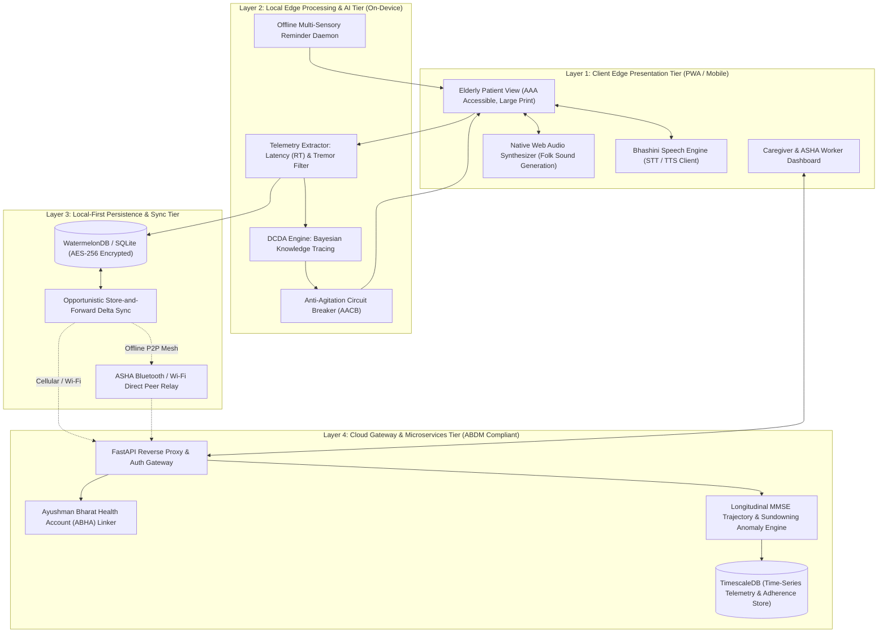
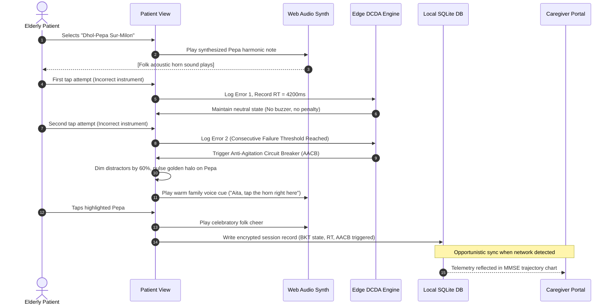
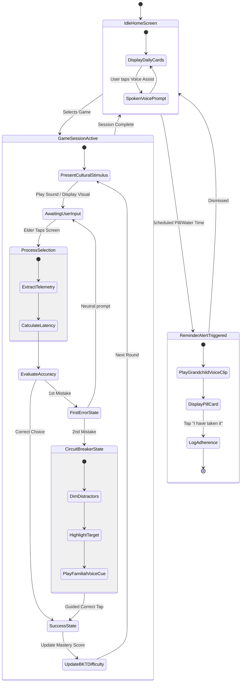

# 📐 SOFTWARE REQUIREMENTS SPECIFICATION (SRS) & SYSTEM DESIGN DOCUMENT (SDD)

**Project Name**: Smriti-NER (স্মৃতি / ꯁ꯭ꯃ꯭ꯔꯤꯇꯤ)  
**Problem Statement ID**: 26003 (SIH 2026)  
**Sponsoring Authority**: Ministry of Development of North Eastern Region (MDoNER), Government of India  
**Document Standard**: Compliant with IEEE 830 / ISO/IEC/IEEE 29148 Standards  
**Version**: 1.0.0 (Release Candidate)  

---

## 1. Introduction

### 1.1 Purpose
This Software Requirements Specification (SRS) and System Design Document (SDD) delineates the functional, non-functional, behavioral, and architectural specifications for **Smriti-NER**, an AI-enabled cognitive digital therapeutic and memory assistance platform engineered for elderly dementia patients and caregivers in the 8 North Eastern States of India.

### 1.2 Scope of the System
Smriti-NER is an offline-first, dual-persona, mobile/tablet and web application that delivers:
1. **Culturally immersive cognitive games** targeting memory, attention, pattern recognition, and executive function.
2. **Dynamic Cognitive Difficulty Adjustment (DCDA)** powered by edge Bayesian Knowledge Tracing with an **Anti-Agitation Circuit Breaker (AACB)**.
3. **Multilingual and familiar voice-guided navigation** integrated with Government of India Bhashini (AI4Bharat) APIs and personalized family voice prompts.
4. **Multi-sensory reminder system** for medication, hydration, and daily living routines.
5. **Caregiver and ASHA/ANM healthcare worker monitoring portal** delivering longitudinal Mini-Mental State Examination (MMSE) trajectory telemetry and sundowning anomaly tracking.
6. **Zero-connectivity edge operation** with opportunistic store-and-forward delta packet synchronization.

---

## 2. System Actors & User Personas

| Actor | Profile & Environmental Context | Primary System Interactions |
| :--- | :--- | :--- |
| **1. Elderly Patient ("আইতা / ককা")** | Age 65+, experiencing mild-to-moderate dementia or MCI, low digital literacy, may be illiterate, native speaker of Assamese, Meitei, Bodo, Khasi, etc. | Plays cognitive games, listens to spoken voice prompts and folk instruments, responds to personalized family medicine/water reminders. |
| **2. Family Caregiver** | Adult child or grandchild living in the same or nearby household; possesses basic smartphone literacy. | Records personalized family voice prompts, schedules medicines/appointments, uploads family memory photos, monitors cognitive trajectory and sundowning alerts. |
| **3. ASHA / ANM Worker** | Grassroots community healthcare worker equipped with a standard National Health Mission (NHM) Android tablet. | Conducts village visits, monitors multiple village elders via aggregate cohort dashboard, initiates peer-to-peer Bluetooth delta sync in zero-connectivity zones. |
| **4. District Medical Officer / Neurologist** | Clinician at district civil hospital or Medical College (e.g., GMCH Guwahati, RIMS Imphal). | Reviews longitudinal MMSE and reaction latency graphs, adjusts clinical management, reviews adherence compliance. |

---

## 3. Detailed Functional Requirements (FR)

### 3.1 Module 1: Elderly-Centric Accessibility & Interaction
* **FR-01**: The system shall provide an ultra-clean "আইতা / ককা" interface with a maximum cognitive load of 3 primary navigation options per screen.
* **FR-02**: All text elements in the patient view shall use a minimum font size of 24 points (1.5rem) and satisfy WCAG 2.2 AAA contrast ratio (minimum 7:1 against background).
* **FR-03**: All interactive touch targets shall measure a minimum of 64 × 64 density-independent pixels (dp) with a minimum 16dp spacing margin to accommodate senile motor tremors.
* **FR-04**: The system shall feature a persistent, high-visibility "Voice Assistant" button (*"কথাৰে কওক"*) that triggers native speech synthesis of on-screen instructions.
* **FR-05**: The system shall allow instant 1-click language toggling between Assamese, Meitei, Bengali, Bodo, Khasi, Mizo, Hindi, and English.

### 3.2 Module 2: Culturally Rooted Cognitive Games (Reminiscence Therapy)
* **FR-06 (Auditory Memory - Dhol-Pepa Sur-Milon)**:
  * Synthesize authentic acoustic frequencies of traditional instruments (Pepa, Dhol, Pung, Duitara, Gogona, Tokari) locally via the Web Audio API.
  * Present 2 to 4 high-contrast instrument illustrations; prompt the user to match the played tone.
* **FR-07 (Visual Attention - Kaziranga Safari Search)**:
  * Display a scenic regional wildlife environment featuring indigenous species (One-horned Rhino, Hornbill, Red Panda, Sangai Deer, Hoolock Gibbon).
  * Prompt the elder to locate the designated animal without time pressure or penalty.
* **FR-08 (Sequencing & Working Memory - Weaver's Loom)**:
  * Present a flashing sequence of 3 to 5 traditional textile border motifs (Muga Golden Silk, Gamosa Phulam, Mizo Puan).
  * Enable the elder to reconstruct the pattern sequence via tactile color blocks.
* **FR-09 (Executive Function & Daily Living - Daily Haat)**:
  * Present a weekly village market scenario with traditional ingredients (Khar, Bamboo Shoots, Starfruit, Local Fish).
  * Prompt the elder to assemble the ingredients required for a classic regional recipe.
* **FR-10 (Zero Negative Reinforcement)**:
  * Under no circumstances shall the games display red "X" icons, play jarring buzzer sounds, or show "Game Over" screens upon an incorrect selection.

### 3.3 Module 3: Edge AI Engine & Dynamic Cognitive Difficulty Adjustment (DCDA)
* **FR-11**: The system shall continuously extract fine-grained telemetry during gameplay:
  * Total Reaction Time ($RT_{total}$) in milliseconds.
  * Motor Hesitation Latency ($\tau$) measured via bounding-box touch wander.
  * Cognitive Deliberation Latency ($RT_{delib} = RT_{total} - \tau$).
* **FR-12**: The difficulty engine shall evaluate patient proficiency via Bayesian Knowledge Tracing (BKT) and update item complexity parameters.
* **FR-13 (Anti-Agitation Circuit Breaker - AACB)**:
  * If the patient records 2 consecutive incorrect selections, the AACB shall activate immediately:
    * Dim non-target distractors by 60%.
    * Enlarge target touch hitbox by 25%.
    * Trigger a warm, familiar family audio prompt guiding the elder to the answer.

### 3.4 Module 4: Multi-Sensory Reminders & Familiar Voice Prompts
* **FR-14**: The system shall provide an automated scheduler for medication, hydration, and medical appointments.
* **FR-15**: When a reminder triggers, the system shall play a pre-recorded personalized audio note in the voice of a family member (grandchild or child) accompanied by their photograph.
* **FR-16**: The reminder screen shall require a single large confirmation tap (*"খালো / মই খাইছো"* / "I have taken it") to log adherence into the local database.

### 3.5 Module 5: Caregiver & ASHA Telemetry Dashboard
* **FR-17**: The system shall provide an authenticated Caregiver/Clinician portal with one-click toggling.
* **FR-18**: The portal shall render an interactive 30-day longitudinal Mini-Mental State Examination (MMSE) proxy trajectory chart calculated from in-game telemetry.
* **FR-19**: The portal shall display real-time adherence rates for medications and hydration.
* **FR-20**: The portal shall generate an automated alert if late-afternoon interaction anomalies indicate sundowning agitation.
* **FR-21**: The portal shall allow caregivers to record voice notes and upload personal family photographs for the in-app Reminiscence Album.

### 3.6 Module 6: Offline Storage & Multi-Channel Synchronization
* **FR-22**: The platform shall be fully operational with zero network connectivity; all assets, games, and audio synthesizers must be cached locally on the device.
* **FR-23**: The system shall serialize telemetry sessions into encrypted binary delta packets (< 50 KB).
* **FR-24**: The system shall perform automatic opportunistic synchronization whenever cellular data or Wi-Fi is detected.
* **FR-25**: In off-grid habitations, the system shall support peer-to-peer Bluetooth/Wi-Fi Direct delta harvesting by visiting ASHA worker tablets.

---

## 4. Non-Functional Requirements (NFR)

### 4.1 Usability & Accessibility (WCAG 2.2 AAA)
* **NFR-01**: Contrast ratio between foreground text and background elements shall be $\ge 7:1$.
* **NFR-02**: All buttons must have an active tactile scale feedback animation (subtle depression on press) and haptic vibration feedback where supported by hardware.
* **NFR-03**: Zero nested menus or multi-level drawer navigation in Patient Mode; all key options accessible within a single viewport.

### 4.2 Performance & Latency
* **NFR-04**: On-device game response time (from touch event to acoustic/visual feedback) shall not exceed **50 milliseconds**.
* **NFR-05**: Local database read/write queries on SQLite/WatermelonDB shall complete within **15 milliseconds**.
* **NFR-06**: Weekly compressed telemetry synchronization packet shall not exceed **50 Kilobytes**.

### 4.3 Reliability & Availability
* **NFR-07**: The offline client application shall maintain **100% availability** regardless of network signal status.
* **NFR-08**: Application crash rate shall remain under 0.05% across budget Android devices with 2GB RAM.

### 4.4 Security & Data Privacy (DISHA / ABDM / HIPAA)
* **NFR-09**: Local client storage shall be encrypted using **AES-256-GCM** with keys stored in Android Keystore / Secure Enclave.
* **NFR-10**: Cloud network transmissions shall enforce **TLS 1.3** with strict certificate pinning.
* **NFR-11**: Personal identifiable information (PII) shall be segregated from behavioral telemetry using irreversible SHA-256 anonymized pseudo-IDs.

---

## 5. System Architecture & Component Design



---

## 6. Dynamic Behavioral Models & Workflows

### 6.1 Sequence Diagram: Game Session, Telemetry & AACB Trigger



---

### 6.2 State Machine Diagram: Patient Experience & Difficulty Flow



---

## 7. Data Models & Database Schemas

### 7.1 Client-Side SQLite / WatermelonDB Schema (Encrypted)

```sql
-- Patients Table
CREATE TABLE patients (
    patient_id VARCHAR(64) PRIMARY KEY,
    abha_id VARCHAR(32) UNIQUE,
    full_name VARCHAR(128) NOT NULL,
    age INTEGER NOT NULL,
    primary_language VARCHAR(16) DEFAULT 'as_IN', -- Assamese
    caregiver_contact VARCHAR(32),
    baseline_mmse REAL DEFAULT 24.0,
    created_at TIMESTAMP DEFAULT CURRENT_TIMESTAMP
);

-- Cognitive Game Telemetry Sessions
CREATE TABLE game_telemetry (
    session_id VARCHAR(64) PRIMARY KEY,
    patient_id VARCHAR(64) REFERENCES patients(patient_id),
    game_type VARCHAR(32) NOT NULL, -- 'pepa_recall', 'kaziranga_search', 'weavers_loom', 'daily_haat'
    difficulty_level INTEGER DEFAULT 1,
    reaction_time_ms INTEGER NOT NULL,
    motor_hesitation_ms INTEGER NOT NULL,
    accuracy_score REAL NOT NULL,
    consecutive_errors INTEGER DEFAULT 0,
    aacb_triggered BOOLEAN DEFAULT FALSE,
    session_timestamp TIMESTAMP DEFAULT CURRENT_TIMESTAMP,
    sync_status VARCHAR(16) DEFAULT 'PENDING' -- 'PENDING', 'SYNCED'
);

-- Multi-Sensory Reminders Table
CREATE TABLE routine_reminders (
    reminder_id VARCHAR(64) PRIMARY KEY,
    patient_id VARCHAR(64) REFERENCES patients(patient_id),
    reminder_type VARCHAR(32) NOT NULL, -- 'MEDICINE', 'HYDRATION', 'APPOINTMENT'
    scheduled_time TIME NOT NULL,
    title VARCHAR(128) NOT NULL,
    family_voice_path VARCHAR(256),
    family_member_name VARCHAR(64),
    dosage_instructions VARCHAR(128),
    is_active BOOLEAN DEFAULT TRUE
);

-- Daily Adherence Logs
CREATE TABLE adherence_logs (
    log_id VARCHAR(64) PRIMARY KEY,
    reminder_id VARCHAR(64) REFERENCES routine_reminders(reminder_id),
    scheduled_date DATE NOT NULL,
    actual_taken_time TIMESTAMP,
    adherence_status VARCHAR(16) NOT NULL, -- 'TAKEN', 'MISSED', 'SNOOZED'
    sync_status VARCHAR(16) DEFAULT 'PENDING'
);
```

---

## 8. API Specifications (Cloud Gateway)

| Endpoint | Method | Security | Payload Summary | Purpose |
| :--- | :--- | :--- | :--- | :--- |
| `/api/v1/sync/delta` | `POST` | Bearer JWT + AES-256 | Compressed binary JSON containing pending `game_telemetry` & `adherence_logs` | Store-and-forward telemetry sync from edge device. |
| `/api/v1/patient/{id}/trajectory` | `GET` | Role: Clinician / Caregiver | Query params: `start_date`, `end_date`, `window_days` | Returns 30-day longitudinal MMSE trajectory and sundowning anomaly indices. |
| `/api/v1/reminders/voice-upload` | `POST` | Role: Caregiver | `multipart/form-data`: Audio WAV/MP3 + reminder metadata | Uploads personalized grandchild voice clip for offline synchronization. |
| `/api/v1/mesh/relay-harvest` | `POST` | ASHA Tablet Mutual TLS | Batch array of encrypted patient delta packets | ASHA tablet bulk upload upon returning to PHC Wi-Fi. |
| `/api/v1/bhashini/tts-stream` | `POST` | API Key (Government Bhashini) | Text string + target language code (`as`, `mni`, `bn`, `brx`, `kha`) | Fallback dynamic TTS synthesis for custom caregiver messages. |

---

## 9. Verification & Acceptance Criteria

1. **Accessibility Verification**: Verified by passing automated axe-core and Google Lighthouse Accessibility audits with a score of 100/100, adhering to WCAG 2.2 AAA guidelines.
2. **Offline Resilience Test**: Application functions seamlessly in airplane mode with zero crash rate; all 4 games, audio synthesis, and reminder alerts trigger accurately without network connection.
3. **AACB Trigger Verification**: When two successive incorrect inputs are delivered, the Anti-Agitation Circuit Breaker triggers within 100ms, displaying golden guidance highlights and suppressing error cues.
4. **Data Sync Delta Validation**: Telemetry bundle compressed size remains under 50 KB for 14 continuous days of game sessions, synchronizing within 3 seconds under a simulated 2G connection (50 kbps).
