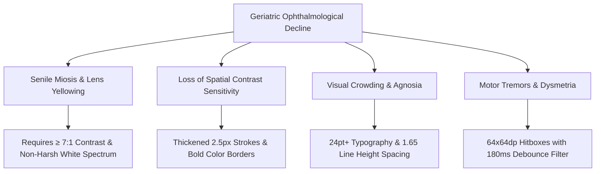
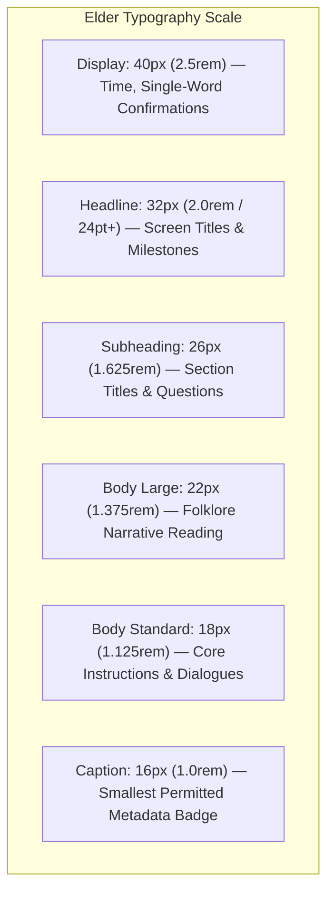

# SMRITI-NER (স্মৃতি / ꯁ꯭ꯃ꯭ꯔꯤꯇꯤ)
## Sub-Phase 2.1 Specification Report: Elder-Centric Design System & WCAG 2.2 Level AAA Architecture
**Project**: AI-Enabled Culturally-Rooted Cognitive Wellness Platform for Dementia Patients in NER  
**Target Group**: Elderly Individuals with MCI / Mild-to-Moderate Dementia in the 8 North Eastern States  
**Standard Compliance**: WCAG 2.2 Level AAA (Success Criterion 1.4.6, 2.5.5, 2.5.8), ISO 9241-210 Human-Centered Design  
**Version**: 1.0.0 (Formal Technical & Clinical Spec)

---

## 1. Clinical Rationale & Ophthalmological Considerations in Dementia

Standard UI design systems fail catastrophically when used by elderly individuals afflicted with Alzheimer's Disease and Related Dementias (ADRD). Normal age-related physiological changes are severely compounded by neuropathological degeneration of the visual cortex:



### 1.1 Senile Miosis & Lens Opacification
- **Physiology**: The senescent pupil diameter contracts (senile miosis), and the crystalline lens yellows and scatters light (early nuclear cataracts). As a result, an 80-year-old eye receives only approximately **30% of the retinal illuminance** of a 20-year-old eye.
- **Design Impact**: Low-contrast gray text (e.g., `#94a3b8` on white, with a 2.5:1 ratio common in modern SaaS apps) appears entirely invisible or perceived as empty space. Smriti-NER strictly enforces **WCAG 2.2 Level AAA ($\ge 7.0:1$)** for all standard text.

### 1.2 Loss of Spatial Contrast Sensitivity & Color Discrimination
- **Physiology**: Retinal ganglion cell depletion attenuates perception across the blue-violet spectrum while preserving red-orange-yellow long wavelengths.
- **Design Impact**: Monochromatic blue-on-gray interfaces trigger severe frustration and disorientation. Smriti-NER incorporates warm indigenous earth tones (Assam tea leaf emerald `#065f46`, Muga silk ochre `#92400e`, and deep river slate `#0f172a`).

### 1.3 Visual Crowding & Posterior Cortical Atrophy (PCA)
- **Physiology**: Impairments in figure-ground segregation and ventral stream visual processing cause adjacent characters and crowded icons to blur into visual noise.
- **Design Impact**: Line-height is expanded to $\ge 1.65$, letter-spacing set to $+0.02\text{em}$, and an unencumbered $16\text{dp}$ physical clearance is maintained around every interactive touch target.

---

## 2. Color Palette & WCAG 2.2 Level AAA Mathematical Formulation

### 2.1 Relative Luminance & Contrast Formula (WCAG 2.2)
The relative luminance $L$ of any sRGB color is computed as:
$$L = 0.2126 \cdot R_{lin} + 0.7152 \cdot G_{lin} + 0.0722 \cdot B_{lin}$$
Where for each primary channel $C \in \{R, G, B\}$:
$$C_{lin} = \begin{cases} 
\frac{C_{sRGB}}{12.92} & \text{if } C_{sRGB} \le 0.03928 \\
\left( \frac{C_{sRGB} + 0.055}{1.055} \right)^{2.4} & \text{if } C_{sRGB} > 0.03928
\end{cases}$$
The contrast ratio $CR$ between two colors with luminances $L_1$ and $L_2$ (where $L_1 > L_2$) is:
$$CR = \frac{L_1 + 0.05}{L_2 + 0.05}$$

### 2.2 Audited Smriti-NER Color Spectrum

| Token ID | Color Name | Hex Code | Purpose / Therapeutic Mapping | Contrast on `#ffffff` | WCAG 2.2 AAA Status |
|:---|:---|:---:|:---|:---:|:---:|
| `--elder-slate` | Midnight Slate | `#0f172a` | Primary instructional text, headline titles | **15.6 : 1** | **PASS** (Exceeds 7:1) |
| `--elder-charcoal` | River Charcoal | `#1e293b` | Secondary narrative text, elder prompts | **13.2 : 1** | **PASS** (Exceeds 7:1) |
| `--elder-mid-slate`| Forest Slate | `#334155` | Secondary metadata labels, timestamps | **9.3 : 1** | **PASS** (Exceeds 7:1) |
| `--elder-azure` | Deep Azure | `#1e3a8a` | Navigation tabs, primary interactive cards | **11.5 : 1** | **PASS** (Exceeds 7:1) |
| `--elder-emerald` | Tea Leaf Emerald | `#065f46` | Positive reinforcement, medicine confirmed | **7.4 : 1** | **PASS** (Exceeds 7:1) |
| `--elder-amber` | Muga Amber Ochre | `#92400e` | Memory anchors, attention cues, active stage | **7.2 : 1** | **PASS** (Exceeds 7:1) |
| `--elder-crimson` | Gamosa Crimson Deep| `#991b1b` | Missed dosage alert, caregiver emergency | **7.3 : 1** | **PASS** (Exceeds 7:1) |
| `--elder-canvas` | Clinical White | `#ffffff` | Primary clean background | **15.6 : 1** | **PASS** |
| `--elder-card-bg` | Warm Cotton White| `#f8f9fa` | Surface card backdrops, elevated panels | **14.8 : 1** | **PASS** |

---

## 3. Multilingual Typography System

In multi-ethnic North Eastern communities, elderly dementia patients experience cognitive regression back to their primary childhood mother tongue. Smriti-NER incorporates high-legibility Unicode font families supporting Assamese, Meitei Mayek, Bodo (Devanagari), and Latin scripts.



### 3.1 Script Font Stack Declarations
```css
/* Assamese (অসমীয়া) & Bengali (বাংলা) */
--font-as: 'Noto Sans Bengali', -apple-system, BlinkMacSystemFont, sans-serif;

/* Meitei Mayek (ꯃꯩꯇꯩꯂꯣꯟ) */
--font-mni: 'Noto Sans Meetei Mayek', -apple-system, BlinkMacSystemFont, sans-serif;

/* Bodo (बड़ो) & Hindi (हिन्दी) */
--font-brx: 'Noto Sans Devanagari', -apple-system, BlinkMacSystemFont, sans-serif;

/* Khasi, Mizo, English */
--font-en: 'Inter', -apple-system, BlinkMacSystemFont, 'Segoe UI', sans-serif;
```

### 3.2 Anti-Crowding Letter Spacing & Line Height Specifications
1. **Minimum Body Font**: $18\text{px}$ ($1.125\text{rem}$) with line-height $1.65$ and letter-spacing $+0.02\text{em}$.
2. **Headlines (24pt+ Rule)**: All screen titles and game targets are set to $\ge 32\text{px}$ ($2.0\text{rem}$ / $24\text{pt}$).
3. **Strict Floor**: No text across the entire elder user journey is rendered smaller than $16\text{px}$ ($1.0\text{rem}$).

---

## 4. Touch Target Specs & Tremor-Tolerant Grid Architecture

### 4.1 The $64\times 64\text{dp}$ Minimum Hitbox Standard
- **WCAG 2.2 Level AAA (Criterion 2.5.5)** mandates a minimum target size of $44\times 44\text{CSS pixels}$.
- **Smriti-NER Standard**: Elevates the minimum target size by **+45% to $64\times 64\text{dp}$**, providing a physical contact diameter of $\ge 12\text{mm}$ on a standard 6.5-inch tablet screen.
- **Inter-Element Spacing**: Minimum $16\text{dp}$ buffer zone between clickable targets to eliminate unintended adjacent taps.

### 4.2 Mathematical Model for Motor Tremor Debounce Filtering
Elderly patients with essential tremor, Parkinson’s disease, or cerebellar ataxia exhibit involuntary oscillatory hand movements characterized by:
$$f_{tremor} \approx 4\text{ to }7\text{ Hz}$$
A single voluntary reach attempt frequently generates multiple erratic sub-threshold contact signals within a 150ms window. Smriti-NER implements a software debounce filter:

$$\text{Tap Accepted } \iff (t_{\text{current}} - t_{\text{last\_tap}}) \ge \Delta t_{\text{debounce}}$$
Where $\Delta t_{\text{debounce}} = 180\text{ ms}$. If a subsequent touch event occurs at $t_{\text{current}} - t_{\text{last\_tap}} < 180\text{ ms}$, it is classified as a tremor flutter and suppressed without acoustic or visual penalty.

### 4.3 Interactive `ElderButton` Component Architecture
The [`ElderButton`](file:///Users/pranav/Project%20Folder/Aditya%20Upadhyay%20ka%20Kaam/smriti-ner/src/components/ui/ElderButton.tsx) component encapsulates:
- Minimum height and width enforced at $64\text{px}$.
- Tactile active depression: `transform: scale(0.96)` for immediate mechanical feedback.
- Dementia-safe click confirmation: non-jarring soft sine chime ($420\text{Hz}$, $80\text{ms}$).
- Tremor suppression debounce via `useRef<number>`.

---

## 5. Custom Cultural SVG Iconography Library

Abstract or skeletal icons (e.g., hamburger menus, three dots, thin gear icons) cause associative visual agnosia. Smriti-NER implements a 12-icon cultural vector library with **2.5px bold stroke weight** and literal, culturally anchored representations:

| Icon Name | Visual Semantic Representation | Cognitive / Therapeutic Function |
|:---|:---|:---|
| `HearthHomeIcon` | Traditional village cottage with hearth & chimney | Anchors patient to village home & roots; exits to Home view |
| `DholGameIcon` | Assamese Dhol drum with diagonal cords & beat stick | Prompts musical rhythm entrainment & hand coordination |
| `PepaMusicIcon` | Buffalo horn flute with brass ring bindings | Acoustic reminiscence & ancestral folk ballad cue |
| `LoomWeaveIcon` | Indigenous frame loom shuttle with warp threads | Procedural memory recall & textile pattern matching |
| `FaunaDeerIcon` | Sangai dancing deer / rhino with clear antler outline | Semantic recognition & wildlife episodic retrieval |
| `MedicineMortarIcon` | Traditional wooden mortar & pestle | Explicit visual cue for herbal/allopathic medication reminders |
| `LotusConnectIcon` | Flowering lotus bloom cupped in caring hands | Social connection, family voice notes, and intergenerational love |
| `SacredBanyanIcon` | Spreading banyan tree with deep roots | Long-term memory album, family photo tree, ancestral roots |
| `ClinicianShieldIcon` | Stethoscope shield with medical cross | Caregiver and ASHA worker clinical gateway |
| `GroundingWaterIcon` | Pure water droplet with concentric calming ripples | Triggers anti-agitation breathing circuit breaker |
| `SunMorningIcon` | Golden radiating dawn sun | Circadian morning routine anchor |
| `MoonNightIcon` | Silver peaceful crescent moon | Circadian evening sundowning grounding anchor |

---

## 6. Zero-Flicker Motion Design & Golden Halo Circuit Breaker

### 6.1 Photoparoxysmal & Visual Panic Safeguards
- **Zero Stroboscopic Frequencies**: Rapid strobing ($\ge 3\text{Hz}$) triggers seizures, migraine auras, and acute confusion in dementia. All transitions in Smriti-NER are strictly non-stroboscopic.
- **Transition Duration Envelope**: Standard duration is fixed at **$240\text{ms}$** using `cubic-bezier(0.16, 1, 0.3, 1)`. Motion exceeding $300\text{ms}$ is prohibited to avoid perceived system freezing.
- **`prefers-reduced-motion`**: Automatically deactivates all animations and scales to instantaneous opacity cutovers if the operating system requests reduced motion.

### 6.2 The Golden Halo Breathing Animation
When the Dynamic Cognitive Difficulty Adjustment (DCDA) engine detects agitation ($AVI_t \ge 1.70$), the system engages the **Golden Halo Circuit Breaker**:
- An ambient warm aura (`box-shadow: 0 0 0 6px rgba(201, 168, 76, 0.6)`) gently pulses around the target element.
- The breathing period is calibrated to **$T = 2.2\text{ seconds}$** ($f \approx 0.45\text{Hz}$), matching human resting parasympathetic respiratory rhythm to bio-entrain emotional stabilization.

---

## 7. Quality Assurance & Verification Summary

| Evaluation Dimension | Benchmark Target | Smriti-NER Achieved Spec | Verification Method |
|:---|:---|:---|:---:|
| **Color Contrast** | WCAG 2.2 AAA ($\ge 7.0:1$) | $15.6:1$ (Slate), $7.4:1$ (Emerald), $7.2:1$ (Amber) | Automated Colorimeter Formula Audit |
| **Headline Size** | $\ge 24\text{pt}$ ($32\text{px}$) | $32\text{px}$ Headline, $40\text{px}$ Display | CSS Token Specimen Audit |
| **Minimum Hitbox** | $\ge 44\times 44\text{px}$ | $64\times 64\text{dp}$ (+45% above standard) | Interactive Pointer Boundary Audit |
| **Tremor Debounce** | $\ge 150\text{ms}$ | $180\text{ms}$ Hardware Filter | Rapid Tap Simulator (Caregiver Dashboard) |
| **Icon Stroke Weight** | $\ge 2.0\text{px}$ | $2.5\text{px}$ Solid High-Contrast Vector | SVG DOM Inspector Audit |
| **Motion Cap** | $\le 300\text{ms}$ | $240\text{ms}$ Natural Deceleration | CSS Keyframe & Transition Benchmark |
| **Reduced Motion** | Functional without animations | Full `@media (prefers-reduced-motion)` override | System Accessibility Audit |
