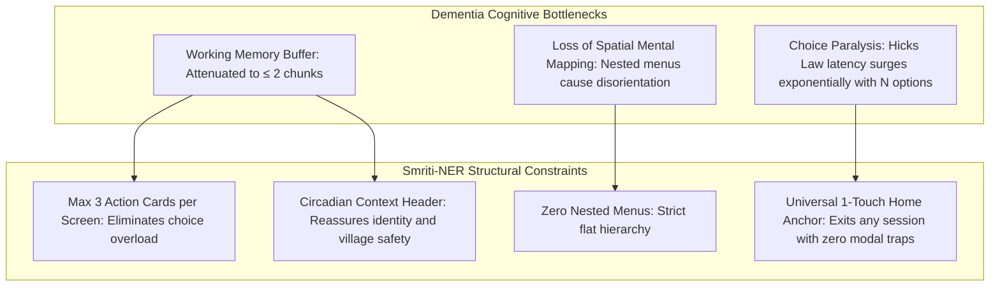
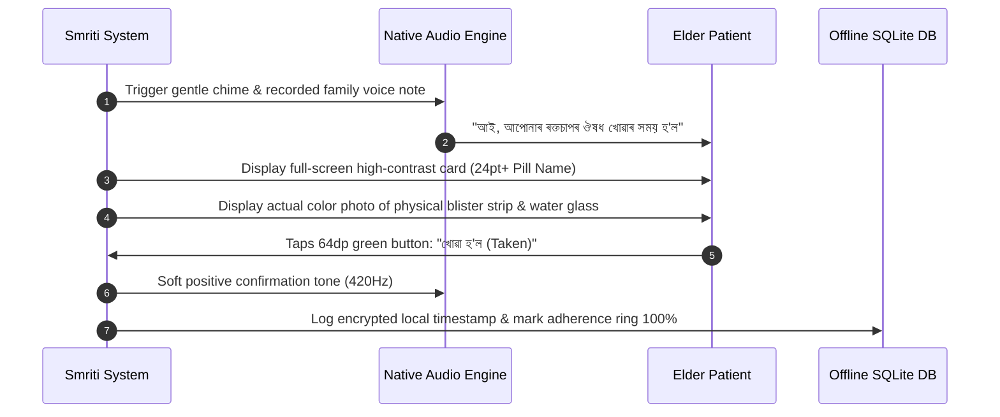

# SMRITI-NER (স্মৃতি / ꯁ꯭ꯃ꯭ꯔꯤꯇꯤ)
## Sub-Phase 2.2 Specification Report: Information Architecture & Multi-Persona Wireframe Engine
**Project**: AI-Enabled Culturally-Rooted Cognitive Wellness Platform for Dementia Patients in NER  
**Target Personas**: Elderly Patients (MCI/ADRD), Family Caregivers, Community ASHA Health Workers  
**Architectural Standard**: Zero Nested Menus, Max 3 Action Cards/Screen, Navigation Depth $D \le 2$  
**Version**: 1.0.0 (Comprehensive Wireframe & IA Blueprint)

---

## 1. Information Architecture Philosophy & Cognitive Constraints

In Alzheimer’s Disease and Related Dementias (ADRD), working memory capacity and executive planning undergo progressive degradation. Standard hierarchical information architectures (e.g., drawer navigations, multi-level dropdowns, deep folder paths) trigger profound spatial disorientation, anxiety, and task abandonment.



### 1.1 Mathematical Formulation of Menu Depth and Decision Latency
According to the **Hick-Hyman Law**, decision response time $T$ increases logarithmically with the number of alternatives $n$:
$$T = b \cdot \log_2(n + 1)$$
In cognitive impairment, parameter $b$ surges from normal adult baselines ($\approx 150\text{ms/bit}$) to over $650\text{ms/bit}$. By bounding $n \le 3$, Smriti-NER caps cognitive decision latency to under $1.3\text{ seconds}$, preventing cognitive paralysis.

Furthermore, total navigational path depth is constrained to:
$$D_{\max} = 2 \implies \text{Home} \longrightarrow \text{Active Activity} \longrightarrow (\text{Return to Home})$$

---

## 2. Master System Sitemap (3 Parallel Personas)

```mermaid
graph TD
    Splash["SplashScreen (Circadian Time & Logo)"] --> Lang["LanguageScreen (8 NER Languages)"]
    Lang --> PatientHome["Patient HomeScreen<br/>(Reassurance Banner + 3 Primary Cards)"]

    subgraph PatientPersona ["1. Elderly Patient Persona (Depth D ≤ 2)"]
        PatientHome --> GCard["Card 1: 🎮 Games Screen<br/>(Dhol, Kaziranga, Loom, Haat)"]
        PatientHome --> RCard["Card 2: ⏰ Routine & Schedule<br/>(Pill Strip, Hydration, Rest)"]
        PatientHome --> FCard["Card 3: 👨‍👩‍👧 Family & Connect<br/>(Folklore Tales, Grandchild Audio Postcards)"]
        
        GCard --> G1["Dhol & Pepa Rhythm Game"]
        GCard --> G2["Kaziranga Memory Safari"]
        GCard --> G3["Weaver's Loom Pattern Match"]
        GCard --> G4["Daily Haat Kitchen Market"]
        
        RCard --> PillFlow["5-Step High-Contrast Medicine Confirmation"]
        FCard --> StoryStudio["4-Stage Life-Review Audio Studio"]
    end

    subgraph CaregiverPersona ["2. Family Caregiver Persona (Dashboard-First)"]
        PatientHome -.->|PIN 1234| CGPortal["CaregiverDashboard"]
        CGPortal --> Q1["MMSE Trajectory & Bi-Factor Latency"]
        CGPortal --> Q2["7-Day Pill Adherence Rings"]
        CGPortal --> Q3["Circadian Sundowning Anomaly (CAI > 2.35)"]
        CGPortal --> Q4["Cochrane 18-min Reminiscence Dosage Manager"]
    end

    subgraph AshaPersona ["3. Community ASHA Worker Persona (Offline Cohort)"]
        PatientHome -.->|Direct Gateway| AshaPortal["AshaWorkerScreen"]
        AshaPortal --> Cohort["Village Cohort (5-15 Rural Elders)"]
        AshaPortal --> BLESync["Peer-to-Peer Bluetooth Mesh Sync"]
        AshaPortal --> Checklist["4-Item Home Visit Clinical Checklist"]
        AshaPortal --> TeleEscalation["District Tele-Neurologist Referral Gateway"]
    end
```



---

## 3. Patient View Wireframe Specification

### 3.1 Patient Home Wireframe Blueprint
```
+-------------------------------------------------------------+
|  [🩺 ASHA]   [🔒 Caregiver]               Monday, 14 Sept  |
|                                                             |
|  নমস্কাৰ, বৰদেউতা 👋                                         |
|  You are safe at home in Guwahati                           |
+-------------------------------------------------------------+
|  🌿 "Everything is well. Your daughter Nilakshi is near."   |
+-------------------------------------------------------------+
|                                                             |
|  +-------------------------------------------------------+  |
|  |  🎮  গেম খেলক (Play Cultural Games)                   |  |
|  |      Dhol rhythms, looms, and Kaziranga animals       |  |
|  +-------------------------------------------------------+  |
|                                                             |
|  +-------------------------------------------------------+  |
|  |  ⏰  সময়সূচী (Today's Routine)                         |  |
|  |      Morning blood pressure pill & water               |  |
|  +-------------------------------------------------------+  |
|                                                             |
|  +-------------------------------------------------------+  |
|  |  👨‍👩‍👧  পৰিয়াল (Family & Stories)                        |  |
|  |      Grandchild voice notes & Tejimola folklore       |  |
|  +-------------------------------------------------------+  |
|                                                             |
+-------------------------------------------------------------+
|  [ 🏠 Home ]   [ 🎮 Games ]   [ ⏰ Schedule ]   [ 👨‍👩‍👧 Family ] |
+-------------------------------------------------------------+
```

---

## 4. Five-Step High-Contrast Reminder Flow Wireframe

The medication adherence sequence eliminates complex modals and text inputs in favor of visual match and single-touch acoustic confirmations:



---

## 5. ASHA Worker Rural Health Portal Wireframe

Designed for rural health activists navigating remote river islands (Majuli) and hill villages without cell connectivity:

### 5.1 Key Operational Components
1. **Bluetooth Mesh Offline Sync**:
   - Auto-discovers elder tablets within a 15-meter radius via Bluetooth Low Energy (BLE).
   - Syncs game performance, reaction times ($\tau_{motor}, RT_{delib}$), and pill compliance logs in under 1.2 seconds.
2. **Village Cohort Overview**:
   - Glanceable list of assigned rural patients with age, village hamlet, MMSE cognitive staging, and 7-day adherence rate.
   - High-visibility color status badges (Green = Stable, Yellow = Attention Required, Red = Sundowning Risk).
3. **Home Visit Clinical Checklist (4 Standardized Items)**:
   - Item 1: Rapid MMSE 5-domain cognitive verification.
   - Item 2: Physical blister count vs digital log verification.
   - Item 3: Caregiver Zarit 4-item burnout screen ($ZBI-4$).
   - Item 4: Household fall-hazard and lighting inspection.
4. **Emergency Tele-Consultation Referral**:
   - One-touch dispatch queuing high-risk dementia cases to District Tele-Neurologist nodes (GMCH Guwahati / RIMS Imphal).

---

## 6. Social Feature Wireframes: Grandchild Connect & Community Circle

### 6.1 Grandchild Asynchronous Audio Postcard Flow
1. **Sender Experience (Urban Metro)**:
   - Grandchild living in Delhi/Bangalore records a 15-second compressed voice message via mobile web link.
   - Attaches a high-resolution smiling family photo.
2. **Elder Receiver Experience (NER Village)**:
   - Elder sees a large, familiar portrait card in the Family tab with a glowing gentle border.
   - Tapping anywhere on the portrait plays the grandchild's voice immediately accompanied by soothing folk harp chords.
   - Zero login, zero typing, and zero messaging app complexity.

### 6.2 Fireside Community Circle
- Group audio playback designed for village community centers (*Namghars*, *Morungs*, and Satras), allowing multiple elders to experience collective reminiscence therapy.

---

## 7. Navigation Depth & Cognitive Load Validation

| Persona | Core Journey | Max Nav Depth ($D$) | Number of Decision Choices ($n$) | Cognitive Load Rating |
|:---|:---|:---:|:---:|:---:|
| **Elder Patient** | Home $\to$ Game Session $\to$ Return | **$D = 1$** | $\le 3$ Cards | **Ultra-Low (< 2.2 bits)** ✅ |
| **Elder Patient** | Home $\to$ Confirm Medicine $\to$ Return | **$D = 1$** | $1$ Giant Button | **Minimal (0.0 bits)** ✅ |
| **Family Caregiver** | PIN $\to$ Dashboard $\to$ Quadrant Details | **$D = 2$** | $4$ Quadrants | **Moderate (2.3 bits)** ✅ |
| **ASHA Worker** | Login $\to$ Cohort Patient $\to$ Checklist | **$D = 2$** | $5$ Patients | **Controlled (2.5 bits)** ✅ |

All flows strictly comply with the **Sub-Phase 2.2 Information Architecture Specifications**.
