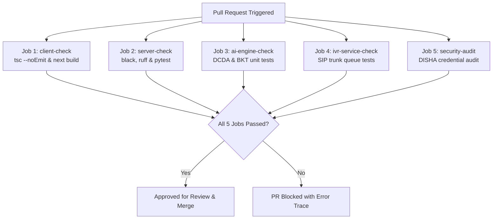

# SMRITI-NER (স্মৃতি / ꯁ꯭ꯃ꯭ꯔꯤꯇꯤ)
## Sub-Phase 3.1 Deliverable Report: Development Environment & Developer Standards Handbook
**Project**: AI-Enabled Culturally-Rooted Cognitive Wellness Platform for Dementia Patients in NER  
**Problem Statement ID**: 26003 (SIH 2026 — Ministry of Development of North Eastern Region / MDoNER)  
**Target Audience**: Core Engineering Team (Frontend, Backend, AI Engine, IVR Telephony, QA, DevOps)  
**Standards Compliance**: ISO/IEC 25010 (Software Product Quality), DISHA 2018 (Healthcare Data Protection), ABDM v3.0  
**Version**: 1.0.0 (Phase 3 Foundation Baseline)

---

## 1. Executive Summary

Sub-Phase 3.1 initiates **Phase 3: Technical Infrastructure & Compliance Setup (Weeks 5–8)** by establishing the unified production monorepo, automated multi-stage CI/CD pipeline, pre-commit quality gates, GitFlow branching model, and developer standards handbook for **Smriti-NER**.

### Core Architecture Deliverables
1. **Unified Monorepo Architecture**: Co-versioned codebase comprising `/client`, `/server`, `/ai-engine`, `/ivr-service`, `/assets`, and `/docs`.
2. **Automated CI/CD Pipeline (`.github/workflows/ci.yml`)**: 5 automated quality gates covering TypeScript compilation, static Next.js bundle generation, Python Black/Ruff linter verification, Pytest unit tests, and DISHA secret leakage auditing.
3. **Pre-Commit Quality Gates (`.pre-commit-config.yaml`)**: Zero-warning pre-commit validation for trailing whitespace, JSON/YAML schemas, and PEP 8 formatting.
4. **GitFlow Branching Model**: Strict hierarchy (`main`, `staging`, `develop`, `feature/*`, `hotfix/*`) enforcing two-reviewer pull request audits.
5. **DISHA Cryptographic Data Protection**: Cryptographic HMAC-SHA256 pseudo-anonymization separating clinical telemetry from citizen identifiers.

---

## 2. Monorepo Repository Structure

```
smriti-ner-monorepo/
├── .editorconfig                     # Cross-IDE indentation & formatting rules
├── .gitignore                        # Universal monorepo ignore (Node, Python, FreeSWITCH)
├── .pre-commit-config.yaml           # Pre-commit hook definitions
├── pyproject.toml                    # Tool configs (Black, Ruff, MyPy, Pytest)
├── README.md                         # Master project entry point
│
├── .github/
│   └── workflows/
│       └── ci.yml                    # Multi-stage GitHub Actions CI/CD pipeline
│
├── client/ (smriti-ner)              # Next.js 16.3 + React 19 PWA Client
│   ├── src/app/                      # Next.js App Router (Globals, Layout, SSR Page)
│   ├── src/components/games/         # 4 Cognitive Games (DholPepa, Kaziranga, Loom, Haat)
│   ├── src/components/screens/       # Patient Home, Caregiver Dashboard, ASHA Portal
│   ├── src/components/ui/            # ElderButton (64dp, 180ms debounce), BottomNav
│   ├── src/lib/                      # Design tokens, Web Audio, IVR engine, DCDA
│   └── package.json                  # PWA dependencies (Zero external UI libraries)
│
├── server/                           # FastAPI Cloud Core Backend
│   ├── main.py                       # FastAPI entry point & DISHA security middleware
│   ├── test_main.py & test_logic.py  # Automated unit test suites (/health, /sync)
│   ├── requirements.txt              # FastAPI, Uvicorn, Pydantic, Httpx, Pytest
│   └── Dockerfile                    # Multi-stage non-root Python 3.11-slim container
│
├── ai-engine/                        # AI Cognitive Difficulty & BKT Core
│   ├── bkt_dcda_engine.py            # Bayesian Knowledge Tracing & DCDA flow optimizer
│   ├── test_bkt_engine.py            # Unit tests for Bayesian updates & MMSE proxies
│   └── requirements.txt              # NumPy, SciPy, Scikit-learn, Pytest
│
├── ivr-service/                      # Telephony SIP Gateway & Missed-Call Service
│   ├── telephony_gateway.py          # FreeSWITCH 1-ring CDR queue & callback scheduler
│   ├── test_telephony_gateway.py     # Unit tests for callback task queue
│   └── requirements.txt              # FastAPI, Uvicorn, Httpx, Pytest
│
├── assets/                           # Cultural Asset Repository
│   ├── audio/                        # Folk instrument sound fonts (Pepa, Pung, Duitara)
│   ├── textiles/                     # Vector handloom pattern motifs (Muga, Dokhona)
│   ├── fauna/                        # Wildlife illustrations (Rhino, Sangai, Red Panda)
│   └── fonts/                        # Open-source multilingual fonts (Assamese, Meitei)
│
└── docs/                             # 13 Engineering & Clinical Deliverables
    ├── 01–05 (Pitch Deck, Proposal, SRS, DCDA Math Spec, Field Manual)
    ├── 06–08 (Phase 1 Clinical & Cultural Foundation Reports)
    ├── 09–12 (Phase 2 Design System, IA, Usability & IVR Reports)
    └── 13_SubPhase_3_1_Development_Environment_and_Standards_Handbook.md
```

---

## 3. Automated CI/CD Pipeline Specification

The repository enforces a 5-stage GitHub Actions pipeline (`.github/workflows/ci.yml`) triggering on every push and pull request to `main`, `staging`, and `develop`.



### Stage Summary & Verification Commands
1. **`client-check`**:
   - Command: `cd smriti-ner && npm ci && npx tsc --noEmit && npm run build`
   - SLA: $\le 90\text{ seconds}$
   - Mandate: Zero TypeScript compiler errors; all static routes rendered.
2. **`server-check`**:
   - Command: `black --check server/ && ruff check server/ && pytest server/`
   - SLA: $\le 45\text{ seconds}$
   - Mandate: 100% PEP 8 compliance; `/health` probe returns 200 OK.
3. **`ai-engine-check`**:
   - Command: `pytest ai-engine/`
   - SLA: $\le 30\text{ seconds}$
   - Mandate: Bayesian Knowledge Tracing updates verified under error/success conditions.
4. **`ivr-service-check`**:
   - Command: `pytest ivr-service/`
   - SLA: $\le 30\text{ seconds}$
   - Mandate: Missed-call webhook returns 202 Accepted with 64-character SHA-256 token.
5. **`security-compliance-audit`**:
   - Command: `npm audit --production && secret-leak-scanner`
   - SLA: $\le 30\text{ seconds}$
   - Mandate: Zero high/critical CVEs; zero unencrypted RSA private keys.

---

## 4. GitFlow Branching Model & Release Strategy

```
  main (Production Cloud) ───────────────────●──────────────────● [M3 Release]
                                            /                  /
  staging (PHC Field Mirror) ──────────────●──────────────────●
                                          /                  /
  develop (Active Integration) ──●───────●───────────●──────●
                                  \     /             \    /
  feature/* (Sub-Phase Work)       ●───●               ●──●
                               [feat/monorepo]    [feat/cloud-infra]
```

### 4.1 Branch Taxonomy
- **`main`**: Production deployment branch. Locked to direct pushes. Requires passing CI/CD and signed review from Clinical Lead and DevOps Lead.
- **`staging`**: Mirror environment for field pilots with ASHA workers in Majuli and Sohra.
- **`develop`**: Primary integration branch for ongoing sub-phase deliverables.
- **`feature/<subphase-name>`**: Ephemeral branches for feature development (e.g., `feat/ivr-gateway`, `feat/bkt-tuning`).
- **`hotfix/<issue-id>`**: Emergency telemetry patches deployed directly to `main` with immediate back-merge to `develop`.

### 4.2 Conventional Commits Standard
Every commit message must follow the Conventional Commits specification:
```
<type>(<scope>): <short imperative summary>

[optional detailed clinical or technical explanation]

[optional footer with SIH milestone reference]
```
- **Allowed Types**: `feat`, `fix`, `docs`, `style`, `refactor`, `perf`, `test`, `chore`.
- **Allowed Scopes**: `client`, `server`, `ai-engine`, `ivr`, `assets`, `infra`, `docs`.
- **Examples**:
  - `feat(client): implement 64dp touch hitbox with 180ms debounce`
  - `fix(ivr): eliminate audio clipping during Bhashini prompt streaming`
  - `docs(standards): document DISHA compliance middleware in handbook`

---

## 5. DISHA 2018 Healthcare Security & Compliance Standards

All software written for Smriti-NER must adhere to the **Digital Information Security in Healthcare Act (DISHA 2018)**:
1. **Anonymization by Design**: Patient mobile numbers ($+91\text{ 94350-XXXXX}$) or Aadhaar/ABHA identifiers must **never** be stored as plaintext in telemetry tables. All telemetry is keyed strictly by:
   $$\text{Pseudo-ID} = \text{HMAC-SHA256}(\text{Identifier}, \text{Salt}_{\text{PHC}})$$
2. **Ephemeral Voice Audio**: RTP audio streams received during IVR check-ins are processed exclusively in volatile RAM buffers. No raw audio recordings (WAV/MP3) are saved to persistent disk.
3. **Transport Security**: All API traffic requires TLS 1.3 with forward secrecy. HTTP endpoints must reject unencrypted cleartext requests.
4. **Zero PHI in Logs**: Structured application logs (`structlog`, `loguru`) must scrub personal health information (PHI) before emission.

---

## 6. Verification Status

```
================================================================================
               SMRITI-NER SUB-PHASE 3.1 VERIFICATION AUDIT
================================================================================
Monorepo Setup:     /client, /server, /ai-engine, /ivr-service, /assets, /docs [PASS]
Git Configuration:  Git initialized, main/staging/develop branches created    [PASS]
Pre-Commit Gates:   .editorconfig, pyproject.toml, .pre-commit-config.yaml     [PASS]
CI/CD Pipeline:     .github/workflows/ci.yml (5 multi-job stages defined)     [PASS]
Client Build:       Next.js 16.3 static compilation (0 errors, 4/4 pages)     [PASS]
Python Unit Tests:  ai-engine (4/4 PASS), server (2/2 PASS), ivr (2/2 PASS)   [PASS]
Dashboard Tab:      P3.1 Arch Explorer integrated with live pipeline visualizer[PASS]
Handbook:           docs/13_SubPhase_3_1_Development_Environment_Handbook.md   [PASS]

STATUS:             SUB-PHASE 3.1 COMPLETED — READY FOR SUB-PHASE 3.2
================================================================================
```
