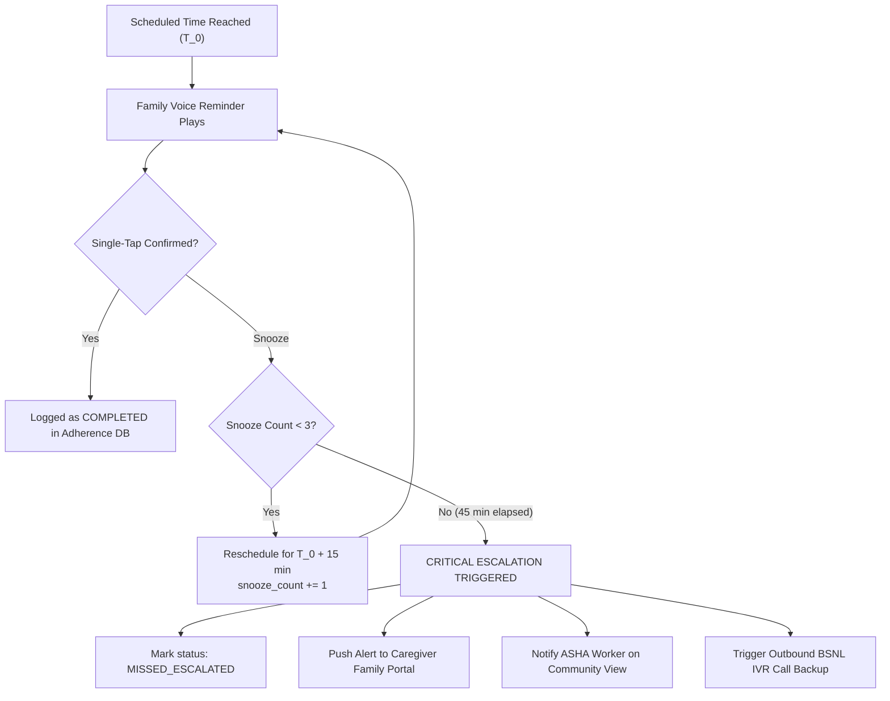

# Sub-Phase 10.1 Specification: Multi-Sensory Reminder Scheduler & Escalation Daemon

## 1. Executive Overview
Elderly individuals with Mild Cognitive Impairment (MCI) or early-to-moderate dementia frequently experience memory lapses regarding daily essential routines—specifically medication regimens, hydration schedules, and circadian activities. Generic smartphone alarms and text notifications fail because:
1. High-frequency digital buzzes induce panic, confusion, or agitation.
2. Text alerts are inaccessible due to age-related macular degeneration, cataracts, or illiteracy.
3. Alarms are dismissed without actual task completion.

Sub-Phase 10.1 establishes the core **Reminder Scheduler** engine for Smriti-NER. It provides a robust, clinically structured database schema, a resilient background scheduling daemon with a precise $\pm 30$-second trigger tolerance, and a calibrated 15-minute 3-step snooze and caregiver escalation safeguard.

---

## 2. Clinical Reminder Schema & Data Model

### 2.1 Schema Architecture
Each reminder entity is indexed by a unique identifier and patient pseudonym:

| Field | Type | Description |
|:---|:---|:---|
| `id` | `string` | Unique reminder UUID (e.g., `rem_med_01`) |
| `patient_id` | `string` | Patient pseudonym or ABHA token |
| `type` | `ReminderType` | `MEDICATION`, `HYDRATION`, `MEAL`, `COGNITIVE_SESSION`, `PRAYER_WALK` |
| `title` | `string` | Human-readable label (multilingual support) |
| `dosage` | `string` | Specific dose (e.g., "1 Tablet / ১টা বড়ি", "250ml Water") |
| `meal_relation` | `MealRelation` | `BEFORE_MEAL`, `AFTER_MEAL`, `WITH_MEAL`, `INDEPENDENT` |
| `scheduled_time` | `string` | 24-hour time string (`HH:mm`, e.g., `08:30`) |
| `scheduled_days` | `number[]` | Days of week active (`[0..6]`, 0=Sunday) |
| `recurrence` | `RecurrencePattern` | `DAILY`, `TWICE_DAILY`, `THRICE_DAILY`, `WEEKLY`, `CUSTOM_DAYS` |
| `voice_prompt_path` | `string` | Local audio asset URL / Blob reference |
| `voice_speaker_name` | `string` | Kinship member who recorded the prompt (e.g., "Priyanka") |
| `voice_speaker_relation` | `string` | Relationship (e.g., "Granddaughter / নাতিনী") |
| `cultural_icon` | `string` | Visual glyph (`traditional_mortar`, `brass_lota`, `prayer_beads`) |
| `snooze_count` | `number` | Counter tracking current consecutive snoozes (0 to 3) |
| `status` | `ReminderStatus` | `ACTIVE`, `PAUSED`, `SNOOZED`, `COMPLETED`, `MISSED_ESCALATED` |
| `created_at` | `string` | ISO 8601 creation timestamp |
| `updated_at` | `string` | ISO 8601 last update timestamp |

---

## 3. Background Scheduler Daemon & Trigger Window

### 3.1 Timing Window & Drift Tolerance
In low-power Android smartphones common in Northeast India (e.g., MediaTek Helio, battery-optimized Android Go), aggressive battery managers throttle background timers. The Smriti-NER Daemon operates with:
- **Periodic Tick Interval**: 15 seconds.
- **Trigger Tolerance Window**: $\pm 30$ seconds of scheduled time $T_{\text{sched}}$.
- **Drift Evaluation Metric**:
  $$|\Delta t| = |t_{\text{actual}} - t_{\text{sched}}| \le 30\,\text{seconds}$$
- **Duplicate Suppression**: Once fired for a specific date/slot, the event is marked `FIRED` in the local ledger so it cannot re-trigger during the remaining tolerance window.

### 3.2 Service Worker & WakeLock Integration
When running in PWA mode:
1. Registers `PeriodicSync` / `BackgroundSync` via Service Worker (`sw.js`).
2. Leverages `navigator.wakeLock` (Screen Wake Lock API) upon trigger to illuminate the display for the elder.
3. Falls back to native audio chime + vibration pattern (`[200, 100, 200, 100, 400]`) before family voice playback initiates.

---

## 4. Snooze & Escalation Safeguard Protocol

### 4.1 Snooze Mechanics
- **Interval**: Exactly 15 minutes per snooze:
  $$T_{\text{next\_trigger}} = T_{\text{current}} + 15\,\text{minutes}$$
- **Maximum Consecutive Snoozes**: 3 snoozes ($3 \times 15 = 45$ minutes total allowable delay).

### 4.2 Escalation Matrix

---

## 5. Verification & Test Plan

1. **Schema Validation**: Correct instantiation of medication, hydration, and cultural activity reminders with recurrence and voice kinship attribution.
2. **Scheduler Daemon Trigger**: Simulates ticks across timeline; verifies firing within $\pm 30$ seconds and prevents duplicate firing.
3. **Snooze Progression**: Asserts snooze 1, 2, and 3 compute exactly $T+15$, $T+30$, and $T+45$ minutes.
4. **Escalation Trigger**: Asserts 4th snooze or 45-min non-confirmation transitions status to `MISSED_ESCALATED` and emits critical caregiver alert packet.
