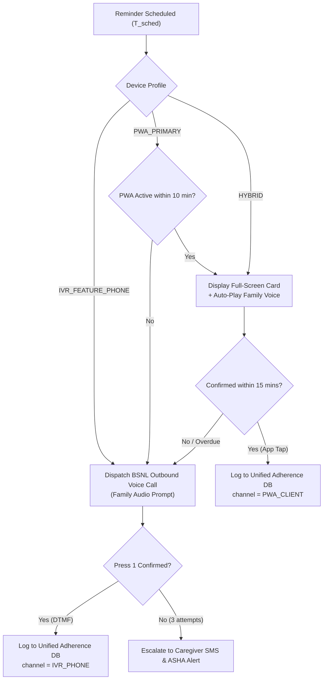

# Sub-Phase 10.4 Specification: Cross-Channel Reminder Unification & Milestone M10 Sign-Off

## 1. Executive Overview & Regional Imperative
Healthcare delivery across the eight states of Northeast India operates under stark infrastructural diversity. In urban centers like Guwahati, Shillong, or Imphal, elders or their resident caregivers frequently possess 4G/5G-enabled Android smartphones. In contrast, in upper Assam tea estates, remote Karbi Anglong hamlets, riverine char villages of Dhubri, and high-altitude frontier areas of Arunachal Pradesh, elders frequently rely on basic 2G feature phones (e.g. Nokia 105, JioPhone) or experience prolonged power outages.

Sub-Phase 10.4 introduces the **Cross-Channel Reminder Unification Engine**. By seamlessly bridging the smartphone PWA layer with the BSNL Toll-Free IVR telephony gateway (developed in Phase 8), Smriti-NER guarantees:
1. **Dynamic Channel Routing**: Intelligently routes reminders to the smartphone PWA (visual full-screen card + family voice playback) when online, or to an outbound automated voice call over standard cellular/PSTN networks when the smartphone is unreachable or in basic-phone households.
2. **Automated 15-Minute Failover Bridge**: If a smartphone reminder is ignored or snoozed past the 15-minute tolerance window without confirmation, the system automatically triggers an outbound IVR voice phone call as an urgent failover.
3. **Unified Adherence Ledger (Single Source of Truth)**: Merges app-tap confirmations (`"✓ মই খাইছো"`) and IVR keypress confirmations (`"Press 1 to confirm"`) into a deduplicated, cryptographic ledger preventing double-counting while providing unified visibility on caregiver, ASHA, and clinician dashboards.
4. **Milestone M10 Formal Certification**: Formally certifies the end-to-end operation of the multi-sensory reminder system meeting the $\pm 30$-second firing window, automated voice playback, and multi-channel offline synchronization.

---

## 2. Channel Preference & Dispatch Engine

### 2.1 Elder Persona Profiles
Each patient profile maintains a primary device affinity:
- `PWA_PRIMARY`: Elder or live-in caregiver uses the Smriti-NER PWA.
- `IVR_FEATURE_PHONE`: Elder uses a basic non-smart keypad phone; reminders delivered strictly via voice phone calls.
- `HYBRID_SMART_FAILOVER`: PWA card triggered first; if unconfirmed within 15 minutes, automatically escalates to phone call.

### 2.2 Decision Matrix

---

## 3. Unified Adherence Ledger & Deduplication

### 3.1 Composite Ledger Schema
| Field | Type | Description |
|:---|:---|:---|
| `entry_id` | `string` | Unique record UUID |
| `patient_id` | `string` | Patient pseudonym |
| `slot_key` | `string` | Unique deduplication key: `{patientId}_{reminderId}_{YYYY-MM-DD}_{HH:mm}` |
| `reminder_id` | `string` | Foreign key to scheduled reminder |
| `type` | `ReminderType` | `MEDICATION`, `HYDRATION`, `COGNITIVE_SESSION`, `MEAL` |
| `title` | `string` | Medication name or hydration task |
| `scheduled_time` | `string` | Scheduled time (`HH:mm`) |
| `confirmed_time` | `string` | Actual time of elder confirmation |
| `confirmation_channel` | `ChannelType` | `PWA_CLIENT` (touch) or `IVR_PHONE` (DTMF keypress 1) |
| `latency_minutes` | `number` | Time between scheduled slot and confirmation |
| `status` | `AdherenceStatus` | `COMPLETED`, `MISSED`, `ESCALATED` |
| `synced_to_cloud` | `boolean` | Flag indicating TimescaleDB upstream replication |

### 3.2 Deduplication Invariant
$$\forall \text{slot\_key}, \quad \text{Count}(\text{ActiveConfirmations}) \le 1$$
If both a PWA tap and an IVR keypress are recorded within the same 30-minute window, the first timestamp takes precedence and the second is logged as an idempotent confirmation duplicate.

---

## 4. Milestone M10 Verification Framework

Milestone M10 evaluates the end-to-end multi-sensory reminder loop:
1. **Firing Timing Window**: Timers fire within $\pm 30$ seconds of the scheduled time ($|\Delta t| \le 30$s).
2. **Voice Auto-Playback**: Family voice asset auto-triggers upon card display with waveform visualization.
3. **Cross-Channel Adherence Ledger**: Accurately merges PWA taps and IVR DTMF confirmations without duplicate records.
4. **Offline Persistence**: Logs remain durable in local IndexedDB storage during simulated network severance.
