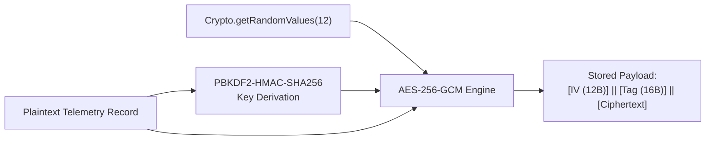

# Sub-Phase 11.1 Specification: Local-First Encrypted Persistence Layer

## 1. Executive Overview & Offline Realities
In remote districts of the Northeast Region (e.g. Majuli island river chars, Dima Hasao hill slopes, Mon in Nagaland), network connectivity is intermittent, erratic, or non-existent for weeks at a time during monsoon floods and power disruptions. Any platform relying on real-time server roundtrips will fail clinicians, ASHAs, and patients.

Sub-Phase 11.1 implements the **Local-First Encrypted Persistence Layer** of Smriti-NER, delivering:
1. **Local-First Database Architecture**: An offline-first embedded datastore (IndexedDB with SQLite abstraction for Capacitor hybrid builds) providing sub-millisecond local reads and writes for all cognitive gameplay telemetry, adherence events, and reminiscence media.
2. **At-Rest AES-256-GCM Hardware-Backed Encryption**: DISHA 2018 Section 29 statutory compliance requiring all protected health information (PHI) stored locally to be encrypted via AES-256-GCM with hardware-backed key derivation (Android Keystore / Web Crypto API SubtleCrypto).
3. **Version-Aware Schema Migration Engine**: A deterministic migration runner executing structured migrations across schema releases without data corruption or loss.
4. **Storage Quota & 180-Day Lifecycle Pruning Engine**: Active disk quota surveillance preventing browser eviction, paired with automated rolling archival of telemetry older than 180 days into compressed summary baselines.

---

## 2. Cryptographic Architecture: AES-256-GCM

### 2.1 Encryption Standard
- **Cipher**: Advanced Encryption Standard in Galois/Counter Mode (`AES-256-GCM`).
- **Key Length**: 256 bits (32 bytes derived from device master secret using PBKDF2 with HMAC-SHA-256 and 100,000 iterations).
- **Initialization Vector (IV)**: 96 bits (12 bytes) cryptographically random per record.
- **Authentication Tag**: 128 bits (16 bytes) providing authenticated integrity verification against tampering.

$$\text{Ciphertext} \,\|\, \text{Tag} = \text{AES-GCM-Encrypt}(K_{256}, \text{IV}_{96}, \text{Plaintext}, \text{AAD})$$

---

## 3. Schema & Version-Aware Migration Engine

### 3.1 Migration Ledger
| Version | Release Epoch | Migration Tasks |
|:---:|:---|:---|
| `v1` | Core Foundation | Initial tables: `patients`, `game_sessions`, `audio_assets` |
| `v2` | Cognitive AI | Added tables: `aacb_events`, `bkt_states`, `sundowning_logs` |
| `v3` | Unified Reminders | Added tables: `reminders`, `adherence_ledger`, `peer_wellness_records` |

### 3.2 Transactional Integrity
Migrations run inside atomic IndexedDB/SQLite transactions. If any step fails, the schema rolls back to the prior checkpoint, preventing partial state corruption.

---

## 4. Storage Quota Management & 180-Day Pruning Policy

### 4.1 Quota Surveillance
- Checks `navigator.storage.estimate()` upon app initialization.
- Thresholds:
  - **Healthy**: $< 60\%$ quota used.
  - **Warning**: $60\% - 79\%$ quota used (triggers silent telemetry compression).
  - **Critical Alert**: $\ge 80\%$ quota used (alerts user and executes immediate pruning).

### 4.2 180-Day Pruning & Summarization Rule
Telemetry records older than 180 days are:
1. Condensed into monthly summary statistics (average reaction time, accuracy, completion rate).
2. Raw high-frequency jitter/touch coordinate arrays are purged.
3. Longitudinal MMSE trajectory points and clinical intervention flags are permanently preserved.

---

## 5. Verification & Test Plan

1. **AES-256-GCM Roundtrip**: Verifies that encrypted payloads cannot be read as plaintext and decrypt with bitwise equality.
2. **Tamper Detection**: Asserts that modifying a single byte in ciphertext fails authentication tag verification.
3. **Migration Sequence**: Validates step-by-step migration from v1 to v3 with schema version verification.
4. **Quota Calculation & Pruning**: Asserts records older than 180 days are condensed while preserving summary metrics.
