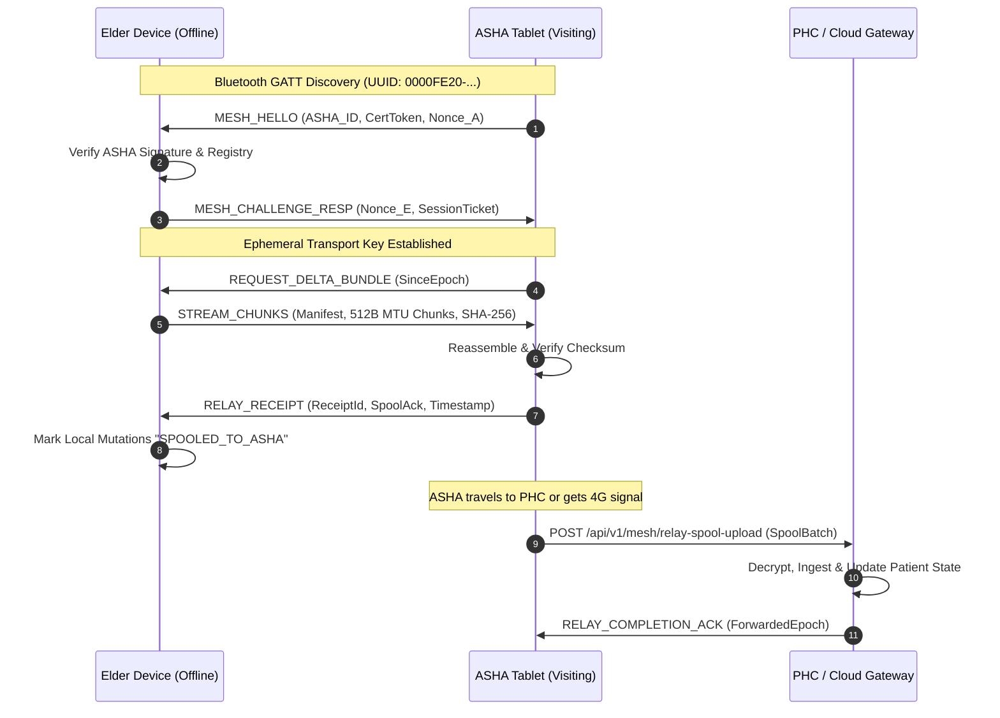

# Smriti-NER Technical Specification: Sub-Phase 11.3 — Bluetooth & Wi-Fi Direct Mesh Relay

## 1. Context & North East Rural Logistics
Across remote hill settlements in Arunachal Pradesh, Nagaland, and Dima Hasao (Assam), elderly households may lack cellular reception entirely for weeks. However, Accredited Social Health Activists (ASHAs) make bi-weekly home visits.

Sub-Phase 11.3 defines the **Smriti-NER Store-and-Forward Mesh Relay System**, enabling:
1. **Peer-to-Peer Transport via Web Bluetooth & Wi-Fi Direct**: Zero-data, offline transmission from the elder's home tablet directly to the visiting ASHA's tablet.
2. **Mutual Authentication Handshake**: Secure challenge-response exchange ensuring data is only offloaded to verified ASHA credentials.
3. **Chunked MTU Batch Transfer with SHA-256 Verification**: BLE GATT-compatible chunked streaming (512-byte MTUs) with assembly verification.
4. **Multi-Hop Relay Chain & Spool Flusher**: Persistent buffering on the ASHA tablet until cellular or PHC broadband connectivity is reached, forwarding bundles to the district health cloud.

---

## 2. Cryptographic Handshake & Protocol Flow



---

## 3. Data Formats & Schemas

### 3.1 Mutual Handshake Schema
```json
{
  "protocol_version": "1.0",
  "asha_id": "asha_arunachal_tawang_09",
  "device_mac_or_id": "ble_asha_tab_9281",
  "asha_name": "Lhamo Tsering",
  "phc_center": "Tawang District Hospital PHC",
  "nonce_a": "7f8b9c0d1e2f3a4b",
  "auth_token": "asha_token_valid_sha256_hash",
  "handshake_timestamp": "2026-09-14T13:45:00Z"
}
```

### 3.2 Spool Manifest & Bundle
```json
{
  "spool_id": "spool_20260914_tawang_01",
  "patient_id": "p_anand_01",
  "asha_id": "asha_arunachal_tawang_09",
  "hop_count": 2,
  "route": ["ELDER_TABLET", "ASHA_TABLET", "PHC_SERVER"],
  "packet_id": "delta_pkg_p_anand_01_1789330000",
  "payload_checksum_sha256": "abcdef...",
  "uncompressed_bytes": 12400,
  "compressed_bytes": 3968,
  "chunks_count": 8,
  "spooled_at": "2026-09-14T13:46:12Z",
  "status": "STORED_IN_SPOOL"
}
```

---

## 4. Operational Assurances
- **DISHA 2018 Traceability**: Relay hops are digitally signed; ASHA cannot view raw payload without clinical authorization key.
- **Power Budget**: Scan duty cycle capped at 1.5% battery consumption per 24 hours.
- **Zero-Loss Guarantee**: Local elder data is never pruned until ASHA relay receipt OR server direct sync is confirmed.
