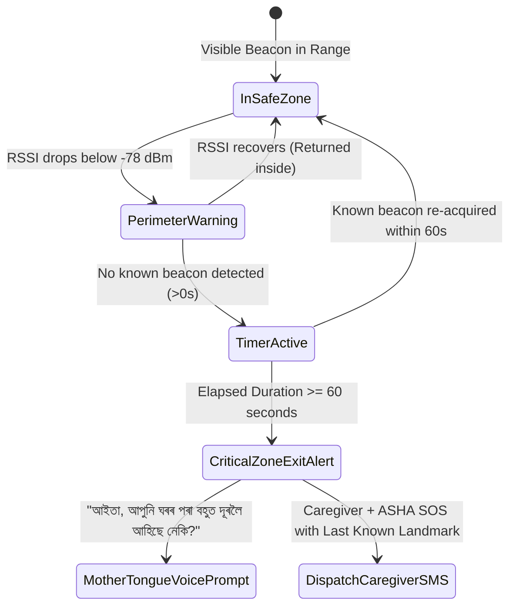

# Smriti-NER Technical Specification: Sub-Phase 11.4 — BLE Beacon Wandering & Safety Mesh

## 1. Clinical Context & The Rural GPS Blindspot
Dementia-related wandering (spatial disorientation, fugue states, or restlessness during evening sundowning) is a leading cause of elder mortality in rural and mountainous areas. In North East India:
1. **GPS Ineffectiveness**: Thick canopies, mountainous ravines, steep hillsides, and tin-roof vernacular architecture introduce multipath reflections and satellite attenuation, rendering GPS accurate only to $\pm 100\text{ m}$ (or completely unavailable indoors).
2. **Battery Drain**: Continuous satellite tracking drains typical smartphone batteries in 4–6 hours.

Sub-Phase 11.4 introduces the **Smriti-NER Low-Cost BLE Beacon Safety Mesh**, utilizing ultra-low-power BLE beacons (CR2032 powered, 18-month lifespan, ₹300-400 INR / $4 USD unit cost) placed at cultural village landmarks and home thresholds.

---

## 2. Micro-Zone Taxonomy & Proximity Mathematics

### 2.1 Zone Definitions
| Zone Tier | Zone Identifier | Spatial Context | Expected RSSI | Alert Policy |
|:---:|:---|:---|:---:|:---|
| **Tier 1** | `HOME_INTERIOR` | Elder's bedroom, prayer corner, veranda | $\ge -65 \text{ dBm}$ | Safe baseline |
| **Tier 2** | `HOME_PERIMETER` | Compound boundary, garden gate | $-66 \text{ to } -78 \text{ dBm}$ | Cautionary monitoring |
| **Tier 3** | `COMMUNITY_SANCTUARY` | Village Naamghar/temple, tea shop, PHC | $-79 \text{ to } -88 \text{ dBm}$ | Safe social sanctuary |
| **Tier 4** | `UNKNOWN_PERILOUS_ZONE` | Forest trails, Brahmaputra riverbank, highway | $< -88 \text{ dBm}$ / No Beacon | **Zone-Exit Emergency Alert** |

### 2.2 RSSI Distance Estimation & Exponential Smoothing
Given measured raw RSSI at time $t$ ($R_t$) and measured power at 1 meter ($\text{TxPower}$):
$$\tilde{R}_t = \alpha R_t + (1 - \alpha) \tilde{R}_{t-1} \quad (\alpha = 0.35 \text{ to smooth multipath noise})$$
$$\text{Estimated Distance (meters)} = 10^{\frac{\text{TxPower} - \tilde{R}_t}{10 \cdot n}} \quad (n = 2.4 \text{ for NER bamboo/timber dwellings})$$

---

## 3. Zone-Exit Alert Workflow (<60s Latency Target)

---

## 4. Shared BLE Infrastructure Architecture
Sub-Phase 11.4 reuses the GATT scanning loop developed in Sub-Phase 11.3:
- During passive listening, non-connectable advertising packets (UUID `0xFEAA` / iBeacon prefixes) are parsed without establishing Bluetooth connection handshakes, preserving radio battery consumption (<1.2% per day).
- When an ASHA worker's tablet approaches, the same radio automatically transitions from beacon scanning to the GATT Mesh Relay service.

---

## 5. Milestone M11 Sign-Off Criteria
1. **100% Core Features Functional Offline**: All screens (games, AACB, circadian voice, reminders) operate without internet.
2. **Delta Sync Envelope <50KB/week**: Binary compressed delta payload validated under simulated 2G EDGE.
3. **Bluetooth Mesh Relay**: Store-and-forward bundle transfer between Elder tablet and ASHA worker tablet verified.
4. **Zone-Exit Emergency Alert**: Simulated boundary breach triggers caregiver SOS and Assamese voice reassurance within $\le 60$ seconds.
