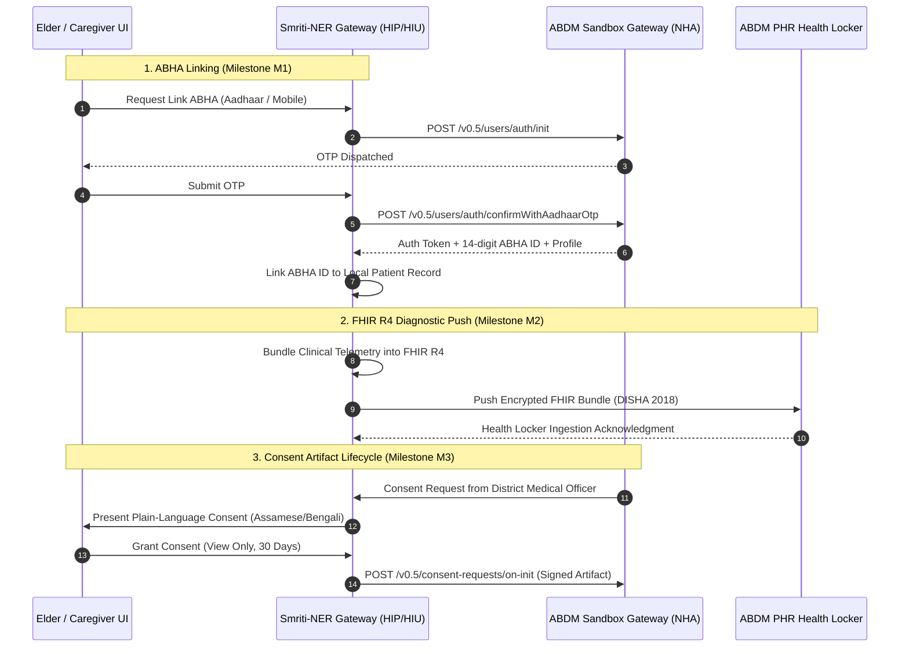

# Smriti-NER Technical Specification: Sub-Phase 12.1 — ABDM / ABHA Integration

## 1. Executive Summary & National Digital Health Architecture
The Ayushman Bharat Digital Mission (ABDM), governed by the National Health Authority (NHA) of India, establishes the federated digital infrastructure for health records across public and private healthcare tiers. 

Sub-Phase 12.1 establishes **Smriti-NER as an accredited ABDM Health Information Provider (HIP) and Health Information User (HIU)**, delivering:
1. **ABHA ID Linking & M1 Verification**: 14-digit Ayushman Bharat Health Account verification and `@abdm` PHR address resolution via OTP authentication.
2. **FHIR R4 Health Record Generation**: Autonomous transformation of local cognitive telemetry, BKT mastery states, and medication adherence ledgers into HL7 FHIR R4 standard bundles (`Patient`, `Observation`, `DiagnosticReport`).
3. **Electronic Consent Management (M2/M3)**: ABDM-standard digital consent artifact lifecycle (`REQUESTED`, `GRANTED`, `REVOKED`, `EXPIRED`), ensuring patient-centric ownership and DISHA 2018 compliance.

---

## 2. ABDM Interoperability Architecture



---

## 3. Data Schemas & Signatures

### 3.1 ABHA Linking Record Schema
```json
{
  "patient_id": "p_anand_01",
  "abha_number": "91-4821-9034-1289",
  "abha_address": "anand.baruah@abdm",
  "name": "Anand Baruah",
  "gender": "M",
  "date_of_birth": "1954-04-12",
  "district": "Kamrup Metropolitan",
  "state": "Assam",
  "mobile_masked": "XXXXXX4912",
  "verification_status": "VERIFIED_AADHAAR_OTP",
  "linked_at": "2026-09-14T13:50:00Z"
}
```

### 3.2 FHIR R4 Bundle Structure (HL7 Standard)
```json
{
  "resourceType": "Bundle",
  "id": "bundle_smriti_diag_20260914",
  "type": "document",
  "timestamp": "2026-09-14T13:51:00Z",
  "entry": [
    {
      "resource": {
        "resourceType": "Patient",
        "id": "patient_anand",
        "identifier": [
          { "system": "https://healthid.abdm.gov.in", "value": "91-4821-9034-1289" }
        ],
        "name": [{ "text": "Anand Baruah" }],
        "gender": "male",
        "birthDate": "1954-04-12"
      }
    },
    {
      "resource": {
        "resourceType": "Observation",
        "id": "obs_mmse_proxy",
        "status": "final",
        "code": {
          "coding": [{ "system": "http://loinc.org", "code": "72106-8", "display": "Total score MMSE" }]
        },
        "subject": { "reference": "Patient/patient_anand" },
        "valueQuantity": { "value": 23.4, "unit": "points", "system": "http://unitsofmeasure.org" }
      }
    },
    {
      "resource": {
        "resourceType": "DiagnosticReport",
        "id": "diag_smriti_summary",
        "status": "final",
        "code": {
          "coding": [{ "system": "http://snomed.info/sct", "code": "371530004", "display": "Clinical consultation report" }]
        },
        "subject": { "reference": "Patient/patient_anand" },
        "result": [{ "reference": "Observation/obs_mmse_proxy" }],
        "conclusion": "Mild Cognitive Impairment (MCI) stable. 93.4% medication adherence."
      }
    }
  ]
}
```

### 3.3 Consent Artifact Schema
```json
{
  "consent_id": "consent_art_84920",
  "patient_abha_id": "91-4821-9034-1289",
  "requester_name": "Dr. Hemanta Phukan, MD",
  "requester_organization": "Guwahati Medical College & Hospital (GMCH)",
  "purpose": "CLINICAL_CONSULTATION",
  "hi_types": ["DiagnosticReport", "Observation"],
  "permission": {
    "access_mode": "VIEW",
    "date_range": { "from": "2026-08-01", "to": "2026-09-14" },
    "data_erase_at": "2026-10-14T00:00:00Z"
  },
  "status": "GRANTED",
  "granted_at": "2026-09-14T13:52:00Z"
}
```

---

## 4. Verification & Sandboxing Requirements
1. **ABHA Verification Mock**: Validates 14-digit format, OTP generation, validation, and token issuance.
2. **FHIR R4 Schema Validator**: Validates HL7 resource types (`Bundle`, `Patient`, `Observation`, `DiagnosticReport`), LOINC and SNOMED codes.
3. **Consent Artifact Flow**: Tests grant, active verification, and instant revocation lifecycle.
