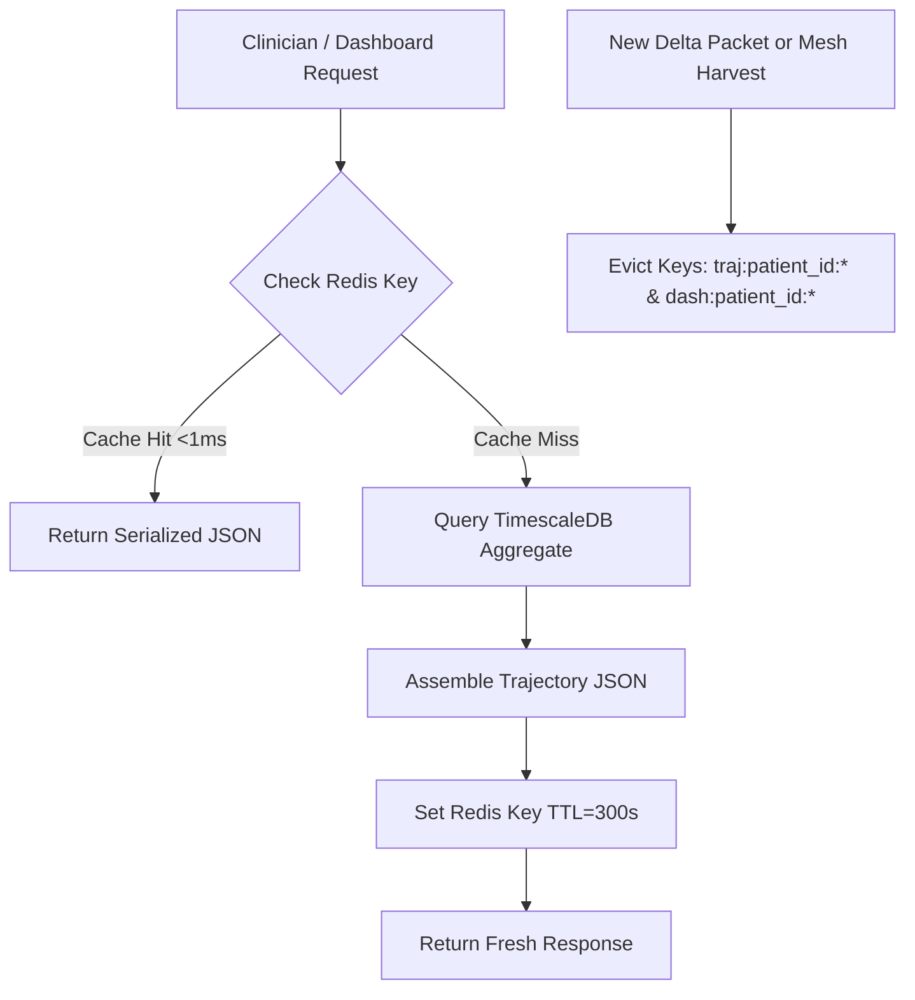

# Smriti-NER Technical Specification: Sub-Phase 12.2 — Backend API Development

## 1. Executive Summary & Enterprise Architecture
Sub-Phase 12.2 delivers the **Production-Grade Backend Architecture** powering Smriti-NER across the North Eastern Region. Designed for high resilience under intermittent rural connectivity, this layer unites:
1. **Consolidated High-Performance FastAPI Gateway**: Standardized REST endpoints supporting delta sync ingestion, longitudinal cognitive trajectories, kinship voice uploads, mesh harvesting, Bhashini streaming TTS, and IVR bridge check-ins.
2. **TimescaleDB Clinical Time-Series Hypertables**: PostgreSQL with TimescaleDB extensions partitioning high-frequency cognitive game telemetry, circadian sundowning logs, and medication adherence records by time chunks with automated zstandard compression policies.
3. **Redis Multi-Tier Caching Layer**: In-memory caching with sub-millisecond retrieval of pre-aggregated patient MMSE trajectories and clinical dashboards, with automated cache eviction upon delta sync triggers.
4. **Celery Distributed Asynchronous Task Pipeline**: Decoupled background processing for computationally intensive MMSE proxy estimation, circadian anomaly clustering, and weekly adherence rollup alerts.
5. **Role-Based Access Control (RBAC) & Rate Limiting Middleware**: Cryptographic JWT validation with strict role boundaries (`PATIENT`, `CAREGIVER`, `ASHA`, `CLINICIAN`, `DMO`) and token-bucket sliding-window rate limiting.

---

## 2. TimescaleDB Time-Series Data Architecture

```sql
-- Hypertable 1: Continuous Cognitive Game Telemetry
CREATE TABLE IF NOT EXISTS patient_cognitive_telemetry (
    time TIMESTAMPTZ NOT NULL,
    patient_id VARCHAR(64) NOT NULL,
    game_id VARCHAR(64) NOT NULL,
    reaction_time_ms INTEGER NOT NULL,
    accuracy_score NUMERIC(5, 4) NOT NULL,
    bkt_p_know NUMERIC(5, 4) NOT NULL,
    mmse_proxy_point NUMERIC(4, 2) NOT NULL,
    device_id VARCHAR(64)
);
SELECT create_hypertable('patient_cognitive_telemetry', 'time', chunk_time_interval => INTERVAL '1 day');
ALTER TABLE patient_cognitive_telemetry SET (
    timescaledb.compress,
    timescaledb.compress_segmentby = 'patient_id'
);
SELECT add_compression_policy('patient_cognitive_telemetry', INTERVAL '14 days');

-- Hypertable 2: Medication & Circadian Adherence Events
CREATE TABLE IF NOT EXISTS patient_adherence_events (
    time TIMESTAMPTZ NOT NULL,
    patient_id VARCHAR(64) NOT NULL,
    reminder_id VARCHAR(64) NOT NULL,
    scheduled_time VARCHAR(8) NOT NULL,
    channel VARCHAR(32) NOT NULL, -- PWA_CLIENT, IVR_PHONE, ASHA_VERIFIED
    status VARCHAR(32) NOT NULL,  -- COMPLETED, SNOOZED, ESCALATED
    latency_minutes INTEGER DEFAULT 0
);
SELECT create_hypertable('patient_adherence_events', 'time', chunk_time_interval => INTERVAL '7 days');
```

---

## 3. Redis Caching & Cache Invalidation Policy



---

## 4. Celery Worker Task Pipeline
1. `tasks.compute_mmse_proxy_batch(patient_id)`: Recomputes longitudinal 30-day Kalman smoothed score upon ingestion of $\ge 3$ new game sessions.
2. `tasks.detect_sundowning_anomalies_batch()`: Runs hourly between 16:00 and 20:00 (sunset twilight window in NER) to detect restlessness and voice jitter anomalies.
3. `tasks.compute_adherence_trend_batch()`: Midnight cron calculating 7-day and 30-day rolling compliance percentages; triggers ASHA task if adherence drops $<70\%$.

---

## 5. Security, RBAC & Rate Limiting Specifications
- **JWT Secret**: HMAC-SHA256 with 256-bit entropy.
- **Roles Matrix**:
  - `PATIENT`: Access own games, reminders, profile.
  - `CAREGIVER`: Access assigned elder's adherence, wandering alerts, wellness tools.
  - `ASHA`: Access assigned village cluster, mesh spool upload, visit check-in.
  - `CLINICIAN`: Full clinical trajectory, MMSE proxy drill-down, e-Sanjeevani referrals.
- **Rate Limits**:
  - Auth / Token endpoint: 5 req/min
  - TTS / Voice upload: 10 req/min
  - Delta sync / Harvest: 30 req/min
  - General read endpoints: 120 req/min
