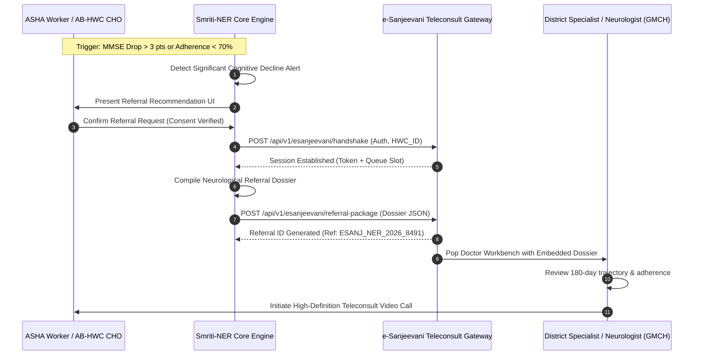

# Smriti-NER Technical Specification: Sub-Phase 12.3 — e-Sanjeevani Teleconsultation Bridge

## 1. Executive Summary & National Tele-Neurology Architecture
Under the National Programme for Health Care of the Elderly (NPHCE) and the Ayushman Bharat Digital Mission, geriatric cognitive disorders require timely access to specialist care. However, across North East India, tertiary neurologists are predominantly concentrated at regional centers such as Guwahati Medical College (GMCH) and NEIGRIHMS (Shillong). 

Sub-Phase 12.3 introduces the **Smriti-NER e-Sanjeevani Teleconsultation Bridge**, connecting grassroots ASHA workers and elders at Health and Wellness Centres (AB-HWCs) with tertiary neurologists via India's national teleconsultation system:
1. **e-Sanjeevani API Handshake Protocol**: Secure authentication and session handshake linking local patient ABHA accounts to e-Sanjeevani HWC doctor queues.
2. **Automated Neurological Referral Dossier**: Comprehensive, pre-packaged clinical dossiers auto-compiling longitudinal MMSE trajectories, domain subscores, cross-channel adherence ledgers, and sundowning behavior patterns upon clinician triage triggers.

---

## 2. Teleconsultation Escalation Workflow



---

## 3. Data Schemas & Signatures

### 3.1 e-Sanjeevani Handshake Schema
```json
{
  "hwc_center_code": "AS_KAM_HWC_1042",
  "hwc_name": "Sonapur Ayushman Bharat HWC",
  "district": "Kamrup Metropolitan",
  "state": "Assam",
  "cho_or_asha_id": "asha_anita_01",
  "auth_secret": "esanj_sec_token_valid_2026",
  "timestamp": "2026-09-14T14:10:00Z"
}
```

### 3.2 Neurological Referral Dossier Schema
```json
{
  "referral_id": "esanj_ref_20260914_p_anand_01",
  "patient_id": "p_anand_01",
  "abha_number": "91-4821-9034-1289",
  "patient_name": "Anand Baruah",
  "age": 72,
  "gender": "M",
  "referral_urgency": "HIGH_PRIORITY",
  "trigger_reason": "CRITICAL_MMSE_DROP_OVER_3_POINTS",
  "clinical_summary": {
    "baseline_mmse": 24.0,
    "current_mmse_proxy": 20.8,
    "delta_points": -3.2,
    "adherence_30d_pct": 74.2,
    "domain_subscores": {
      "orientation": 7.0,
      "memory_recall": 2.5,
      "executive_clock_drawing": 2.0,
      "language_comprehension": 8.0
    },
    "sundowning_episodes_last_14d": 5,
    "last_sundowning_peak": "17:45 IST"
  },
  "suggested_questions_for_specialist": [
    "Evaluate for transition from amnestic MCI to early Alzheimer's disease.",
    "Review donepezil dosage adherence and morning anti-hypertensive timing.",
    "Recommend B12 and Thyroid re-screening at District Hospital."
  ],
  "compiled_at": "2026-09-14T14:11:00Z",
  "status": "QUEUED_FOR_SPECIALIST"
}
```

---

## 4. Operational & Compliance Standards
- **AB-HWC e-Sanjeevani Guideline Alignment**: Fully compatible with MoHFW guidelines for Community Health Officers (CHOs) referring rural patients to Specialist Doctors at Medical College Hubs.
- **Data Encapsulation**: Dossiers transmitted with AES-256 TLS payload encryption; ABHA credentials verified prior to dispatch.
