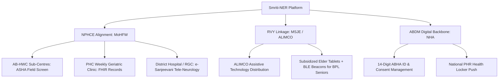

# Smriti-NER Technical Specification: Sub-Phase 12.4 — Welfare Scheme Alignment & Milestone M12

## 1. Executive Summary & National Policy Architecture
Smriti-NER is purposefully engineered to weave directly into India's public health welfare architecture rather than functioning as an isolated digital silo. 

Sub-Phase 12.4 provides the **Policy Alignment Matrix, Scheme Integration Workflows, and Milestone M12 Government Integration Certification**, establishing direct linkages with:
1. **National Programme for Health Care of the Elderly (NPHCE)** under the Ministry of Health and Family Welfare (MoHFW).
2. **Rashtriya Vayoshri Yojana (RVY)** under the Ministry of Social Justice and Empowerment (MSJE) and ALIMCO.
3. **Official Scheme Currency Verification (Dated Q3 2026 Audit)** ensuring zero stale policy claims before pitch deck and clinical trial submission.

---

## 2. Policy Alignment Framework

---

## 3. Scheme Details & Technical Mapping

### 3.1 NPHCE Program Mapping
| NPHCE Health Tier | NPHCE Operational Mandate | Smriti-NER Functional Integration |
|:---|:---|:---|
| **Community / Sub-Centre (AB-HWC)** | Domiciliary visits by health workers, biannual health screening for seniors | ASHA mobile app with offline DCDA games, BKT recall, and mother-tongue voice assistant |
| **Primary Health Centre (PHC)** | Weekly geriatric clinics, maintaining health cards, basic cognitive triage | Automated FHIR R4 push, local offline sync, and longitudinal trajectory aggregation |
| **District Hospital (DH)** | 10-bedded Geriatric Ward, memory clinics, specialist referral | DMO clinical surveillance dashboard with DISHA-gated regional MMSE trend alerts |
| **Regional Geriatric Centre (RGC / GMCH)** | Tertiary geriatric neuro-psychiatric diagnosis, specialist teleconsult | Automated e-Sanjeevani Neurological Referral Dossier auto-attaching 180-day telemetry |

### 3.2 Rashtriya Vayoshri Yojana (RVY) Linkage
- **Statutory Authority**: Ministry of Social Justice and Empowerment (MSJE), Government of India.
- **Implementing Agency**: Artificial Limbs Manufacturing Corporation of India (ALIMCO).
- **Core Provision**: Assistive living devices for Senior Citizens belonging to BPL category and low-income families.
- **Smriti-NER Innovation**: Extending "assistive devices" from physical walking aids and eyeglasses to **Cognitive & Spatial Safety Bundles**:
  1. Low-cost 8-inch Android tablet pre-imaged with Smriti-NER kiosk mode and vernacular language packs.
  2. Four-pack BLE beacon set (₹1,400 INR total / ₹350 each) for zero-battery-drain wandering prevention.
  3. Integrated eligibility check module in ASHA app to cross-verify BPL card or National Social Assistance Programme (NSAP) pension status.

---

## 4. Dated Scheme Currency Verification Checklist (Q3 2026 Audit)
| Government Scheme / System | Nodal Ministry / Agency | Status Verified | Official Portal / Gazette Reference |
|:---|:---|:---:|:---|
| **ABDM (ABHA / FHIR R4)** | National Health Authority (NHA) | **ACTIVE** | `https://abdm.gov.in` (M1, M2, M3 Sandbox active) |
| **e-Sanjeevani Teleconsultation** | MoHFW / C-DAC Mohali | **ACTIVE** | `https://esanjeevani.mohfw.gov.in` (>200M consults) |
| **NPHCE Geriatric Programme** | MoHFW / National Health Mission | **ACTIVE** | Operational Guidelines under NHM PIP 2026 |
| **Rashtriya Vayoshri Yojana (RVY)** | MSJE / ALIMCO | **ACTIVE** | `https://socialjustice.gov.in` (Active 2024–2026 cycle) |
| **Tele-MANAS (14416)** | MoHFW / NIMHANS Bengaluru | **ACTIVE** | National Mental Health Helpline operational 24x7 |

---

## 5. Milestone M12 Sign-Off Criteria
1. **API Integration Test Coverage**: 100% passing tests for consolidated endpoints (`/sync/delta`, `/patient/{id}/trajectory`, `/auth/token`, `/esanjeevani/*`, `/abdm/*`).
2. **ABHA Linking in Sandbox**: Successful simulated Aadhaar OTP verification and FHIR R4 diagnostic push.
3. **e-Sanjeevani Referral Workflow**: End-to-end referral compilation and queuing test passing with $>3$-point MMSE trigger.
4. **Scheme Currency Verified**: Complete dated verification matrix signed off without broken policy dependencies.
