# Smriti-NER Technical Specification: Sub-Phase 13.1 — Functional Testing Suite

## 1. Executive Summary & Verification Methodology
Before deployment to rural Community Health Centres and district memory clinics, Smriti-NER must undergo rigorous clinical and technical verification. 

Sub-Phase 13.1 establishes the **Comprehensive Functional Verification Engine**, delivering:
1. **Multi-Module Unit Test Coverage (≥90% Target)**: Automated verification across all clinical cognitive engines (DCDA, BKT, circadian sundowning, MMSE proxy, delta sync, IVR bridge).
2. **End-to-End Clinical Integration Flow**: Complete closed-loop validation linking game tap inputs $\to$ telemetry filtering $\to$ BKT probabilistic knowledge tracing $\to$ Kalman MMSE proxy projection $\to$ clinical dashboard rendering.
3. **Cross-Device Hardware Matrix**: Formal compatibility profiling across budget Android Go devices (2GB RAM), mid-range field tablets (ASHA tablets), and iOS/iPadOS browsers, verifying 48dp–60dp touch target compliance and Eastern Nagari font rendering.
4. **30-Day Simulated Offline Resilience Audit**: Soak testing confirming zero data loss under prolonged connectivity blackout, with persistent local buffering, automatic storage compaction, and seamless delta batch reconciliation.

---

## 2. End-to-End Clinical Integration Flow

```mermaid
graph LR
    subgraph Client [Elder Client / ASHA App]
        GamePlay[1. DCDA Cognitive Game Session] --> TelemetryEvent[2. Micro-Interaction Telemetry: Reaction Time & Jitter]
        TelemetryEvent --> BktEngine[3. Bayesian Knowledge Tracing Engine]
        BktEngine --> LocalStore[(4. AES-256-GCM Encrypted Local Store)]
    end

    subgraph Sync [Delta & Mesh Relay Layer]
        LocalStore --> DeltaPack[5. Serialized Delta Packet <50KB/week]
        DeltaPack --> ServerSync[6. Gateway Ingestion: POST /sync/delta]
    end

    subgraph Server [FastAPI & Analytics Engine]
        ServerSync --> MmseProxy[7. Kalman Filter MMSE Proxy Recomputation]
        MmseProxy --> RedisCache[(8. Redis Trajectory Cache Update)]
        RedisCache --> DmoDashboard[9. Clinician / DMO Surveillance Dashboard]
    end
```

---

## 3. Cross-Device Matrix & Hardware Tiers

| Tier & Target Hardware | Screen Resolution | RAM / CPU | OS / Browser | Touch Target Standard | Nagari Font Rendering |
|:---|:---:|:---:|:---|:---:|:---:|
| **Tier 1: Budget Entry (JioPhone / Redmi 9A)** | 720 x 1600 (20:9) | 2GB / Helio G25 | Android 10 Go (Chrome) | $\ge 60 \text{ dp}$ | Assamese Unicode Verified |
| **Tier 2: ASHA Field Tablet (Galaxy Tab A9)** | 800 x 1340 | 4GB / Helio G99 | Android 13 (PWA Standalone) | $\ge 56 \text{ dp}$ | Assamese / Bengali Verified |
| **Tier 3: Elder Home Tablet (Lenovo Tab M8)** | 800 x 1280 | 3GB / MediaTek | Android 12 (Kiosk Mode) | $\ge 64 \text{ dp}$ | Assamese Unicode Verified |
| **Tier 4: Clinician iPad (iPad 10.2 / Air)** | 1620 x 2160 | 4GB / Apple A13+ | iPadOS 17+ (Safari WebKit) | $\ge 48 \text{ dp}$ | Full Desktop Scalability |

---

## 4. 30-Day Offline Soak Simulation Architecture
- **Simulated Duration**: 30 consecutive simulated days (720 hours).
- **Simulated Activity**:
  - 2 daily cognitive game sessions (60 total sessions).
  - 3 daily medication/hydration reminders (90 adherence events).
  - 1 weekly grandchild audio message playback.
  - 1 daily circadian sundowning evening check-in.
- **Verification Gates**:
  1. Zero unhandled database exceptions during offline operation.
  2. Local storage consumption $\le 18.5 \text{ MB}$ (well within 50MB quota).
  3. Single-batch delta upload package on Day 30 resolves with 0 packet drops and $<150 \text{ KB}$ total transfer.
