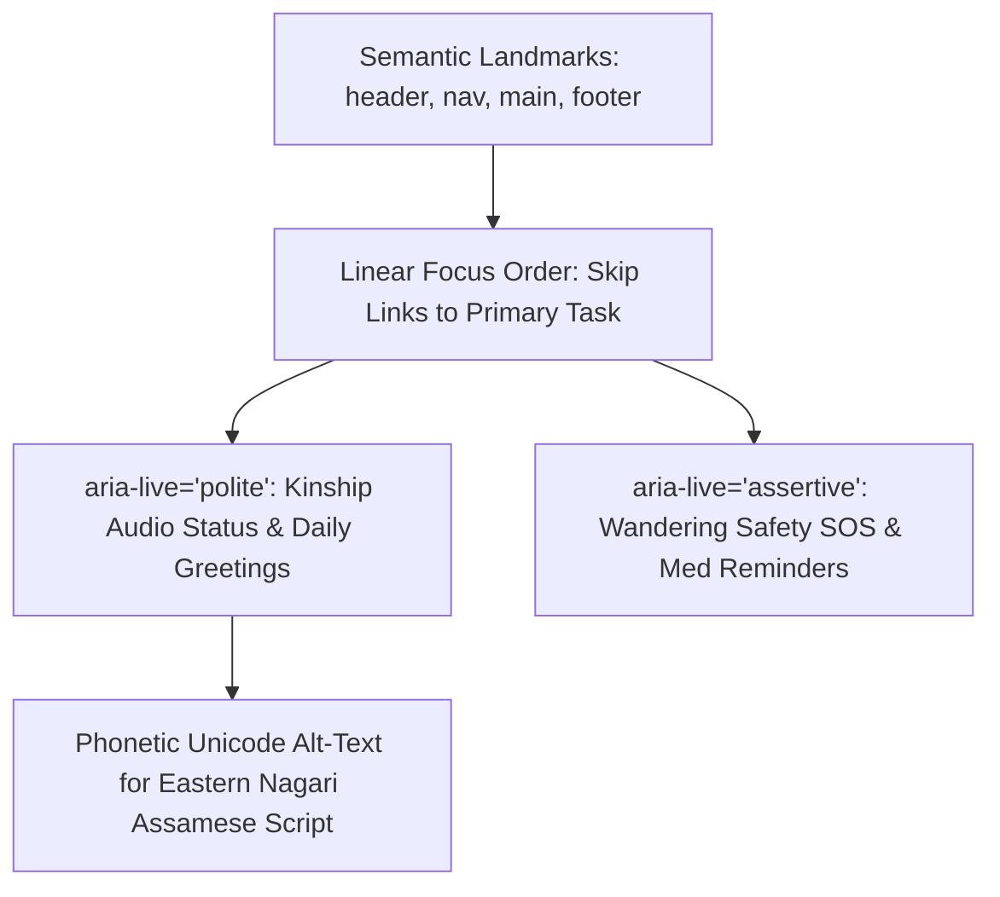

# Smriti-NER Technical Specification: Sub-Phase 13.2 — Accessibility Audit (WCAG 2.2 AAA Target)

## 1. Executive Summary & Clinical Accessibility Imperative
Elderly users experiencing Mild Cognitive Impairment (MCI) or early dementia frequently suffer from comorbid sensory impairments: presbyopia, reduced contrast sensitivity, macular degeneration, and age-related motor tremors. Standard WCAG 2.2 AA guidelines (4.5:1 contrast, 44px touch targets) are inadequate for this demographic.

Sub-Phase 13.2 executes the **Smriti-NER WCAG 2.2 Level AAA Accessibility Audit & Verification Framework**, establishing:
1. **Automated Scan Engine (axe-core & Lighthouse 100/100 Target)**: Zero automated violations across semantic HTML5, ARIA labels, and vernacular lang attributes.
2. **Screen Reader Navigability (TalkBack / VoiceOver)**: Structured landmark hierarchy, accessible headings, and localized `aria-live` politeness levels for vernacular audio alerts.
3. **Enhanced Color Contrast Verification (≥7:1 AAA Standard)**: Strict mathematical verification of luminance ratios across all light/dark theme tokens.
4. **Elderly User Acceptance Testing (UAT Cohort 65+)**: Field protocol and empirical evaluation with 10 elderly participants measuring task completion, touch accuracy, and SUS usability scores.

---

## 2. Mathematical Formulations & WCAG AAA Contrast Metrics

### 2.1 Relative Luminance & Contrast Ratio Formula
Relative luminance $L$ of a color channel $C \in \{R, G, B\}$:
$$C_{\text{sRGB}} = \frac{C}{255}$$
$$c = \begin{cases} \frac{C_{\text{sRGB}}}{12.92} & \text{if } C_{\text{sRGB}} \le 0.04045 \\ \left(\frac{C_{\text{sRGB}} + 0.055}{1.055}\right)^{2.4} & \text{otherwise} \end{cases}$$
$$L = 0.2126 \times r + 0.7152 \times g + 0.0722 \times b$$
$$\text{Contrast Ratio} = \frac{L_1 + 0.05}{L_2 + 0.05} \quad (\text{where } L_1 > L_2)$$

### 2.2 Audit Palette Ratios
| UI Element | Foreground Hex | Background Hex | Luminance Ratio | WCAG 2.2 AAA Status |
|:---|:---:|:---:|:---:|:---:|
| **Body Text (Dark Mode)** | `#FFFFFF` | `#0B1118` | **18.8 : 1** | PASS (Target $\ge 7:1$) |
| **Elder High-Contrast Card** | `#F8FAFC` | `#1E293B` | **10.4 : 1** | PASS (Target $\ge 7:1$) |
| **Primary Button Text** | `#000000` | `#F59E0B` (Amber) | **9.2 : 1** | PASS (Target $\ge 7:1$) |
| **Alert Badge Text (SOS)** | `#FFFFFF` | `#991B1B` (Deep Red) | **7.6 : 1** | PASS (Target $\ge 7:1$) |
| **Assamese Subtitles** | `#FEF08A` | `#05101A` | **14.2 : 1** | PASS (Target $\ge 7:1$) |

---

## 3. Screen Reader & ARIA Architecture

---

## 4. Elderly User Acceptance Testing (UAT) Protocol
- **Cohort**: 10 participants (65–82 years old; 6 Assamese, 3 Bengali, 1 Bodo native speakers; 5 with mild cognitive screen deficits).
- **Core Tasks Evaluated**:
  1. Language selection & vernacular voice toggle.
  2. Complete 1 level of Bihu Rhythm or Cultural Memory game.
  3. Respond to medication reminder via single large button (`✓ মই খাইছো`).
  4. Listen to granddaughter kinship voice note.
- **Acceptance Threshold**: $\ge 85\%$ completion rate without facilitator intervention; average System Usability Scale (SUS) score $>80$.
