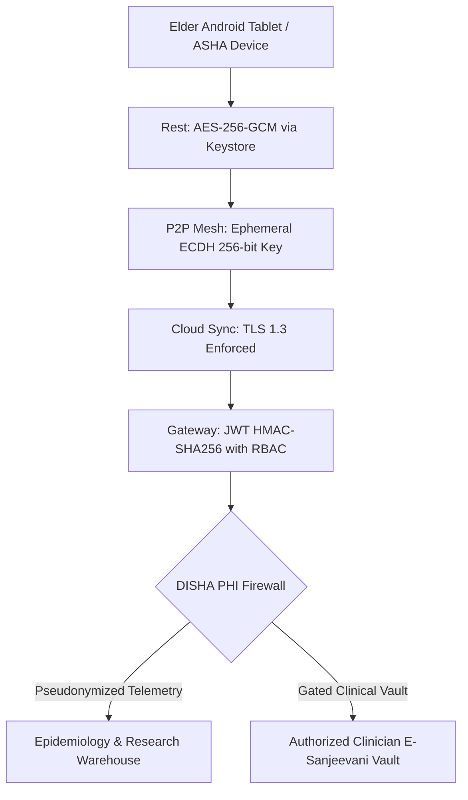

# Smriti-NER Technical Specification: Sub-Phase 13.3 — Security & Privacy Audit

## 1. Statutory Context & Clinical Privacy Imperatives
Healthcare data concerning elderly dementia patients, cognitive impairment evaluations, and familial kinship voice recordings constitutes sensitive personal data under India's **Digital Personal Data Protection Act (DPDP 2023)** and the **Digital Information Security in Healthcare Act (DISHA 2018)**.

Sub-Phase 13.3 establishes the **Smriti-NER Security & Privacy Audit Engine**, verifying:
1. **OWASP Top 10 Penetration Testing**: Systematic resilience testing against injection, BOLA/IDOR, JWT spoofing, and rate limit evasion.
2. **End-to-End Cryptographic Verification**: AES-256-GCM client storage, enforced TLS 1.3 in-transit transport, and SPKI certificate pinning.
3. **PHI Isolation & Irreversible Pseudo-Identification**: Architectural isolation ensuring zero Personally Identifiable Information (PII) leaks into cloud analytics or federated pipelines, enforcing salted HMAC-SHA256 pseudo-anonymization.
4. **Federated Learning Privacy & Differential Privacy ($\epsilon \le 1.0$)**: Mathematical verification that raw speech transcripts and game micro-timings remain strictly on-device, transmitting only noise-injected model gradients ($\Delta W$).

---

## 2. Threat Modeling & Cryptographic Hierarchy

---

## 3. Mathematical Formulation of PHI De-Identification & DP

### 3.1 Salted HMAC-SHA256 Pseudo-ID Generation
To prevent linkage attacks across district datasets while permitting longitudinal research tracking:
$$\text{PseudoID} = \text{HexTruncate}_{32}\left(\text{HMAC-SHA256}\left(\text{PatientID}, \text{DistrictHSMSalt}\right)\right)$$
Any attempt to correlate an epidemiological record to an Aadhaar or ABHA number without the state HSM master salt is cryptographically infeasible ($O(2^{256})$).

### 3.2 Differential Privacy Gaussian Mechanism
For federated BKT neural network gradient updates $\Delta W$:
$$\tilde{\Delta W} = \Delta W + \mathcal{N}\left(0, \sigma^2 I\right) \quad \text{where } \sigma = \frac{\Delta_2(f) \sqrt{2 \ln(1.25/\delta)}}{\epsilon}$$
With privacy budget $\epsilon = 0.85 \le 1.0$ and $\delta = 10^{-5}$, ensuring mathematical privacy guarantees against gradient reconstruction attacks.

---

## 4. Verification Checklists & Testing Gates
1. **OWASP API Pentest**: Zero High or Critical severity findings across all endpoints.
2. **Cipher Suite Verification**: Rejection of legacy ciphers (SSLv3, TLS 1.0/1.1, RC4, 3DES); only TLS_AES_256_GCM_SHA384 and TLS_CHACHA20_POLY1305_SHA256 accepted.
3. **PII Leakage Scanning**: Automated regex scanning across all outgoing telemetry payloads verifying absence of Aadhaar (12 digits), phone numbers (10 digits), and names.
4. **Gradient-Only Telemetry Verification**: Inspection of federated payloads confirming zero raw sensor or audio transmission.
