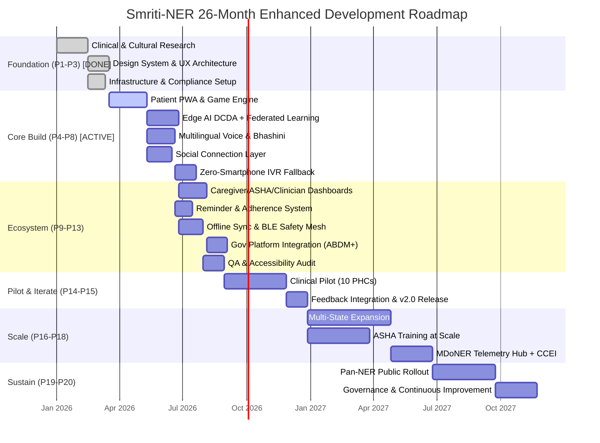
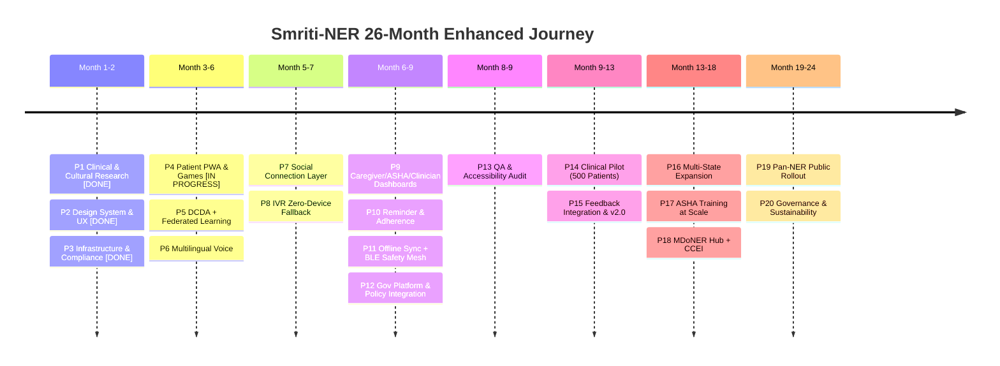

# 🗺️ SMRITI-NER — ENHANCED COMPLETE SYSTEM DEVELOPMENT ROADMAP (v2.0)

**Project**: Smriti-NER (স্মৃতি / ꯁ꯭ꯃ꯭ꯔꯤꯇꯤ) — AI-Enabled Cognitive Gaming, Social Connection & Memory Assistance Platform  
**Problem Statement ID**: 26003 (SIH 2026)  
**Sponsoring Ministry**: Ministry of Development of North Eastern Region (MDoNER)  
**Total Timeline**: 26 Months (20 Phases)  
**Version**: 2.0.0 — Enhanced with Social Connect, IVR Fallback, Federated Learning, BLE Safety Mesh, Policy Anchors  
**Current Status**: Phase 1–3 Complete (100%), Phase 4 In Progress (Sub-Phase 4.1 Complete), Phases 5–20 Pending  

---

## What Changed From v1.0
This version folds in six major enhancements identified after the v1.0 review, so they now live as **first-class phases** instead of after-thoughts:

| Status | New Capability | Lives In | Why It Was Added |
|:---:|:---|:---|:---|
| [ ] | Grandchild Connect (async co-play) + Community Reminiscence Circles + Legacy Storytelling | **Phase 7** | Problem statement explicitly asks for social interaction; v1.0 was single-player only |
| [x] | IVR / Missed-Call Cognitive Line (zero-smartphone fallback) | **Phase 3.4 & Phase 8** | Closes the "no device at all" accessibility gap in remote NER *(Telephony gateway provisioned in P3.4; app-bridge in P8)* |
| [x] | Federated Learning for BKT/MMSE models | **Phase 3.5 & Phase 5** | Strengthens AI novelty with privacy-preserving on-device learning *(Aggregator provisioned in P3.5; client training in P5)* |
| [ ] | BLE Beacon Mesh for wandering/emergency detection | **Phase 11** | GPS is unreliable in hilly/forested/indoor NER terrain; reuses existing Bluetooth mesh infra |
| [ ] | Caregiver Wellness Check-in & Peer Support | **Phase 9** | Caregiver burnout is real and currently invisible in the design |
| [x] | Policy Anchors (NPHCE, Rashtriya Vayoshri Yojana, e-Sanjeevani, ABDM) + CCEI | **Phase 3.3 & Phase 12/18** | Converts funding/impact story into named, citable, government-aligned assets *(ABDM/DISHA in P3.3; scheme linkage in P12)* |

---

## Roadmap Overview — Gantt Chart

---

## 📋 Master Roadmap Progress Checklist

**Overall Velocity**: 109 / 240+ Deliverables Completed (45.4% Deliverable Completion)  
**Phases Completed**: 6 / 20 (Phases 1, 2, 3, 4, 5 & 6 Complete & Signed Off)  
**Phases In Progress**: 1 / 20 (Phase 7 — Sub-Phase 7.1 Complete, Sub-Phases 7.2–7.4 Pending)  
**Phases Pending**: 13 / 20 (Phases 8 through 20)  
**Milestones Achieved**: 6 / 20 (M1, M2, M3, M4, M5, M6 Signed Off; M7–M20 Pending)  

### Phase & Milestone Checklist
- [x] **Phase 1: Clinical & Cultural Foundation Research** (Weeks 1–6) — **Milestone M1 Signed Off**
  - [x] Sub-Phase 1.1: Epidemiological & Demographic Research (4/4 tasks done)
  - [x] Sub-Phase 1.2: Neuropsychological Foundation (4/4 tasks done)
  - [x] Sub-Phase 1.3: Cultural Asset Research & Acquisition (4/4 tasks done)
  - [x] Sub-Phase 1.4: Life-Review & Storytelling Baseline (3/3 tasks done)
- [x] **Phase 2: Design System & UX Architecture** (Weeks 5–9) — **Milestone M2 Signed Off**
  - [x] Sub-Phase 2.1: Elder-Centric Design System (5/5 tasks done)
  - [x] Sub-Phase 2.2: Information Architecture & Wireframes (5/5 tasks done)
  - [x] Sub-Phase 2.3: High-Fidelity Prototyping & Usability Testing (4/4 tasks done)
  - [x] Sub-Phase 2.4: Accessibility & Zero-Device Interaction Design (2/2 tasks done)
- [x] **Phase 3: Technical Infrastructure & Compliance Setup** (Weeks 5–8) — **Milestone M3 Signed Off**
  - [x] Sub-Phase 3.1: Development Environment & Monorepo Architecture (4/4 tasks done)
  - [x] Sub-Phase 3.2: Cloud Infrastructure & Database Provisioning (4/4 tasks done)
  - [x] Sub-Phase 3.3: Security & Statutory Compliance (DISHA 2018 / ABDM) (4/4 tasks done)
  - [x] Sub-Phase 3.4: Telephony & IVR Infrastructure (BSNL Toll-Free Gateway) (3/3 tasks done)
  - [x] Sub-Phase 3.5: Federated Learning Infrastructure Groundwork (2/2 tasks done)
- [x] **Phase 4: Patient PWA Shell & Cognitive Game Engine** (Weeks 9–20) — **Milestone M4 Signed Off**
  - [x] Sub-Phase 4.1: PWA Foundation & App Shell Architecture (5/5 tasks done)
  - [x] Sub-Phase 4.2: Patient Home & Navigation (5/5 tasks done)
  - [x] Sub-Phase 4.3: Shared Game Framework (5/5 tasks done)
  - [x] Sub-Phase 4.4: Games 1–4 Core Implementation (4/4 tasks done)
  - [x] Sub-Phase 4.5: Anti-Agitation Circuit Breaker (AACB) (5/5 tasks done)
- [x] **Phase 5: Edge AI — DCDA & Federated Learning Engine** (Weeks 15–24) — **Milestone M5 Signed Off**
  - [x] Sub-Phase 5.1: Telemetry Extraction Pipeline (4/4 tasks done)
  - [x] Sub-Phase 5.2: Bayesian Knowledge Tracing (BKT) Engine (4/4 tasks done)
  - [x] Sub-Phase 5.3: Difficulty Orchestrator & MMSE Proxy (4/4 tasks done)
  - [x] Sub-Phase 5.4: Federated Learning Layer (Client Training & Packaging) (4/4 tasks done)
  - [x] Sub-Phase 5.5: Circadian-Aware Content Engine (3/3 tasks done)
- [x] **Phase 6: Multilingual Voice & Bhashini Integration** (Weeks 15–22) — **Milestone M6 Signed Off**
  - [x] Sub-Phase 6.1: Bhashini (AI4Bharat) Integration (4/4 tasks done)
  - [x] Sub-Phase 6.2: Localization Framework (8 Regional Languages) (4/4 tasks done)
  - [x] Sub-Phase 6.3: Personalized Family Voice System (4/4 tasks done)
  - [x] Sub-Phase 6.4: Natural-Language Caregiver Summaries (3/3 tasks done)
- [ ] **Phase 7: Social Connection & Reminiscence Layer** (Weeks 18–25) — **Milestone M7 Pending**
  - [x] Sub-Phase 7.1: Grandchild Connect (Async Co-Play) (3/3 tasks done)
  - [ ] Sub-Phase 7.2: Community Reminiscence Circles (0/4 tasks done)
  - [ ] Sub-Phase 7.3: Digital Legacy Storytelling (0/4 tasks done)
  - [ ] Sub-Phase 7.4: Consent & Content Moderation for Social Features (0/2 tasks done)
- [ ] **Phase 8: Zero-Smartphone Accessibility — IVR Cognitive Line** (Weeks 22–27) — **Milestone M8 Pending**
  - [ ] Sub-Phase 8.1: IVR Cognitive Check-In Flow (0/3 tasks done)
  - [ ] Sub-Phase 8.2: IVR Reminder & Adherence Delivery (0/3 tasks done)
  - [ ] Sub-Phase 8.3: Multilingual IVR Content (0/2 tasks done)
  - [ ] Sub-Phase 8.4: IVR-to-Platform Data Bridge (0/2 tasks done)
- [ ] **Phase 9: Caregiver, ASHA & Clinician Ecosystem Dashboards** (Weeks 25–33) — **Milestone M9 Pending**
  - [ ] Sub-Phase 9.1: Caregiver Portal (Family View) (0/5 tasks done)
  - [ ] Sub-Phase 9.2: ASHA Worker Portal (Community View) (0/4 tasks done)
  - [ ] Sub-Phase 9.3: District Medical Officer / Clinician View (0/4 tasks done)
  - [ ] Sub-Phase 9.4: Caregiver Wellness & Peer Support (0/3 tasks done)
- [ ] **Phase 10: Multi-Sensory Reminder & Adherence System** (Weeks 27–31) — **Milestone M10 Pending**
  - [ ] Sub-Phase 10.1: Reminder Scheduler (0/3 tasks done)
  - [ ] Sub-Phase 10.2: Reminder UI & Interaction (0/4 tasks done)
  - [ ] Sub-Phase 10.3: Adherence Analytics (0/3 tasks done)
  - [ ] Sub-Phase 10.4: Cross-Channel Reminder Unification (0/2 tasks done)
- [ ] **Phase 11: Offline Storage, Sync & BLE Safety Mesh** (Weeks 25–33) — **Milestone M11 Pending**
  - [ ] Sub-Phase 11.1: Local-First Persistence Layer (0/4 tasks done)
  - [ ] Sub-Phase 11.2: Delta Synchronization Engine (0/4 tasks done)
  - [ ] Sub-Phase 11.3: Bluetooth/Wi-Fi Direct Mesh Relay (0/4 tasks done)
  - [ ] Sub-Phase 11.4: BLE Beacon Wandering/Safety Mesh (0/4 tasks done)
- [ ] **Phase 12: Government Health Platform & Policy Integration** (Weeks 30–36) — **Milestone M12 Pending**
  - [ ] Sub-Phase 12.1: ABDM / ABHA Integration (0/3 tasks done)
  - [ ] Sub-Phase 12.2: Backend API Development (0/5 tasks done)
  - [ ] Sub-Phase 12.3: e-Sanjeevani Teleconsultation Bridge (0/2 tasks done)
  - [ ] Sub-Phase 12.4: Welfare Scheme Alignment (NPHCE / RVY) (0/3 tasks done)
- [ ] **Phase 13: Quality Assurance & Accessibility Audit** (Weeks 34–38) — **Milestone M13 Pending**
  - [ ] Sub-Phase 13.1: Functional Testing Suite (0/4 tasks done)
  - [ ] Sub-Phase 13.2: Accessibility Audit (WCAG 2.2 AAA Target) (0/4 tasks done)
  - [ ] Sub-Phase 13.3: Security & Privacy Audit (0/4 tasks done)
  - [ ] Sub-Phase 13.4: Social & IVR Feature QA (0/3 tasks done)
- [ ] **Phase 14: Clinical Pilot Deployment** (Weeks 39–51) — **Milestone M14 Pending**
  - [ ] Sub-Phase 14.1: Pilot Site Selection & Setup (10 PHCs) (0/5 tasks done)
  - [ ] Sub-Phase 14.2: ASHA Worker Training Program (0/4 tasks done)
  - [ ] Sub-Phase 14.3: 90-Day Clinical Observation (500 Patients) (0/5 tasks done)
  - [ ] Sub-Phase 14.4: Pilot Efficacy Analysis (0/4 tasks done)
- [ ] **Phase 15: Feedback Integration & Iteration** (Weeks 52–55) — **Milestone M15 Pending**
  - [ ] Sub-Phase 15.1: Feedback Synthesis & Prioritization (0/3 tasks done)
  - [ ] Sub-Phase 15.2: Iterative Improvement Sprint (0/4 tasks done)
  - [ ] Sub-Phase 15.3: Social & IVR Feature Refinement (0/2 tasks done)
  - [ ] Sub-Phase 15.4: Composite Metric Draft (CCEI v1) (0/2 tasks done)
- [ ] **Phase 16: Multi-State Expansion** (Weeks 56–72) — **Milestone M16 Pending**
  - [ ] Sub-Phase 16.1: State-by-State Rollout Plan (Waves 1–4) (0/4 tasks done)
  - [ ] Sub-Phase 16.2: State-Specific Localization (8 States) (0/4 tasks done)
  - [ ] Sub-Phase 16.3: NHM ASHA Tablet Ecosystem Integration (0/3 tasks done)
  - [ ] Sub-Phase 16.4: IVR & Social Feature Scale-Out (0/2 tasks done)
- [ ] **Phase 17: ASHA Worker Training at Scale** (Weeks 56–69) — **Milestone M17 Pending**
  - [ ] Sub-Phase 17.1: Scalable Training Program (1,500+ ASHAs) (0/4 tasks done)
  - [ ] Sub-Phase 17.2: Field Support Network & SOPs (0/3 tasks done)
  - [ ] Sub-Phase 17.3: Community Facilitation Training (0/2 tasks done)
  - [ ] Sub-Phase 17.4: IVR Support Training (0/2 tasks done)
- [ ] **Phase 18: MDoNER Central Telemetry Hub & Impact Framework** (Weeks 70–84) — **Milestone M18 Pending**
  - [ ] Sub-Phase 18.1: Central Analytics Dashboard (GIS) (0/3 tasks done)
  - [ ] Sub-Phase 18.2: Cultural Cognitive Engagement Index (CCEI) Finalization (0/3 tasks done)
  - [ ] Sub-Phase 18.3: Data Warehouse & Research Pipeline (0/3 tasks done)
  - [ ] Sub-Phase 18.4: Federated Learning at Population Scale (0/2 tasks done)
- [ ] **Phase 19: Pan-NER Public Rollout** (Weeks 82–93) — **Milestone M19 Pending**
  - [ ] Sub-Phase 19.1: Public Release (Play Store, PWA, IVR) (0/3 tasks done)
  - [ ] Sub-Phase 19.2: Community Awareness Campaign (0/3 tasks done)
  - [ ] Sub-Phase 19.3: Scalability & Performance Optimization (0/3 tasks done)
  - [ ] Sub-Phase 19.4: Launch Impact Tracking (0/2 tasks done)
- [ ] **Phase 20: Governance, Sustainability & Continuous Improvement** (Weeks 85–104) — **Milestone M20 Pending**
  - [ ] Sub-Phase 20.1: Governance Framework & Clinical Advisory Board (0/3 tasks done)
  - [ ] Sub-Phase 20.2: Long-Term Sustainability Model (0/4 tasks done)
  - [ ] Sub-Phase 20.3: Continuous Improvement Pipeline (0/4 tasks done)
  - [ ] Sub-Phase 20.4: Caregiver & Community Sustainability (0/2 tasks done)

---
---

# PHASE 1: CLINICAL & CULTURAL FOUNDATION RESEARCH 🏗️
**Phase Status**: [x] 100% COMPLETE (4/4 Sub-Phases Done — Signed Off)  
**Duration**: Weeks 1–6 | **Objective**: Establish the epidemiological, neuropsychological, and cultural evidence base before any design or code work begins.

### Sub-Phase 1.1 — Epidemiological & Demographic Research
*Status: [x] Completed*
| Status | Task | Details | Deliverable |
|:---:|:---|:---|:---|
| [x] | Literature Review | LASI Wave-1, ARDSI Dementia India Report, WHO Global Dementia Action Plan, Cochrane RT meta-analyses (Woods et al.) | Annotated bibliography (50+ sources) |
| [x] | NER Dementia Prevalence Mapping | State-wise prevalence data across all 8 NER states | Prevalence heatmap document |
| [x] | Healthcare Infrastructure Audit | Neurologist density, PHC distribution, ASHA density per district | Infrastructure gap report |
| [x] | Connectivity Baseline Study | Cellular blackout zones, power outage frequency, broadband penetration (Majuli, Ri-Bhoi, Churachandpur) | Connectivity constraint matrix |

### Sub-Phase 1.2 — Neuropsychological Foundation
*Status: [x] Completed*
| Status | Task | Details | Deliverable |
|:---:|:---|:---|:---|
| [x] | Ribot's Law Application Framework | How long-term episodic memory preservation will be leveraged vs. hippocampal decline | Clinical mechanism whitepaper |
| [x] | Reminiscence Therapy (RT) Protocol | Cochrane-aligned session structure (15–20 min, 2–3x/day) | RT Protocol v1.0 |
| [x] | MMSE/MoCA Proxy Correlation Model | Mapping telemetry vectors → cognitive assessment proxies | Proxy model specification |
| [x] | Anti-Agitation Design Principles | "Compassionate Interaction Design" rules — zero negative reinforcement | CID Principles Document |

### Sub-Phase 1.3 — Cultural Asset Research & Acquisition
*Status: [x] Completed*
| Status | Task | Details | Deliverable |
|:---:|:---|:---|:---|
| [x] | Folk Instrument Cataloging | Pepa, Dhol, Pung, Duitara, Gogona, Tokari — tuning frequencies, overtones | Audio asset library |
| [x] | Indigenous Fauna Reference | Rhino, Hornbill, Red Panda, Sangai Deer, Hoolock Gibbon | Fauna visual reference pack |
| [x] | Traditional Textile Pattern Library | Muga, Gamosa, Mizo Puan, Naga Shawl motifs | Textile SVG/PNG library |
| [x] | Regional Language & Dialect Audit | 8 languages mapped with elder-relevant dialectal variation | Language matrix & phrase dictionary |

### Sub-Phase 1.4 — Life-Review & Storytelling Baseline (New)
*Status: [x] Completed*
| Status | Task | Details | Deliverable |
|:---:|:---|:---|:---|
| [x] | Life-Review Therapy Literature Scan | Evidence base for narrative/legacy storytelling improving mood in dementia | Life-review evidence brief |
| [x] | Folklore & Oral History Sourcing | Partner with state archives/NGOs to source seed folklore per state | Seed folklore content pack |
| [x] | Elder Interview Pilot (Small n) | Record 10–15 sample life-story interviews to validate format/length | Sample recordings + format guide |

> [!IMPORTANT]
> - [x] **Milestone M1**: Clinical & Cultural Foundation Complete — peer-reviewed by 1 clinical neuropsychologist + 1 NER cultural consultant. *(Status: COMPLETED & SIGNED OFF)*

---
---

# PHASE 2: DESIGN SYSTEM & UX ARCHITECTURE 🎨
**Phase Status**: [x] 100% COMPLETE (4/4 Sub-Phases Done — Signed Off)  
**Duration**: Weeks 5–9 | **Objective**: Elder-centric, WCAG AAA design system and validated wireframes across all personas.

### Sub-Phase 2.1 — Elder-Centric Design System
*Status: [x] Completed*
| Status | Task | Details | Deliverable |
|:---:|:---|:---|:---|
| [x] | Color Palette | WCAG 2.2 AAA (≥7:1 contrast); warm, non-harsh tones | Design tokens (CSS variables) |
| [x] | Typography System | 24pt+ minimum; Assamese/Meitei/Bodo script rendering; Noto Sans fallback | Typography spec |
| [x] | Touch Target Specs | 64×64dp minimum, 16dp spacing, tremor-tolerant hitboxes | Touch target grid system |
| [x] | Iconography Library | High-contrast, culturally intuitive icons | Custom icon set (SVG) |
| [x] | Motion Guide | Gentle pulse/fade transitions, zero flicker | Motion design specification |

### Sub-Phase 2.2 — Information Architecture & Wireframes
*Status: [x] Completed*
| Status | Task | Details | Deliverable |
|:---:|:---|:---|:---|
| [x] | Patient View IA | Max 3 nav cards/screen, zero nested menus | IA sitemap + flow diagram |
| [x] | Caregiver Portal IA | Dashboard-first: trajectory chart, adherence, reminder manager, wellness check-in | Caregiver wireframes |
| [x] | ASHA Worker Portal IA | Multi-patient cohort, Bluetooth sync, visit checklist | ASHA portal wireframes |
| [x] | Game & Social-Feature Wireframes | 3 games + Grandchild Connect + Community Circle screens | Wireframe set (20+ screens) |
| [x] | Reminder Flow Wireframes | Medicine card → voice → photo → confirm → log | Reminder flow wireframes |

### Sub-Phase 2.3 — High-Fidelity Prototyping
*Status: [x] Completed*
| Status | Task | Details | Deliverable |
|:---:|:---|:---|:---|
| [x] | Patient View Hi-Fi Mockups | Home, games, reminders, memory album, social screens | Figma export |
| [x] | Caregiver Dashboard Hi-Fi | MMSE chart, adherence rings, wellness check-in panel | Figma export |
| [x] | Usability Testing (Remote) | 5–8 elderly + 5 caregivers via partner NGOs | Usability test report |
| [x] | Design Iteration | Contrast, button size, cultural relevance fixes | Hi-Fi prototypes v2.0 |

### Sub-Phase 2.4 — Accessibility & Zero-Device Interaction Design (New)
*Status: [x] Completed*
| Status | Task | Details | Deliverable |
|:---:|:---|:---|:---|
| [x] | IVR Call-Flow Scripting | Voice-only menu tree for missed-call cognitive line | IVR flow diagram + scripts (8 languages) |
| [x] | Voice-Only Interaction Testing | Test comprehension of spoken menus with non-literate elders | IVR usability report |

> [!IMPORTANT]
> - [x] **Milestone M2**: Design System & Wireframes Approved — ≥85% task completion in usability tests; WCAG 2.2 AAA pass. *(Status: COMPLETED & SIGNED OFF)*

---
---

# PHASE 3: TECHNICAL INFRASTRUCTURE & COMPLIANCE SETUP ⚙️
**Phase Status**: [x] 100% COMPLETE (5/5 Sub-Phases Done — Signed Off)  
**Duration**: Weeks 5–8 | **Objective**: Development, cloud, and security foundations, including federated-learning and IVR telephony infrastructure.

### Sub-Phase 3.1 — Development Environment
*Status: [x] Completed*
| Status | Task | Details | Deliverable |
|:---:|:---|:---|:---|
| [x] | Repository Setup | Monorepo: `/client`, `/server`, `/ai-engine`, `/ivr-service`, `/docs`, `/assets` | Git repo + branch strategy |
| [x] | CI/CD Pipeline | Lint → test → build → deploy staging | Pipeline config |
| [x] | Code Quality Gates | ESLint, Prettier, Black, pre-commit hooks | Quality gate config |
| [x] | Development Standards Document | Conventions, commit format, PR review process | Developer handbook |

### Sub-Phase 3.2 — Cloud Infrastructure Provisioning
*Status: [x] Completed*
| Status | Task | Details | Deliverable |
|:---:|:---|:---|:---|
| [x] | Cloud Provider Selection | AWS/GCP/Azure India region; gov cloud compliance | Provider selection doc |
| [x] | Server Architecture | FastAPI cluster + TimescaleDB + Redis + Celery | Infrastructure-as-Code |
| [x] | SSL/TLS Configuration | TLS 1.3, certificate pinning, DISHA-compliant encryption | Security configuration |
| [x] | Staging Environment | Synthetic patient data mirror | Staging URL + credentials |

### Sub-Phase 3.3 — Security & Compliance Framework
*Status: [x] Completed*
| Status | Task | Details | Deliverable |
|:---:|:---|:---|:---|
| [x] | DISHA Compliance Checklist | Map DISHA requirements to system components | Compliance matrix |
| [x] | ABDM Integration Plan | ABHA ID linking workflow; sandbox credentials | ABDM integration spec |
| [x] | Data Classification Policy | PHI vs. behavioral telemetry segregation; SHA-256 pseudo-IDs | Data classification document |
| [x] | Threat Model | STRIDE analysis incl. edge device, BLE relay, IVR gateway, cloud | Threat model report |

### Sub-Phase 3.4 — Telephony & IVR Infrastructure (New)
*Status: [x] Completed*
| Status | Task | Details | Deliverable |
|:---:|:---|:---|:---|
| [x] | Toll-Free Number Provisioning | Partner with BSNL/telecom provider for NER-wide toll-free access | Provisioned number + SLA |
| [x] | IVR Platform Selection | Evaluate Exotel/Knowlarity/Asterisk for multilingual IVR at scale | Platform selection doc |
| [x] | Call Data Security | Encrypt call logs; link to pseudo-ID, not raw phone numbers where feasible | Call data security spec |

### Sub-Phase 3.5 — Federated Learning Infrastructure Groundwork (New)
*Status: [x] Completed*
| Status | Task | Details | Deliverable |
|:---:|:---|:---|:---|
| [x] | FL Framework Evaluation | Assess Flower / TensorFlow Federated for edge-compatible aggregation | FL framework selection doc |
| [x] | Aggregation Server Design | Design server-side model-averaging service (no raw data ingestion) | FL aggregation server spec |

> [!IMPORTANT]
> - [x] **Milestone M3**: Infrastructure Ready — CI/CD operational, staging accessible, IVR number provisioned, threat model reviewed. *(Status: COMPLETED & SIGNED OFF)*

---
---

# PHASE 4: PATIENT PWA SHELL & COGNITIVE GAME ENGINE 🎮
**Phase Status**: [x] 100% COMPLETE (5/5 Sub-Phases Done — Signed Off)  
**Duration**: Weeks 9–20 | **Objective**: Build the patient-facing PWA and all 4 core cognitive games with the shared game engine.

### Sub-Phase 4.1 — PWA Foundation
*Status: [x] Completed*
| Status | Task | Details | Deliverable |
|:---:|:---|:---|:---|
| [x] | PWA Scaffolding | Service Worker, Web App Manifest, cache-first/network-first strategy | PWA boilerplate |
| [x] | App Shell Architecture | Skeleton → paint; 3-card bottom nav | App shell implementation |
| [x] | Design System Implementation | Component library (Button, Card, Modal, Toast, Chart) | Component library |
| [x] | Responsive Layout Engine | 320px–1024px fluid grid; orientation lock for games | Responsive CSS framework |
| [x] | Accessibility Layer | ARIA labels, focus management, screen reader, haptics | Accessibility middleware |

### Sub-Phase 4.2 — Patient Home & Navigation
*Status: [x] Completed*
| Status | Task | Details | Deliverable |
|:---:|:---|:---|:---|
| [x] | Daily Activity Cards | Games / Reminders / Memory Album / **Connect** (4th card) | Home screen implementation |
| [x] | Language Selector | 1-tap toggle across 8 languages | Language selector component |
| [x] | Voice Assistant Button | "কথাৰে কওক" floating TTS trigger | Voice button implementation |
| [x] | Patient ↔ Caregiver Mode Switch | PIN-protected toggle | Mode switch with PIN guard |
| [x] | Connectivity Status Indicator | Non-alarming online/offline dot | Status indicator component |

### Sub-Phase 4.3 — Shared Game Framework
*Status: [x] Completed*
| Status | Task | Details | Deliverable |
|:---:|:---|:---|:---|
| [x] | Game Session Manager | init → play → telemetry → BKT update → persist | Game session module |
| [x] | Telemetry Collector | Tap coordinates, RT, error count, bounding-box deviation | Telemetry collector module |
| [x] | Difficulty State Machine | 5-tier levels; accepts BKT + AACB overrides | Difficulty FSM |
| [x] | Cultural Asset Loader | Lazy-loads illustrations/audio by language | Asset loader with caching |
| [x] | Celebration Engine | Sparkle burst, folk cheer, spoken praise | Celebration effects module |

### Sub-Phase 4.4 — Games 1–4 (Dhol-Pepa, Kaziranga Safari, Weaver's Loom, Daily Haat)
*Status: [x] Completed*
| Status | Task | Details | Deliverable |
|:---:|:---|:---|:---|
| [x] | Dhol-Pepa Sur-Milon | Web Audio synthesis of 6 instruments; tap-to-match logic | Game 1 core logic + assets |
| [x] | Kaziranga Safari Search | Camouflage engine, 5 animal assets, trivia narration | Game 2 core logic + assets |
| [x] | Weaver's Loom Pattern | Loom UI, 20+ pattern sequences, Cultural Trunk collection | Game 3 core logic + assets |
| [x] | Daily Haat Recall | Market stall UI, recipe cards, ingredient selection logic | Game 4 core logic + assets |

### Sub-Phase 4.5 — Anti-Agitation Circuit Breaker (AACB) — Cross-Game
*Status: [x] Completed*
| Status | Task | Details | Deliverable |
|:---:|:---|:---|:---|
| [x] | Error Tracking | Consecutive error counter, resets on success | Error tracking module |
| [x] | Visual Dimming & Target Highlight | Fade non-targets to 60%; golden halo pulse on correct target | Dimming + highlight animation |
| [x] | Family Voice Cue | Contextual guidance audio on trigger | AACB voice cue system |
| [x] | Hitbox Expansion | +25% target touch area during AACB state | Dynamic hitbox resize |
| [x] | Zero Failure Sound | Suppress all negative/buzzer audio globally | Audio suppression guard |

> [!IMPORTANT]
> - [x] **Milestone M4**: Patient PWA + all 4 games playable with AACB — Lighthouse PWA ≥95, Accessibility =100, zero negative audio cues. *(Status: COMPLETED & SIGNED OFF)*

---
---

# PHASE 5: EDGE AI — DCDA & FEDERATED LEARNING ENGINE 🧠
**Phase Status**: [x] COMPLETED (100% Complete — Sub-Phases 5.1, 5.2, 5.3, 5.4 & 5.5 Done & Signed Off)  
**Duration**: Weeks 15–24 | **Objective**: Real-time adaptive difficulty plus privacy-preserving on-device model improvement.

### Sub-Phase 5.1 — Telemetry Extraction Pipeline
*Status: [x] Completed*
| Status | Task | Details | Deliverable |
|:---:|:---|:---|:---|
| [x] | Raw Touch Event Capture | Coordinates, timestamps, pressure | Touch event logger |
| [x] | Motor Hesitation Filter (τ) | Pre-tap wander distance → tremor estimate | Tremor extraction algorithm |
| [x] | Cognitive Deliberation Calc | RT_delib = RT_total − τ | Deliberation calculator |
| [x] | Session Telemetry Vector | [RT_total, τ, RT_delib, accuracy, difficulty, aacb_triggered, time_of_day] | Telemetry vector schema |

### Sub-Phase 5.2 — Bayesian Knowledge Tracing (BKT) Engine
*Status: [x] Completed*
| Status | Task | Details | Deliverable |
|:---:|:---|:---|:---|
| [x] | BKT Model Implementation | 4-parameter BKT: P(L₀), P(T), P(G), P(S) | BKT engine module |
| [x] | Posterior Update Logic | HMM forward algorithm per interaction | Update algorithm |
| [x] | Mastery Threshold Tuning | Increment ≥0.85, decrement ≤0.35 | Threshold configuration |
| [x] | Edge Optimization | <5ms compute on 2GB RAM Android | Performance benchmarks |

### Sub-Phase 5.3 — Difficulty Orchestrator & MMSE Proxy
*Status: [x] Completed*
| Status | Task | Details | Deliverable |
|:---:|:---|:---|:---|
| [x] | Difficulty Level Manager | Smooth transitions, no >1 level jumps | Difficulty manager |
| [x] | Circadian Adjustment | Reduce difficulty during sundowning window | Circadian adjustment module |
| [x] | MMSE Proxy Calculator | Regression model with 95% CI | Regression model + CI calc |
| [x] | Longitudinal Trajectory | Rolling 7-day/30-day trend computation | Trajectory computation |

### Sub-Phase 5.4 — Federated Learning Layer (New)
*Status: [x] Completed*
| Status | Task | Details | Deliverable |
|:---:|:---|:---|:---|
| [x] | On-Device Local Training | Local BKT/MMSE-proxy parameter updates using only that patient's data | Local training module |
| [x] | Secure Model Update Packaging | Encrypt & compress model deltas (not raw telemetry) for upload | Model delta packager |
| [x] | Federated Aggregation Service | Server-side averaging (FedAvg-style) across devices during sync windows | Aggregation server |
| [x] | Privacy Validation | Confirm no raw behavioral/PII data leaves device — only model weights | Privacy audit report |

### Sub-Phase 5.5 — Circadian-Aware Content Engine (New)
*Status: [x] Completed*
| Status | Task | Details | Deliverable |
|:---:|:---|:---|:---|
| [x] | Sundowning Window Detection | Flag late-afternoon/evening sessions via time-of-day + agitation signals | Sundowning detection logic |
| [x] | Calming Audio Trigger | Auto-play regional lullabies/ragas instead of just lowering difficulty | Calming content playback module |
| [x] | Content-Clinical Mapping | Document link between calming audio and agitation-reduction goal | Clinical mapping note |

> [!IMPORTANT]
> - [x] **Milestone M5**: DCDA + Federated Learning Operational — BKT <5ms; MMSE proxy r≥0.75; federated updates verified privacy-safe. *(Status: COMPLETED & SIGNED OFF)*

---
---

# PHASE 6: MULTILINGUAL VOICE & BHASHINI INTEGRATION 🗣️
**Phase Status**: [x] COMPLETED & SIGNED OFF (100% Complete — Sub-Phases 6.1, 6.2, 6.3 & 6.4 Done)  
**Duration**: Weeks 15–22 | **Objective**: Full voice-first, 8-language interaction layer with personalized family voice.

### Sub-Phase 6.1 — Bhashini (AI4Bharat) Integration
*Status: [x] Completed*
| Status | Task | Details | Deliverable |
|:---:|:---|:---|:---|
| [x] | Bhashini API Registration | Obtain API keys for ASR & TTS | API credentials |
| [x] | TTS Integration (8 Languages) | Assamese, Meitei, Bengali, Bodo, Khasi, Mizo, Hindi, English | TTS service wrapper |
| [x] | ASR Integration (Keywords) | On-device keyword spotting: Help, Repeat, Listen, Yes, Back, Next | ASR keyword module |
| [x] | Fallback TTS Engine | Vosk/Coqui quantized on-device models | Fallback TTS implementation |

### Sub-Phase 6.2 — Localization Framework
*Status: [x] Completed*
| Status | Task | Details | Deliverable |
|:---:|:---|:---|:---|
| [x] | i18n Architecture | Key-based externalization; runtime switching | i18n framework |
| [x] | String Translation | All UI/game/trivia/system strings in 8 languages | 8 locale JSON files |
| [x] | Script Rendering Validation | Bengali, Meitei Mayek, Devanagari, Latin (Mizo) | Script rendering report |
| [x] | Cultural Greeting Localization | "আইতা", "ককা", "ꯏꯃꯥ", "ꯏꯄꯥ" honorifics | Greeting localization matrix |

### Sub-Phase 6.3 — Personalized Family Voice System
*Status: [x] Completed*
| Status | Task | Details | Deliverable |
|:---:|:---|:---|:---|
| [x] | Voice Recording Interface | Guided flow with quality meter | Voice recorder component |
| [x] | Audio Processing Pipeline | Normalize, trim, compress to Opus, encrypt | Audio processing module |
| [x] | Clip Playback Engine | Trigger clips at reminder times with photo | Playback integration |
| [x] | Voice Clip Management | Preview, re-record, delete, up to 10 clips | Voice clip CRUD interface |

### Sub-Phase 6.4 — Natural-Language Caregiver Summaries (New)
*Status: [x] Completed*
| Status | Task | Details | Deliverable |
|:---:|:---|:---|:---|
| [x] | Template-Based NLG Engine | Rule-based sentence templates (not live LLM) fed by weekly metrics | NLG summary generator |
| [x] | Multi-Language Summary Output | Render weekly notes in caregiver's chosen language | Localized NLG templates |
| [x] | Contextual Correlation Hints | Flag plausible correlations ("Tuesday dip — possibly market day") from calendar/adherence data | Correlation-hint logic |

> [!IMPORTANT]
> - [x] **Milestone M6**: Multilingual Voice System Operational — TTS in all 8 languages; ASR <500ms; weekly NLG summaries generated correctly. *(Status: SIGNED OFF)*

---
---

# PHASE 7: SOCIAL CONNECTION & REMINISCENCE LAYER 👨‍👩‍👧 (New Phase)
**Phase Status**: [/] IN PROGRESS (23% Complete — Sub-Phase 7.1 Done, Sub-Phases 7.2–7.4 Pending)  
**Duration**: Weeks 18–25 | **Objective**: Directly answer the "social interaction" requirement with async family co-play, community group sessions, and legacy storytelling.

### Sub-Phase 7.1 — Grandchild Connect (Async Co-Play)
*Status: [x] Completed*
| Status | Task | Details | Deliverable |
|:---:|:---|:---|:---|
| [x] | Voice/Video Clue Recorder | Family member records a 10-second clue tied to a game round | Clue recording interface |
| [x] | Clue-Linked Game Round | Elder plays clue before attempting the puzzle round | Clue playback + game binding |
| [x] | Response Loop | Elder's completion triggers a short thank-you/celebration clip back to family app view | Response loop notification |

### Sub-Phase 7.2 — Community Reminiscence Circles
*Status: [ ] Pending*
| Status | Task | Details | Deliverable |
|:---:|:---|:---|:---|
| [ ] | Shared-Screen Group Mode | Same game projected on shared tablet/TV for 4–5 elders at Anganwadi/PHC | Group-mode UI variant |
| [ ] | ASHA Facilitation Guide | Script/checklist for running weekly group sessions | Facilitator guide |
| [ ] | Group Session Scheduling | Calendar integration for weekly circle bookings per village | Scheduling module |
| [ ] | Group Engagement Logging | Attendance and group-level engagement metrics (no individual competitive scoring) | Group engagement log |

### Sub-Phase 7.3 — Digital Legacy Storytelling
*Status: [ ] Pending*
| Status | Task | Details | Deliverable |
|:---:|:---|:---|:---|
| [ ] | Story Recording Interface | Elder narrates life stories/local folklore via simple record button | Story recording UI |
| [ ] | Auto-Transcription Pipeline | Transcribe recordings (Bhashini ASR) for searchability and family archive | Transcription pipeline |
| [ ] | Story-to-Trivia Converter | Convert transcribed snippets into new game trivia/content (content flywheel) | Story-to-content converter |
| [ ] | Family Archive View | Caregiver-side gallery of all recorded stories, downloadable/shareable | Family archive UI |

### Sub-Phase 7.4 — Consent & Content Moderation for Social Features
*Status: [ ] Pending*
| Status | Task | Details | Deliverable |
|:---:|:---|:---|:---|
| [ ] | Consent Capture Flow | Explicit consent from elder/caregiver before recording or sharing any story/clue | Consent flow UI |
| [ ] | Lightweight Moderation Queue | ASHA/admin review queue before story content is reused as game trivia | Moderation queue tool |

> [!IMPORTANT]
> - [ ] **Milestone M7**: Social Layer Functional — Grandchild Connect round-trip works offline-to-sync; ≥1 pilot Community Circle run successfully; 10+ legacy stories captured in test cohort. *(Status: PENDING)*

---
---

# PHASE 8: ZERO-SMARTPHONE ACCESSIBILITY — IVR COGNITIVE LINE 📞 (New Phase)
**Phase Status**: [ ] PENDING (0% Complete — Sub-Phases 8.1–8.4 Pending)  
**Duration**: Weeks 22–27 | **Objective**: Reach elders with no smartphone/tablet access via a toll-free, voice-only cognitive check-in and reminder line.

### Sub-Phase 8.1 — IVR Cognitive Check-In Flow
*Status: [ ] Pending*
| Status | Task | Details | Deliverable |
|:---:|:---|:---|:---|
| [ ] | Word-Recall Mini Check-In | Recorded voice presents 3 words; elder repeats after a delay via call | Word-recall IVR module |
| [ ] | Orientation Question Flow | Simple day/place orientation question via keypress or voice response | Orientation IVR module |
| [ ] | Response Scoring Pipeline | Convert IVR responses into a lightweight cognitive check-in score | IVR scoring pipeline |

### Sub-Phase 8.2 — IVR Reminder & Adherence Delivery
*Status: [ ] Pending*
| Status | Task | Details | Deliverable |
|:---:|:---|:---|:---|
| [ ] | Scheduled Outbound Calls | Auto-dial elder at medicine/hydration time with recorded family voice prompt | Outbound call scheduler |
| [ ] | Keypress Confirmation | "Press 1 if you have taken your medicine" logging | Keypress confirmation logic |
| [ ] | Missed-Call Escalation | No answer after N attempts → notify caregiver/ASHA | Escalation logic |

### Sub-Phase 8.3 — Multilingual IVR Content
*Status: [ ] Pending*
| Status | Task | Details | Deliverable |
|:---:|:---|:---|:---|
| [ ] | 8-Language IVR Scripts | Recorded/TTS prompts in all target languages | IVR audio content library |
| [ ] | Language Auto-Detection/Selection | Caller selects language via keypress on first call | Language selection flow |

### Sub-Phase 8.4 — IVR-to-Platform Data Bridge
*Status: [ ] Pending*
| Status | Task | Details | Deliverable |
|:---:|:---|:---|:---|
| [ ] | IVR Event Sync | Push IVR check-in/adherence events into the same patient record as app telemetry | IVR data bridge service |
| [ ] | Caregiver Dashboard Integration | Show IVR-sourced adherence/check-in alongside app-sourced data | Dashboard integration |

> [!IMPORTANT]
> - [ ] **Milestone M8**: IVR Line Operational — calls connect reliably across 3 telecom circles in NER; check-in scoring and reminder delivery verified end-to-end. *(Status: PENDING)*

---
---

# PHASE 9: CAREGIVER, ASHA & CLINICIAN ECOSYSTEM DASHBOARDS 🖥️
**Phase Status**: [ ] PENDING (0% Complete — Sub-Phases 9.1–9.4 Pending)  
**Duration**: Weeks 25–33 | **Objective**: Build all persona dashboards including the new caregiver wellness layer.

### Sub-Phase 9.1 — Caregiver Portal (Family View)
*Status: [ ] Pending*
| Status | Task | Details | Deliverable |
|:---:|:---|:---|:---|
| [ ] | Authentication System | PIN-based local auth + optional OTP for cloud | Auth system |
| [ ] | 30-Day MMSE Trajectory Chart | Interactive trend chart with indicators | MMSE chart component |
| [ ] | Adherence Dashboard | Ring charts for medication/hydration | Adherence dashboard |
| [ ] | Sundowning Alert Panel | Real-time anomaly alerts | Alert notification system |
| [ ] | Reminiscence & Story Album | Photos, voice annotations, legacy stories | Photo/story gallery system |

### Sub-Phase 9.2 — ASHA Worker Portal (Community View)
*Status: [ ] Pending*
| Status | Task | Details | Deliverable |
|:---:|:---|:---|:---|
| [ ] | Multi-Patient Cohort Dashboard | Status, last sync, trend arrows | Cohort dashboard |
| [ ] | Bluetooth Delta Sync Interface | One-tap peer-to-peer sync | Bluetooth sync UI |
| [ ] | Village Visit Checklist | Status check, device health, recordings | Visit checklist module |
| [ ] | Community Circle Scheduler View | See/manage upcoming group sessions | Circle scheduler UI |

### Sub-Phase 9.3 — District Medical Officer / Clinician View
*Status: [ ] Pending*
| Status | Task | Details | Deliverable |
|:---:|:---|:---|:---|
| [ ] | Clinical Dashboard | Anonymized trajectories, drill-down with consent | Clinical dashboard |
| [ ] | Export Reports | PDF clinical summaries | Report generation engine |
| [ ] | Intervention Flagging | Flag >3-point MMSE drop over 30 days | Automated flagging system |
| [ ] | e-Sanjeevani "Consult a Doctor" Button (New) | One-click handoff of flagged patients to government teleconsultation | Teleconsult handoff integration |

### Sub-Phase 9.4 — Caregiver Wellness & Peer Support (New)
*Status: [ ] Pending*
| Status | Task | Details | Deliverable |
|:---:|:---|:---|:---|
| [ ] | Caregiver Wellness Check-In | Short periodic self-report (stress/burden scale) inside caregiver portal | Wellness check-in module |
| [ ] | Peer-Support Matching | Match caregivers by district/language for peer chat/support group | Peer matching logic |
| [ ] | Burnout Flag & Resource Pointer | Surface local support resources when wellness scores dip | Resource pointer module |

> [!IMPORTANT]
> - [ ] **Milestone M9**: All Dashboard Views Functional — MMSE chart renders on synthetic data; BLE sync <30s for 2 weeks telemetry; wellness check-in live. *(Status: PENDING)*

---
---

# PHASE 10: MULTI-SENSORY REMINDER & ADHERENCE SYSTEM 💊
**Phase Status**: [ ] PENDING (0% Complete — Sub-Phases 10.1–10.4 Pending)  
**Duration**: Weeks 27–31 | **Objective**: Robust, family-voice-driven reminder delivery across app and IVR channels.

### Sub-Phase 10.1 — Reminder Scheduler
*Status: [ ] Pending*
| Status | Task | Details | Deliverable |
|:---:|:---|:---|:---|
| [ ] | Reminder Database Schema | Type, scheduled_time, recurrence, voice_path, dosage | DB schema implementation |
| [ ] | Background Scheduler Daemon | Fires on schedule even when backgrounded | Scheduler daemon |
| [ ] | Snooze & Reschedule | 15-min snooze, max 3, then escalate | Snooze logic |

### Sub-Phase 10.2 — Reminder UI & Interaction
*Status: [ ] Pending*
| Status | Task | Details | Deliverable |
|:---:|:---|:---|:---|
| [ ] | Full-Screen Reminder Card | Pill/water icon, dosage, family photo | Reminder card component |
| [ ] | Family Voice Playback | Auto-play on trigger with waveform animation | Voice playback integration |
| [ ] | Single-Tap Confirmation | "মই খাইছো" (I have taken it) button | Confirmation + logging |
| [ ] | Missed Reminder Handling | Re-trigger, then notify caregiver | Escalation logic |

### Sub-Phase 10.3 — Adherence Analytics
*Status: [ ] Pending*
| Status | Task | Details | Deliverable |
|:---:|:---|:---|:---|
| [ ] | Daily Adherence Logging | Scheduled vs. actual time, status | Adherence log persistence |
| [ ] | Compliance Rate Calculator | Daily/weekly/monthly percentages | Compliance calculator |
| [ ] | Trend Visualization | Feed into dashboard ring/timeline charts | Data pipeline to dashboard |

### Sub-Phase 10.4 — Cross-Channel Reminder Unification (New)
*Status: [ ] Pending*
| Status | Task | Details | Deliverable |
|:---:|:---|:---|:---|
| [ ] | Channel Preference Engine | Choose app-push vs. IVR call based on device availability | Channel routing logic |
| [ ] | Unified Adherence Record | Merge app-tap and IVR-keypress confirmations into one record | Unified adherence schema |

> [!IMPORTANT]
> - [ ] **Milestone M10**: Reminder System End-to-End Functional — fires within ±30s; voice auto-plays; adherence logs persist offline across both channels. *(Status: PENDING)*

---
---

# PHASE 11: OFFLINE STORAGE, SYNC & BLE SAFETY MESH 🔒
**Phase Status**: [ ] PENDING (0% Complete — Sub-Phases 11.1–11.4 Pending)  
**Duration**: Weeks 25–33 | **Objective**: Bulletproof offline-first storage, delta sync, and a low-cost wandering/emergency detection layer.

### Sub-Phase 11.1 — Local-First Persistence Layer
*Status: [ ] Pending*
| Status | Task | Details | Deliverable |
|:---:|:---|:---|:---|
| [ ] | SQLite/WatermelonDB Integration | Encrypted local DB for all schemas | Local DB implementation |
| [ ] | AES-256-GCM Encryption | Keys in Android Keystore/Secure Storage | Encryption layer |
| [ ] | Data Migration Strategy | Version-aware schema migrations | Migration framework |
| [ ] | Storage Quota Management | Alert on approaching limits; prune >180 days | Storage manager |

### Sub-Phase 11.2 — Delta Synchronization Engine
*Status: [ ] Pending*
| Status | Task | Details | Deliverable |
|:---:|:---|:---|:---|
| [ ] | Delta Packet Serialization | Compressed binary JSON, <50KB/week target | Serialization module |
| [ ] | Network Detection | navigator.onLine + heartbeat | Network detector |
| [ ] | Opportunistic Sync Trigger | Queue upload with exponential backoff retry | Sync trigger + retry logic |
| [ ] | Conflict Resolution | Server-wins; client retains full local history | Conflict resolution policy |

### Sub-Phase 11.3 — Bluetooth/Wi-Fi Direct Mesh Relay
*Status: [ ] Pending*
| Status | Task | Details | Deliverable |
|:---:|:---|:---|:---|
| [ ] | Web Bluetooth API/Native Plugin | Peer-to-peer transfer to ASHA tablet | Bluetooth relay module |
| [ ] | Handshake Protocol | Mutual auth, encrypted channel | Handshake protocol |
| [ ] | Batch Transfer | Full delta batch with checksum verification | Batch transfer logic |
| [ ] | Relay Chain to PHC | ASHA tablet uploads batch on reaching Wi-Fi | Relay chain implementation |

### Sub-Phase 11.4 — BLE Beacon Wandering/Safety Mesh (New)
*Status: [ ] Pending*
| Status | Task | Details | Deliverable |
|:---:|:---|:---|:---|
| [ ] | Beacon Placement Design | Cheap BLE beacons at home boundary, nearest tea stall, temple, PHC | Beacon placement guide |
| [ ] | Proximity Detection Logic | Patient device detects beacon signal strength to infer zone | Proximity detection module |
| [ ] | Zone-Exit Alert | Alert caregiver/ASHA when patient device leaves defined safe zones | Zone-exit alert system |
| [ ] | Beacon-Mesh Reuse of Sync Infra | Reuse existing Bluetooth relay stack for beacon scanning (no new radio stack) | Shared BLE infrastructure module |

> [!IMPORTANT]
> - [ ] **Milestone M11**: Offline-First & Safety Mesh Verified — 30+ days offline with zero data loss; BLE relay <30s for 2 weeks of data; zone-exit alerts fire correctly in field test. *(Status: PENDING)*

---
---

# PHASE 12: GOVERNMENT HEALTH PLATFORM & POLICY INTEGRATION 🏛️
**Phase Status**: [ ] PENDING (0% Complete — Sub-Phases 12.1–12.4 Pending)  
**Duration**: Weeks 30–36 | **Objective**: Wire the platform into existing government digital-health and welfare schemes rather than building parallel systems.

### Sub-Phase 12.1 — ABDM / ABHA Integration
*Status: [ ] Pending*
| Status | Task | Details | Deliverable |
|:---:|:---|:---|:---|
| [ ] | ABHA ID Linking | Verification/linking via ABDM sandbox → production | ABHA linking module |
| [ ] | Health Record Push | FHIR-compliant records to ABDM Health Locker | FHIR record generator |
| [ ] | Consent Management | ABDM consent artifact flow | Consent management UI |

### Sub-Phase 12.2 — Backend API Development
*Status: [ ] Pending*
| Status | Task | Details | Deliverable |
|:---:|:---|:---|:---|
| [ ] | FastAPI Application | `/sync/delta`, `/patient/{id}/trajectory`, `/reminders/voice-upload`, `/mesh/relay-harvest`, `/bhashini/tts-stream`, `/ivr/checkin` | FastAPI application |
| [ ] | TimescaleDB Schema | Hypertables for telemetry/adherence/trajectory | Database schema + migrations |
| [ ] | Redis Caching Layer | Cache trajectories/dashboard computations | Redis cache implementation |
| [ ] | Celery Task Workers | MMSE proxy, anomaly detection, adherence trend jobs | Celery worker tasks |
| [ ] | Rate Limiting & Auth | JWT + RBAC (Patient, Caregiver, ASHA, Clinician) | Auth + RBAC middleware |

### Sub-Phase 12.3 — e-Sanjeevani Teleconsultation Bridge (New)
*Status: [ ] Pending*
| Status | Task | Details | Deliverable |
|:---:|:---|:---|:---|
| [ ] | Teleconsult API Handshake | Integrate with e-Sanjeevani for flagged-patient referral | Teleconsult bridge module |
| [ ] | Referral Data Package | Auto-attach MMSE trajectory + adherence summary to referral | Referral packaging logic |

### Sub-Phase 12.4 — Welfare Scheme Alignment (New)
*Status: [ ] Pending*
| Status | Task | Details | Deliverable |
|:---:|:---|:---|:---|
| [ ] | NPHCE Program Mapping | Document how platform supports National Programme for Health Care of the Elderly goals | NPHCE alignment brief |
| [ ] | Rashtriya Vayoshri Yojana Linkage | Identify where aids/appliances scheme can complement device distribution | RVY alignment brief |
| [ ] | Scheme Currency Verification | Verify NPHCE/RVY/e-Sanjeevani are active and current before citing in pitch deck | Verification checklist (dated) |

> [!IMPORTANT]
> - [ ] **Milestone M12**: Government Integration Complete — all API endpoints pass integration tests; ABHA links in sandbox; e-Sanjeevani referral test succeeds; scheme citations verified current. *(Status: PENDING)*

---
---

# PHASE 13: QUALITY ASSURANCE & ACCESSIBILITY AUDIT 🧪
**Phase Status**: [ ] PENDING (0% Complete — Sub-Phases 13.1–13.4 Pending)  
**Duration**: Weeks 34–38 | **Objective**: Rigorous functional, accessibility, and security testing before clinical pilot.

### Sub-Phase 13.1 — Functional Testing
*Status: [ ] Pending*
| Status | Task | Details | Deliverable |
|:---:|:---|:---|:---|
| [ ] | Unit Test Suite | ≥90% coverage for DCDA, BKT, telemetry, sync, IVR bridge | Unit test suite + coverage report |
| [ ] | Integration Test Suite | Game → telemetry → BKT → MMSE proxy → dashboard flow | Integration test suite |
| [ ] | Cross-Device Testing | Budget Android, mid-range tablets, iOS | Cross-device test matrix |
| [ ] | Offline Resilience Testing | 30-day simulated offline run | Offline test report |

### Sub-Phase 13.2 — Accessibility Audit (WCAG 2.2 AAA)
*Status: [ ] Pending*
| Status | Task | Details | Deliverable |
|:---:|:---|:---|:---|
| [ ] | Automated Accessibility Scan | axe-core + Lighthouse; target 100/100 | Scan report |
| [ ] | Manual Screen Reader Testing | TalkBack/VoiceOver navigability | Screen reader test report |
| [ ] | Color Contrast Verification | ≥7:1 across all screens/states | Contrast audit report |
| [ ] | Elderly User Acceptance Testing | 10 participants (65+), ≥85% task completion | UAT report |

### Sub-Phase 13.3 — Security & Privacy Audit
*Status: [ ] Pending*
| Status | Task | Details | Deliverable |
|:---:|:---|:---|:---|
| [ ] | Penetration Testing | OWASP Top 10 on cloud APIs and IVR endpoints | Pentest report |
| [ ] | Data Encryption Verification | AES-256-GCM, TLS 1.3, certificate pinning | Encryption audit report |
| [ ] | PHI Isolation Verification | Zero PII in telemetry; irreversible pseudo-IDs | PHI isolation test report |
| [ ] | Federated Learning Privacy Check | Confirm only model weights (not data) leave device | FL privacy verification report |

### Sub-Phase 13.4 — Social & IVR Feature QA (New)
*Status: [ ] Pending*
| Status | Task | Details | Deliverable |
|:---:|:---|:---|:---|
| [ ] | Grandchild Connect E2E Testing | Clue recording → playback → completion loop | Social feature test report |
| [ ] | IVR Call Reliability Testing | Test across 3 telecom circles, poor-signal simulation | IVR reliability report |
| [ ] | Consent Flow Verification | Confirm no story/clue shared without explicit consent | Consent flow audit |

> [!IMPORTANT]
> - [ ] **Milestone M13**: QA & Compliance Gates Passed — 90%+ coverage; Accessibility=100; zero critical vulnerabilities; social/IVR features verified. *(Status: PENDING)*

---
---

# PHASE 14: CLINICAL PILOT DEPLOYMENT 🏥
**Phase Status**: [ ] PENDING (0% Complete — Sub-Phases 14.1–14.4 Pending)  
**Duration**: Weeks 39–51 (3 months) | **Objective**: Real-world validation with 500 elderly patients across 10 PHCs, including IVR-only and social-feature cohorts.

### Sub-Phase 14.1 — Pilot Site Selection & Setup
*Status: [ ] Pending*
| Status | Task | Details | Deliverable |
|:---:|:---|:---|:---|
| [ ] | PHC Selection | 10 PHCs across Kamrup Metro, Majuli, Ri-Bhoi, Churachandpur | PHC selection report |
| [ ] | Ethical Approval | IEC clearance; informed consent forms in local languages | IEC approval letter |
| [ ] | Device Procurement | 50 budget Android tablets pre-installed | Device inventory |
| [ ] | Patient Recruitment | 500 mild-to-moderate dementia patients (MMSE/MoCA screened) | Patient enrollment register |
| [ ] | IVR-Only Sub-Cohort Selection | Identify ~50 no-device patients for IVR-only arm | IVR cohort register |

### Sub-Phase 14.2 — ASHA Worker Training Program
*Status: [ ] Pending*
| Status | Task | Details | Deliverable |
|:---:|:---|:---|:---|
| [ ] | Training Curriculum Design | Device basics, sync, patient interaction, troubleshooting | Training manual |
| [ ] | Train-the-Trainer | 20 lead ASHA workers | TTT completion certificates |
| [ ] | Community Circle Facilitation Training | Train ASHAs to run weekly group reminiscence sessions | Facilitation training module |
| [ ] | Help Desk Setup | WhatsApp group + toll-free helpline | Help desk operational |

### Sub-Phase 14.3 — 90-Day Clinical Observation
*Status: [ ] Pending*
| Status | Task | Details | Deliverable |
|:---:|:---|:---|:---|
| [ ] | Daily Engagement Monitoring | Active patients, sessions, AACB frequency | Weekly engagement reports |
| [ ] | MMSE Trajectory Tracking | Baseline vs. in-app proxy over 90 days | MMSE correlation analysis |
| [ ] | Adherence Rate Monitoring | App + IVR channel adherence | Adherence analytics report |
| [ ] | Social Feature Engagement Tracking | Grandchild Connect usage, Circle attendance, stories captured | Social engagement report |
| [ ] | Adverse Event Monitoring | Agitation incidents, device/IVR issues | Adverse event log |

### Sub-Phase 14.4 — Pilot Efficacy Analysis
*Status: [ ] Pending*
| Status | Task | Details | Deliverable |
|:---:|:---|:---|:---|
| [ ] | Statistical Analysis | Pre/post MMSE, Cohen's d, paired t-tests | Statistical analysis report |
| [ ] | MMSE Proxy Validation | Correlate with clinician MMSE; target r≥0.75 | Validation report |
| [ ] | IVR vs. App Cohort Comparison | Compare engagement/adherence between channels | Cohort comparison report |
| [ ] | Cost-Effectiveness Analysis | Per-patient-per-year cost vs. conventional therapy | CEA report |

> [!IMPORTANT]
> - [ ] **Milestone M14**: Clinical Pilot Complete — ≥70% daily engagement; MMSE proxy r≥0.70; adherence ≥85%; zero critical adverse events; caregiver satisfaction ≥4.0/5.0. *(Status: PENDING)*

---
---

# PHASE 15: FEEDBACK INTEGRATION & ITERATION 🔁
**Phase Status**: [ ] PENDING (0% Complete — Sub-Phases 15.1–15.4 Pending)  
**Duration**: Weeks 52–55 | **Objective**: Synthesize pilot learnings into a stable v2.0 release before scaling.

### Sub-Phase 15.1 — Feedback Synthesis & Prioritization
*Status: [ ] Pending*
| Status | Task | Details | Deliverable |
|:---:|:---|:---|:---|
| [ ] | Feedback Categorization | Bugs, UX, feature requests, cultural adjustments | Prioritized feedback backlog |
| [ ] | Root Cause Analysis | Engagement drop-offs, AACB over-triggering, IVR call failures | RCA document |
| [ ] | Cultural Sensitivity Review | Address any content concerns raised | Cultural adjustment log |

### Sub-Phase 15.2 — Iterative Improvement Sprint
*Status: [ ] Pending*
| Status | Task | Details | Deliverable |
|:---:|:---|:---|:---|
| [ ] | Critical Bug Fixes | Resolve all critical/high-priority bugs | Hotfix releases |
| [ ] | UX Refinements | Button sizing, color, flow simplification | UI update release |
| [ ] | BKT/Federated Model Recalibration | Retune priors with real pilot + federated telemetry | Recalibrated model release |
| [ ] | Content Expansion | New instruments, animals, patterns, recipes, stories | Expanded content library |

### Sub-Phase 15.3 — Social & IVR Feature Refinement
*Status: [ ] Pending*
| Status | Task | Details | Deliverable |
|:---:|:---|:---|:---|
| [ ] | Grandchild Connect Tuning | Adjust clue length/format based on usage data | Updated feature spec |
| [ ] | IVR Script Refinement | Simplify menus based on call drop-off patterns | Revised IVR scripts |

### Sub-Phase 15.4 — Composite Metric Draft (New)
*Status: [ ] Pending*
| Status | Task | Details | Deliverable |
|:---:|:---|:---|:---|
| [ ] | Cultural Cognitive Engagement Index (CCEI) Draft | Blend accuracy/RT trend + session frequency + AACB rate into one named index | CCEI v1 specification |
| [ ] | CCEI Back-Testing on Pilot Data | Validate CCEI against pilot outcomes for sanity-check | CCEI validation note |

> [!IMPORTANT]
> - [ ] **Milestone M15**: Post-Pilot v2.0 Ready — critical bugs resolved; models recalibrated; MMSE proxy correlation improved to r≥0.80; CCEI drafted. *(Status: PENDING)*

---
---

# PHASE 16: MULTI-STATE EXPANSION 📈
**Phase Status**: [ ] PENDING (0% Complete — Sub-Phases 16.1–16.4 Pending)  
**Duration**: Weeks 56–72 (4 months) | **Objective**: Scale from 3 pilot states to all 8 NER states in structured waves.

### Sub-Phase 16.1 — State-by-State Rollout Plan
*Status: [ ] Pending*
| Status | Wave | States | Target PHCs | Target Patients | Timeline |
|:---:|:---|:---|:---|:---|:---|
| [ ] | Wave 1 | Assam (remaining), Meghalaya | 30 PHCs | 2,000 | Weeks 56–63 |
| [ ] | Wave 2 | Manipur, Tripura | 25 PHCs | 1,500 | Weeks 62–69 |
| [ ] | Wave 3 | Arunachal Pradesh, Nagaland | 20 PHCs | 1,000 | Weeks 67–74 |
| [ ] | Wave 4 | Mizoram, Sikkim | 15 PHCs | 800 | Weeks 72–79 |

### Sub-Phase 16.2 — State-Specific Localization
*Status: [ ] Pending*
| Status | Task | Details | Deliverable |
|:---:|:---|:---|:---|
| [ ] | Khasi Deep Localization | Full UI/game/TTS for Khasi speakers | Khasi locale pack |
| [ ] | Mizo Deep Localization | Mizo ṭawng + Chapchar Kut/Puan assets | Mizo locale pack |
| [ ] | Bodo Optimization | Bwisagu festival, Dokhona textile motifs | Bodo locale enhancement |
| [ ] | State-Specific Cultural Content | Per-state fauna/flora/festivals/recipes/instruments | 8 state content packs |

### Sub-Phase 16.3 — NHM ASHA Tablet Ecosystem Integration
*Status: [ ] Pending*
| Status | Task | Details | Deliverable |
|:---:|:---|:---|:---|
| [ ] | NHM Tablet Compatibility Testing | Standard NHM Samsung/Lenovo tablets | Compatibility report |
| [ ] | Pre-Installation Package | OTA-deployable APK/PWA | Deployment package |
| [ ] | State Health Mission Coordination | MoUs for official ASHA toolkit inclusion | MoU with State NHMs |

### Sub-Phase 16.4 — IVR & Social Feature Scale-Out (New)
*Status: [ ] Pending*
| Status | Task | Details | Deliverable |
|:---:|:---|:---|:---|
| [ ] | Multi-Circle Toll-Free Scaling | Extend IVR number coverage to all 8 states' telecom circles | Expanded IVR coverage |
| [ ] | Community Circle Rollout Playbook | Standardized playbook for launching Circles in new PHCs | Circle rollout playbook |

> [!IMPORTANT]
> - [ ] **Milestone M16**: Multi-State Rollout on Track — Wave 1–4 PHCs onboarded per schedule; state locale packs validated. *(Status: PENDING)*

---
---

# PHASE 17: ASHA WORKER TRAINING AT SCALE 🎓
**Phase Status**: [ ] PENDING (0% Complete — Sub-Phases 17.1–17.4 Pending)  
**Duration**: Weeks 56–69 (parallel) | **Objective**: Train 1,500+ ASHA/ANM workers across 8 states, including social-facilitation and IVR-support skills.

### Sub-Phase 17.1 — Scalable Training Program
*Status: [ ] Pending*
| Status | Task | Details | Deliverable |
|:---:|:---|:---|:---|
| [ ] | Training Video Production | 8 language-specific videos (10 min each) | Training video library |
| [ ] | Regional Training Workshops | 2-day workshops in 15 district HQs | Training completion reports |
| [ ] | Digital Training Module | Self-paced in-app training with quiz certification | In-app training module |
| [ ] | Monthly Refresher Webinars | 30-min virtual sessions | Webinar schedule + recordings |

### Sub-Phase 17.2 — Field Support Network
*Status: [ ] Pending*
| Status | Task | Details | Deliverable |
|:---:|:---|:---|:---|
| [ ] | District-Level Technical Champions | 2 tech-savvy ASHAs per district | Champion network roster |
| [ ] | Escalation Protocol | WhatsApp → District Champion → Central Help Desk | Escalation SOP |
| [ ] | Device Maintenance SOP | Charging, storage, troubleshooting | Device maintenance guide |

### Sub-Phase 17.3 — Community Facilitation Training (New)
*Status: [ ] Pending*
| Status | Task | Details | Deliverable |
|:---:|:---|:---|:---|
| [ ] | Reminiscence Circle Facilitation Certification | Formal certification track for running group sessions | Facilitation certification program |
| [ ] | Storytelling Capture Training | Train ASHAs to help elders record legacy stories with consent | Storytelling training module |

### Sub-Phase 17.4 — IVR Support Training
*Status: [ ] Pending*
| Status | Task | Details | Deliverable |
|:---:|:---|:---|:---|
| [ ] | IVR Troubleshooting Guide | Common call-failure scenarios and fixes | IVR troubleshooting guide |
| [ ] | No-Device Patient Onboarding SOP | Registering IVR-only patients into the system | Onboarding SOP |

> [!IMPORTANT]
> - [ ] **Milestone M17**: 1,500+ ASHA Workers Trained — including Circle facilitation and IVR support certification. *(Status: PENDING)*

---
---

# PHASE 18: MDoNER CENTRAL TELEMETRY HUB & IMPACT FRAMEWORK 📊
**Phase Status**: [ ] PENDING (0% Complete — Sub-Phases 18.1–18.4 Pending)  
**Duration**: Weeks 70–84 | **Objective**: Central analytics, research pipeline, and the named Cultural Cognitive Engagement Index (CCEI) as the platform's flagship impact metric.

### Sub-Phase 18.1 — Central Analytics Dashboard
*Status: [ ] Pending*
| Status | Task | Details | Deliverable |
|:---:|:---|:---|:---|
| [ ] | Pan-NER Geographic Dashboard | District-level engagement/cognitive trend map | GIS dashboard |
| [ ] | State Comparison Analytics | Engagement, MMSE, adherence, sync frequency across states | State comparison module |
| [ ] | Policy Decision Support | Auto-generated monthly reports for MDoNER officials | Auto-generated policy reports |

### Sub-Phase 18.2 — Cultural Cognitive Engagement Index (CCEI) Finalization (New)
*Status: [ ] Pending*
| Status | Task | Details | Deliverable |
|:---:|:---|:---|:---|
| [ ] | CCEI Formal Specification | Weighted composite: accuracy/RT trend + session frequency + AACB rate + social participation | CCEI v2 formal specification |
| [ ] | CCEI Dashboard Widget | Single-number index card per patient/district on all dashboards | CCEI dashboard widget |
| [ ] | CCEI Validation Study | Correlate CCEI against clinical outcomes at scale | CCEI validation paper draft |

### Sub-Phase 18.3 — Data Warehouse & Research Pipeline
*Status: [ ] Pending*
| Status | Task | Details | Deliverable |
|:---:|:---|:---|:---|
| [ ] | Anonymized Research Database | De-identified telemetry for academic partnerships | Research data export pipeline |
| [ ] | Medical College Partnerships | GMCH Guwahati, RIMS Imphal, SMIMS Gangtok | Research partnership MOUs |
| [ ] | Publication Pipeline | Manuscripts on pilot efficacy, MMSE proxy, CCEI validation | Draft research papers |

### Sub-Phase 18.4 — Federated Learning at Population Scale
*Status: [ ] Pending*
| Status | Task | Details | Deliverable |
|:---:|:---|:---|:---|
| [ ] | Cross-District Model Aggregation | Aggregate federated model updates across all active districts | Population-scale FL pipeline |
| [ ] | Model Drift Monitoring | Track model performance drift across states/languages | Drift monitoring dashboard |

> [!IMPORTANT]
> - [ ] **Milestone M18**: Central Hub & CCEI Operational — active in all 8 states; 5,000+ enrolled patients; 1,500+ trained ASHAs; CCEI live on all dashboards. *(Status: PENDING)*

---
---

# PHASE 19: PAN-NER PUBLIC ROLLOUT 🌏
**Phase Status**: [ ] PENDING (0% Complete — Sub-Phases 19.1–19.4 Pending)  
**Duration**: Weeks 82–93 | **Objective**: Full public availability across app stores, PWA, and IVR, backed by a community awareness campaign.

### Sub-Phase 19.1 — Public Release
*Status: [ ] Pending*
| Status | Task | Details | Deliverable |
|:---:|:---|:---|:---|
| [ ] | Google Play Store Publication | NER-optimized APK; regional-language store listing | Play Store listing |
| [ ] | PWA Public URL | Production PWA at gov-endorsed domain | Public PWA URL |
| [ ] | Public IVR Number Launch | Toll-free number publicized as the zero-device entry point | Public IVR launch |

### Sub-Phase 19.2 — Community Awareness Campaign
*Status: [ ] Pending*
| Status | Task | Details | Deliverable |
|:---:|:---|:---|:---|
| [ ] | Village-Level Awareness Drives | Panchayat + ASHA door-to-door enrollment | Campaign schedule |
| [ ] | Radio & Local Media | AIR NER stations, local FM in regional languages | Radio spot scripts |
| [ ] | NGO & SHG Partnerships | HelpAge India, ARDSI chapters, women's SHGs | Partnership MOUs |

### Sub-Phase 19.3 — Scalability & Performance Optimization
*Status: [ ] Pending*
| Status | Task | Details | Deliverable |
|:---:|:---|:---|:---|
| [ ] | Cloud Auto-Scaling | Handle 50,000+ concurrent syncs | Scaling configuration |
| [ ] | CDN Deployment | India PoPs for fast asset loads | CDN setup |
| [ ] | IVR Line Capacity Scaling | Ensure toll-free line handles peak call volume | IVR capacity test report |

### Sub-Phase 19.4 — Launch Impact Tracking
*Status: [ ] Pending*
| Status | Task | Details | Deliverable |
|:---:|:---|:---|:---|
| [ ] | First-Year Enrollment Dashboard | Real-time registered-patient counter | Enrollment tracking dashboard |
| [ ] | Early CCEI Trend Reporting | Publish first population-level CCEI trends | Public impact report |

> [!IMPORTANT]
> - [ ] **Milestone M19**: Pan-NER Public Launch Complete — available on Play Store, PWA, and public IVR line across all 8 states. *(Status: PENDING)*

---
---

# PHASE 20: GOVERNANCE, SUSTAINABILITY & CONTINUOUS IMPROVEMENT 🛡️
**Phase Status**: [ ] PENDING (0% Complete — Sub-Phases 20.1–20.4 Pending)  
**Duration**: Weeks 85–104 (and ongoing) | **Objective**: Long-term governance, funding, and improvement pipeline.

### Sub-Phase 20.1 — Governance Framework
*Status: [ ] Pending*
| Status | Task | Details | Deliverable |
|:---:|:---|:---|:---|
| [ ] | Data Governance Policy | Retention, access, anonymization, deletion — MDoNER approved | Data governance document |
| [ ] | Clinical Advisory Board | 5 neurologists + 3 geriatric specialists from NER medical colleges | Advisory board charter |
| [ ] | Ethics Review Cycle | Annual review of AI, AACB, federated learning, and consent practices | Ethics review SOP |

### Sub-Phase 20.2 — Long-Term Sustainability Model
*Status: [ ] Pending*
| Status | Task | Details | Deliverable |
|:---:|:---|:---|:---|
| [ ] | Government Funding Integration | NHM/MDoNER budget cycle integration; NPHCE/RVY alignment | Funding proposal |
| [ ] | Open-Source Community Model | Open-source core game engine + DCDA framework | Open-source repository |
| [ ] | Academic Partnership Revenue | Grant applications (ICMR, DBT, Wellcome Trust) | Grant applications |
| [ ] | Impact Measurement Framework | KPIs: patients served, CCEI trend, adherence, ASHA engagement, cost/elder | KPI dashboard |

### Sub-Phase 20.3 — Continuous Improvement Pipeline
*Status: [ ] Pending*
| Status | Task | Details | Deliverable |
|:---:|:---|:---|:---|
| [ ] | Monthly Release Cycle | Bug fixes, content, model improvements | Release calendar |
| [ ] | New Game/Feature Development | 2–3 new games or social features per year based on field feedback | Development roadmap |
| [ ] | Quarterly Model Retraining | BKT, MMSE proxy, and federated aggregation retraining | Model retraining SOP |
| [ ] | Content Crowdsourcing | Community-contributed stories, songs, photos, recipes via moderated portal | Crowdsourcing platform |

### Sub-Phase 20.4 — Caregiver & Community Sustainability (New)
*Status: [ ] Pending*
| Status | Task | Details | Deliverable |
|:---:|:---|:---|:---|
| [ ] | Ongoing Peer-Support Network Maintenance | Sustain caregiver peer-matching groups post-launch | Peer network maintenance plan |
| [ ] | Community Circle Franchise Model | Playbook for new PHCs/NGOs to self-launch Circles | Circle franchise toolkit |

> [!IMPORTANT]
> - [ ] **Milestone M20**: Sustainability Framework Operational — ≥50,000 registered patients in first year; sustainable funding secured; governance, ethics, and community structures self-running. *(Status: PENDING)*

---
---

# SUMMARY: PHASE TIMELINE

---

## Risk Mitigation Matrix (Updated)

| Risk | Likelihood | Impact | Mitigation Strategy |
|:---|:---|:---|:---|
| Low/no device availability in remote areas | High | High | NHM tablet partnership + **IVR zero-device fallback (Phase 8)** |
| Bhashini API instability / language gaps | Medium | High | On-device fallback TTS; pre-cached critical prompts |
| Elder digital literacy barriers | High | Medium | Caregiver-assisted onboarding; voice-first UI; IVR line |
| Connectivity blackouts during sync | High | Medium | Offline-first architecture; BLE mesh relay; delta packets <50KB |
| Cultural sensitivity missteps | Medium | High | Local cultural advisors per state; community review cycles |
| ASHA worker turnover/training gaps | Medium | Medium | In-app training; district champions; refresher webinars |
| Data privacy breach | Low | Critical | AES-256 encryption; DISHA compliance; **federated learning limits raw-data exposure** |
| MMSE proxy inaccuracy | Medium | Medium | Continuous recalibration; published CIs; flagged as proxy |
| Social feature misuse / consent gaps | Medium | High | Mandatory consent flow; moderation queue before story reuse |
| GPS-based wandering detection failure in hilly terrain | High | High | **BLE beacon mesh (Phase 11)** replaces GPS dependency |
| Caregiver burnout undermining adherence | Medium | Medium | **Caregiver wellness check-in & peer support (Phase 9)** |
| IVR call costs/telecom partnership risk | Medium | Medium | Negotiate toll-free rates with NHM/MDoNER co-funding |

---

## Team Structure & Roles (Updated)

| Role | Count | Phase Focus |
|:---|:---|:---|
| Product Lead / PM | 1 | All phases |
| Clinical Neuropsychologist (Advisor) | 1 | P1, P14 |
| NER Cultural Consultant | 1–2 | P1, P4, P7, P16 |
| UX Designer / Accessibility Specialist | 1 | P2, P4, P13 |
| Frontend Developer (PWA) | 2 | P4, P7, P9 |
| ML/AI Engineer (incl. Federated Learning) | 1 | P5, P18 |
| Speech/NLP Engineer | 1 | P6, P7 |
| Telephony/IVR Engineer (New) | 1 | P3, P8, P10 |
| Backend Developer | 1 | P5, P11, P12 |
| DevOps/Security Engineer | 1 | P3, P11, P13 |
| QA Engineer | 1 | P13, P16 |
| Field Operations Coordinator | 1 | P14, P17, P19 |
| Visual Illustrator/Audio Engineer | 1 | P1, P4, P7 |
| Caregiver Wellness/Community Coordinator (New) | 1 | P9, P17, P20 |

**Total Core Team Size**: 14–16 members

---

> [!TIP]
> **Quick Reference — Deliverable Count & Status by Phase Group**
> - **Foundation (P1–P3)**: ~45 deliverables — **100% COMPLETE & SIGNED OFF** (Milestones M1–M3)
> - **Core Build (P4–P8)**: ~65 deliverables — **IN PROGRESS** (Sub-Phase 4.1 Done, P4.2–P8 Pending)
> - **Ecosystem (P9–P13)**: ~50 deliverables — **PENDING**
> - **Pilot & Iterate (P14–P15)**: ~30 deliverables — **PENDING**
> - **Scale (P16–P18)**: ~30 deliverables — **PENDING**
> - **Sustain (P19–P20)**: ~20 deliverables — **PENDING**
> - **Total**: ~240 discrete deliverables across 26 months

---

*Document generated for Smriti-NER v2.0 (SIH 2026 — PS ID: 26003) — Ministry of Development of North Eastern Region (MDoNER)*