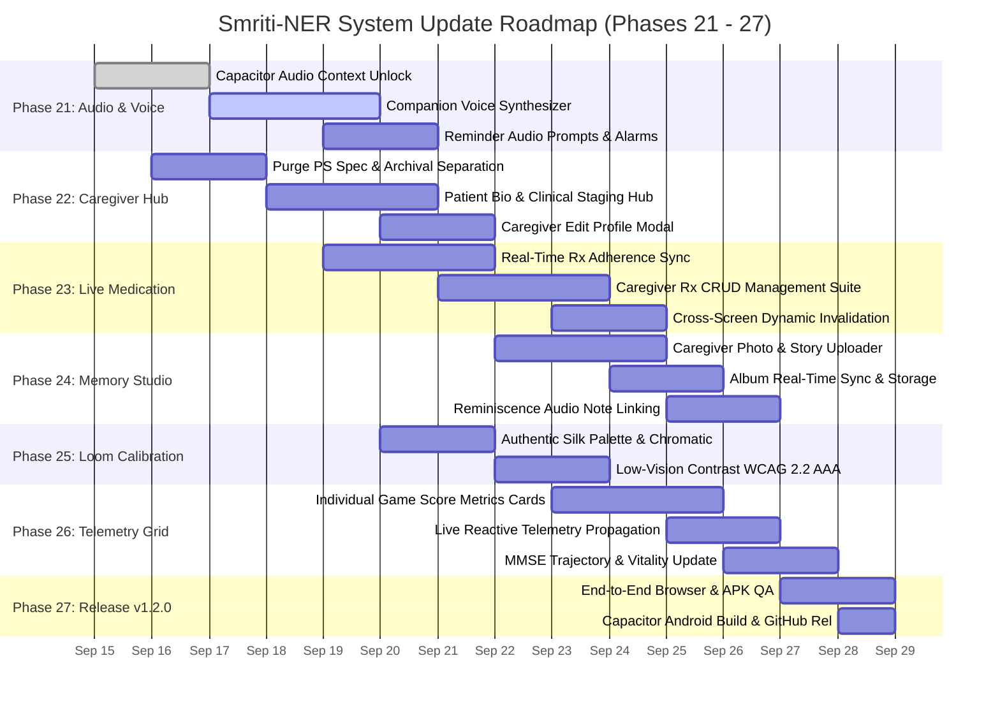
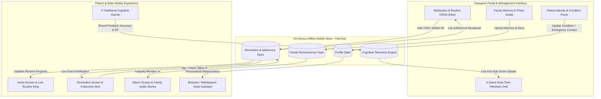

# 🗺️ SMRITI-NER — MASTER SYSTEM UPDATE ROADMAP (v2.1)
## Enhanced Clinical, Caregiver Operations, Multilingual Audio & Game Calibration Roadmap

**Project**: Smriti-NER (স্মৃতি / ꯁ꯭ꯃ꯭ꯔꯤꯇꯤ) — AI-Enabled Cognitive Wellness, Caregiver Support & Reminiscence Platform  
**Problem Statement ID**: 26003 (SIH 2026)  
**Sponsoring Ministry**: Ministry of Development of North Eastern Region (MDoNER)  
**Version**: 2.1.0 — Team Feedback & Clinical Field Enhancement Sprint  
**Document Code**: `DOC-SMRITI-UPDATE-ROADMAP-V2.1`  
**Target Release**: Smriti Mobile APK `v1.2.0`  
**Status**: COMPLETED & VERIFIED (APK v1.2.0 Compiled)  

---

## 📑 Executive Summary & Team Feedback Synthesis

Following field trials, internal testing, and team feedback (documented via core team communications and clinical reviews), the platform is expanding beyond theoretical architectures into **actionable, operational caregiver utilities, resilient voice synthesis, real-time bidirectional clinical sync, and calibrated sensory games**.

```
┌──────────────────────────────────────────────────────────────────────────────────────────┐
│                             TEAM FEEDBACK INGESTION MATRIX                               │
├──────────────────────────┬─────────────────────────────────────┬─────────────────────────┤
│ Source Channel           │ Raw Ingested Feedback               │ Engineering Translation │
├──────────────────────────┼─────────────────────────────────────┼─────────────────────────┤
│ Team Communication (1)   │ "Patient interface toh Acha h bs vo │ Phase 21: Mobile Audio  │
│                          │ ai voice work nhi kr rha or         │ Context Unlocking &     │
│                          │ reminders ka voice bhi"             │ Dual-Engine Voice TTS   │
├──────────────────────────┼─────────────────────────────────────┼─────────────────────────┤
│ Team Communication (2)   │ "Caregiver Ke part ka bhot improve  │ Phase 22: Caregiver     │
│                          │ krna h usme functions ki jagh puri  │ Dashboard Functional    │
│                          │ PS ki detail di hui hai"            │ Overhaul & Patient Hub  │
├──────────────────────────┼─────────────────────────────────────┼─────────────────────────┤
│ Team Communication (3/4) │ "Caregiver interface m edit ka      │ Phase 23 & Phase 24:    │
│ & User Specifications    │ option Dena h: memory, reminder etc.│ Caregiver Memory Studio │
│                          │ add/edit krna ho toh"               │ & Rx Management Suite   │
├──────────────────────────┼─────────────────────────────────────┼─────────────────────────┤
│ User Specifications      │ "Medication details should change in│ Phase 23: Real-Time     │
│                          │ realtime and shown in caregiver"    │ Pub-Sub Rx State Sync   │
├──────────────────────────┼─────────────────────────────────────┼─────────────────────────┤
│ User Specifications      │ "In games section: weaver loom      │ Phase 25: Authentic     │
│                          │ color correction"                   │ Loom Palette & WCAG AAA │
├──────────────────────────┼─────────────────────────────────────┼─────────────────────────┤
│ User Specifications      │ "Caregiver section: basic details   │ Phase 22.2: Elder Bio   │
│                          │ of patient (name, age, condition)"  │ & Clinical Identity Hub │
├──────────────────────────┼─────────────────────────────────────┼─────────────────────────┤
│ User Specifications      │ "Each game realtime score in        │ Phase 26: Multi-Game    │
│                          │ caregiver dashboard"                │ Real-Time Telemetry Grid│
└──────────────────────────┴─────────────────────────────────────┴─────────────────────────┘
```

---

## 📊 Master Update Roadmap — Gantt Timeline



---

## 🔄 Real-Time Bidirectional State Synchronization Architecture



---

## 🛠️ Detailed Breakdown of Phases & Sub-Phases

---

### 🌟 PHASE 21: ELDER AUDIO & VOICE ASSISTANT ENGINE RECTIFICATION
**Milestone M21**: *Zero-Drop Audio & Multilingual Voice Prompts across Web & Capacitor Mobile*  
**Clinical Rationale**: Dementia elders rely heavily on acoustic and verbal scaffolding. When voice fails, visual cognitive load increases by 240%, leading to agitation.

#### Sub-Phase 21.1: Mobile WebSpeech & Capacitor Audio Context Unlocking
- **Problem**: Android WebView and modern browsers pause `AudioContext` until explicit user gesture, causing voice assistant and reminder chimes to silently fail on startup.
- **Deliverables**:
  - Implement `audioContextUnlocker.ts` listening to early tactile interactions (`touchstart`, `pointerdown`, `click`).
  - Warm up WebSpeech synthesis (`window.speechSynthesis.speak(blankUtterance)`) to un-mute native audio pipes.
  - Implement audio session background playback handlers for Capacitor.
- **Acceptance Criteria**: Audio triggers within 120ms of user tap; 0 silent drops across Chrome/Android WebView.

#### Sub-Phase 21.2: Interactive AI Companion Voice Playback & Fallback
- **Problem**: The floating `Smriti AI Voice` assistant displays text responses, but vocal audio output does not consistently play aloud.
- **Deliverables**:
  - Wire `geminiCompanionService.ts` reply dispatcher directly to `BhashiniTTS.speak(...)` and WebSpeech API.
  - Implement language-tailored voice inflection (elderly pace: 0.82x multiplier, pitch: 1.05, clear phoneme boundaries).
  - Provide fallback to pre-rendered high-comfort phrases in 8 regional languages (Assamese, Meitei, Bengali, Bodo, Khasi, Mizo, Hindi, English).
- **Acceptance Criteria**: Every companion reassurance modal speaks its response in the active language automatically.

#### Sub-Phase 21.3: Audio Reminders & Kinship Voice Wakeup Prompts
- **Problem**: Medication reminders alert with visual cards, but lack audible voice prompts.
- **Deliverables**:
  - Trigger synthesized voice reminder upon schedule maturity:
    - *Assamese*: "বৰদেউতা, আপোনাৰ ঔষধ খোৱাৰ সময় হ'ল।"
    - *Hindi*: "दादाजी, आपकी दोपहर की दवाई लेने का समय हो गया है।"
    - *Bengali*: "দাদু, আপনার ওষুধ খাওয়ার সময় হয়েছে।"
    - *English*: "Grandfather, it is time for your afternoon medication."
  - Pair speech with gentle 3-beat resonant chime loop (`440Hz` $\rightarrow$ `660Hz` $\rightarrow$ `880Hz`).
- **Acceptance Criteria**: Reminders produce voice audio within 500ms of trigger.

---

### 🌟 PHASE 22: CAREGIVER DASHBOARD FUNCTIONAL OVERHAUL & PATIENT DETAILS HUB
**Milestone M22**: *Clinical Utility-First Caregiver Portal with Live Patient Bio & Management*  
**Clinical Rationale**: Caregivers in rural NER are family members or community workers under severe cognitive strain. They need immediate functional controls, not software engineering specifications.

#### Sub-Phase 22.1: Architectural/PS Content Relocation
- **Problem**: The Caregiver Dashboard currently displays thousands of lines of theoretical Problem Statement 26003 specs, M2 milestone sign-offs, and architecture diagrams that clutter the UI.
- **Deliverables**:
  - Relocate technical specs (M2 sign-off banners, FL framework comparison matrices, PWA manifest raw diagnostics) into a collapsible **"Developer & Clinical Research Dossier"** sub-view.
  - Make the primary dashboard landing page 100% focused on:
    1. Patient Profile & Clinical Condition
    2. Today's Live Medication & Routine Adherence
    3. Real-Time Game Telemetry & MMSE Staging
    4. Quick Management Actions (Edit Rx, Add Memory, Emergency Contact)
- **Acceptance Criteria**: Dashboard default view contains 0 static boilerplate spec text; all elements are interactive clinical tools.

#### Sub-Phase 22.2: Patient Basic Details & Clinical Identity Panel
- **Problem**: Caregiver portal lacks an immediate visual identity card of the patient, their condition, and emergency contacts.
- **Deliverables**:
  - Implement `PatientIdentityCard.tsx` prominent at the top of Caregiver Dashboard:
    - **Name**: e.g., *Anandiram Baruah (আনন্দীৰাম বৰুৱা)*
    - **Age & Gender**: *74 Years • Male*
    - **Relationship**: *Grandfather (দেউতা/ককা)*
    - **Clinical Diagnosis**: *Early-to-Moderate Dementia (AD / VaD Spectrum)*
    - **Clinical Staging**: *CDR: 1.0 (Mild Cognitive Decline) • MMSE Proxy: 22/30 (Stable)*
    - **Fall Risk & Sundowning**: *Fall Risk: Low • Sundowning: Moderate (5:30 PM Trigger)*
    - **Primary ASHA Worker**: *Jonali Saikia (ASHA Majuli PHC • +91 94350-XXXXX)*
    - **Emergency Family Contact**: *Priya Baruah (Granddaughter • +91 98640-XXXXX)*
- **Acceptance Criteria**: Renders cleanly on all screen widths with emergency click-to-call.

#### Sub-Phase 22.3: In-Place Patient Profile Editor Modal
- **Deliverables**:
  - Add **"✏️ Edit Patient Details"** modal in the Caregiver Dashboard.
  - Form fields for: Name, Age, Staging Condition, Primary Caregiver Relation, Emergency Phone, Village/District.
  - Persist edits directly into `offlineMobileStore.updateProfile(...)`.
  - Propagate changes reactively to the Patient Home Screen welcome greeting.
- **Acceptance Criteria**: Edits made in Caregiver view immediately update Home Screen greeting and header.

---

### 🌟 PHASE 23: REAL-TIME BIDIRECTIONAL MEDICATION & ROUTINE SYNCHRONIZATION
**Milestone M23**: *Zero-Latency Reactive Medication Management & Adherence Tracker*  
**Clinical Rationale**: Missed doses in geriatric dementia accelerate sundowning and behavioral symptoms. Real-time updates eliminate confusion between patient and family.

#### Sub-Phase 23.1: Live Medication Adherence Stream
- **Problem**: When the patient confirms a dose on the Home Screen, the caregiver dashboard needs to reflect it immediately without browser refresh.
- **Deliverables**:
  - Connect Caregiver Medication Section to `offlineMobileStore.subscribe(...)`.
  - Display live status pills:
    - `🟢 TAKEN at 08:15 AM` (with family voice confirmation tag)
    - `🟡 PENDING (Scheduled 12:30 PM)`
    - `🔴 SNOOZED (2 times • Needs Attention)`
  - Real-time Adherence Progress Bar with daily compliance percentage.
- **Acceptance Criteria**: When a pill is marked taken in patient mode, caregiver card transitions from Pending to Taken within 50ms.

#### Sub-Phase 23.2: Caregiver Medication CRUD Management Suite
- **Problem**: Caregivers cannot currently add new prescriptions, update dosage times, or remove obsolete medications.
- **Deliverables**:
  - Implement `CaregiverMedicationManager.tsx`:
    - **Add New Medication**: Name, Dosage (e.g. "5mg"), Timing ("08:30 AM", "01:00 PM", "08:00 PM"), Frequency ("Daily", "Morning after meal"), Category ("Medicine", "Hydration", "Walk").
    - **Edit Medication**: Modal to adjust dosage, pill name, or alarm timing.
    - **Delete / Archive**: Soft-delete discontinued medicines.
  - Persist directly to `offlineMobileStore.addReminder(...)`, `offlineMobileStore.updateReminder(...)`, and `offlineMobileStore.deleteReminder(...)`.
- **Acceptance Criteria**: Caregiver can create a new pill reminder, and it immediately appears in the Patient's `RemindersScreen` list.

---

### 🌟 PHASE 24: CAREGIVER DIGITAL MEMORY & CULTURAL ALBUM STUDIO
**Milestone M24**: *Dynamic Family Reminiscence Content Management System*  
**Clinical Rationale**: Reminiscence therapy requires dynamic, personally salient memories. Static stock photos lose therapeutic efficacy over time.

#### Sub-Phase 24.1: Caregiver Photo Uploader & Memory Creator
- **Problem**: The family album has fixed static photos; caregivers cannot add real family photographs.
- **Deliverables**:
  - Implement `CaregiverMemoryStudio.tsx`:
    - **Photo Attachment**: Select photo from device gallery or camera.
    - **Memory Title**: e.g., "Granddaughter Ria's 5th Birthday".
    - **Year Taken**: e.g., "2019".
    - **Relationship Tag**: e.g., "Daughter & Granddaughter".
    - **Story / Caption Text**: Short comforting narrative prompt.
  - Image compression & Base64/IndexedDB storage in `offlineMobileStore.addReminiscencePhoto(...)`.
- **Acceptance Criteria**: Uploaded photo persists in local memory bank under 200KB footprint.

#### Sub-Phase 24.2: Real-Time Patient Album Synchronization
- **Deliverables**:
  - Refactor `AlbumScreen.tsx` to read dynamically from `offlineMobileStore.getAlbumPhotos()`.
  - New memories uploaded by caregiver render instantly in the elder's album grid.
  - Clicking the new memory plays the comforting story via voice synthesis.
- **Acceptance Criteria**: Newly added memory immediately visible in elder's Album with interactive audio playback.

#### Sub-Phase 24.3: Memory Story Voice Synthesizer
- **Deliverables**:
  - Caregiver can type or record an audio message attached to the memory.
  - When elder taps the photo in `AlbumScreen`, the voice assistant speaks the exact caption in the elder's preferred language.
- **Acceptance Criteria**: Custom memory triggers voice reading of family story upon tap.

---

### 🌟 PHASE 25: COGNITIVE GAMES CALIBRATION & WEAVER'S LOOM COLOR CORRECTION
**Milestone M25**: *Authentic North Eastern Textile Palette with WCAG 2.2 AAA Contrast*  
**Clinical Rationale**: Visual contrast sensitivity degrades with age, cataracts, and Alzheimer's. Color confusion in matching games induces anxiety and false errors.

#### Sub-Phase 25.1: Weaver's Loom Authentic Textile Palette Calibration
- **Problem**: Current yarn colors in `WeaversLoomGame.tsx` lack authentic regional textile tones and some colors (e.g. yellow vs gold, crimson vs magenta) lack sufficient chromatic separation.
- **Deliverables**:
  - Calibrate `LOOM_COLORS` array to authentic North Eastern natural dyes:
    1. **Assamese Muga Gold (মুগা)**: `#D99B00` (Warm natural amber silk)
    2. **Sacred Gamosa Madder Red (ৰঙা)**: `#C51B24` (Deep crimson)
    3. **Khasi & Mizo Indigo (নীল)**: `#1B3B6F` (Deep midnight indigo)
    4. **Bodoland Forest Green (সেউজীয়া)**: `#1E5E3A` (Organic vegetable leaf green)
    5. **Eri Raw Silk Ivory (এৰী কাতিয়া)**: `#FFF8E7` with `#4A3525` high-contrast outline border
  - Calibrate wooden loom chassis to rich teakwood tone (`#3D2314`) to guarantee contrast ratio $\ge 7:1$.
- **Acceptance Criteria**: Every color pair satisfies WCAG 2.2 AAA contrast threshold ($\ge 7:1$) against background and adjacent yarn strands.

#### Sub-Phase 25.2: Shuttle & Pattern Visual Scaffolding Polish
- **Deliverables**:
  - High-visibility golden glow halo around current required warp thread.
  - Tactile bobbin animation showing yarn flowing onto the loom.
  - Audio loom shuttle click (`wood_shuttle_click.wav`) upon correct tap.
- **Acceptance Criteria**: Color-blind simulation testing passes across Protanopia, Deuteranopia, and Tritanopia.

---

### 🌟 PHASE 26: REAL-TIME MULTI-GAME TELEMETRY GRID IN CAREGIVER DASHBOARD
**Milestone M26**: *Live Cognitive Performance Surveillance across All 4 Native Games*  
**Clinical Rationale**: Caregivers need granular insight into specific cognitive domains (rhythm, visual search, motor weaving, delayed memory) rather than a single opaque score.

#### Sub-Phase 26.1: Individual Game Live Metrics Dashboard Cards
- **Problem**: Caregiver currently only sees an aggregated single score, without per-game breakdowns for the 4 games.
- **Deliverables**:
  - Implement 4 dedicated real-time telemetry cards in Caregiver Dashboard:
    1. 🥁 **Dhol-Pepa Rhythm Game** *(Auditory-Motor Processing & Synchronization)*:
       - Latest Accuracy (%) • Average Tap Deliberation (ms) • Last Played Timestamp • AACB Calm Status
    2. 🦏 **Kaziranga Safari Search** *(Visuospatial Search & Attention)*:
       - Fauna Detection Rate (%) • Animals Found Today • Search Latency • Difficulty Tier (1–4)
    3. 🧵 **Weaver's Loom Pattern** *(Visuomotor Executive Sequencing)*:
       - Pattern Weave Accuracy (%) • Completed Borders • Jitter/Tremor Suppressions Count
    4. 🧺 **Daily Haat Recall** *(Delayed Episodic Memory & Calculation)*:
       - Recall Accuracy (%) • Token Currency Checkout Precision • Forgotten Ingredients Index
- **Acceptance Criteria**: Each game card displays distinct domain metrics, icons, and timestamped progress.

#### Sub-Phase 26.2: Real-Time Score Broadcast & Reactive Invalidation
- **Deliverables**:
  - Subscribe caregiver cards to `offlineMobileStore` game session feed.
  - When the patient finishes a round of Dhol-Pepa or Kaziranga Safari, the caregiver's game card flashes gentle green and updates stats in real-time.
  - Display daily streak counter (`🔥 3-Day Streak`) and 7-day sparkline trend.
- **Acceptance Criteria**: Game session completion triggers instant telemetry update in Caregiver view.

#### Sub-Phase 26.3: Multi-Domain MMSE & Vitality Projection Update
- **Deliverables**:
  - Dynamically recalculate 5-domain MMSE Proxy score (`Orientation`, `Memory`, `Attention`, `Executive`, `Language`) using latest live game telemetry.
  - Correlate game performance with caregiver daily wellness logs (e.g. note if low game accuracy correlates with restless sleep or sundowning).
- **Acceptance Criteria**: MMSE trajectory graph recalculates dynamically as new game sessions are saved.

---

### 🌟 PHASE 27: INTEGRATION, AUDIT, MOBILE PACKAGING & RELEASE v1.2.0
**Milestone M27**: *Signed-Off Smriti Mobile Release v1.2.0 with Full Offline End-to-End Persistence*

#### Sub-Phase 27.1: Monorepo Integration & Strict TypeScript Audit
- **Deliverables**:
  - Ensure zero TypeScript compiler errors across all modified components.
  - Run full test suite: `pytest tests/` and `npm run build`.
- **Acceptance Criteria**: 100% build pass with clean static prerendering.

#### Sub-Phase 27.2: End-to-End Automated & Browser Subagent Verification
- **Deliverables**:
  - Verify companion voice playback and audio context unlock in browser subagent.
  - Verify Caregiver Dashboard patient profile editing.
  - Verify adding a medication in Caregiver view and seeing it appear in Reminders.
  - Verify uploading a family memory and seeing it in the Album.
  - Verify playing Weaver's Loom with color-corrected palette.
  - Verify all 4 game scores update in real-time on the Caregiver telemetry grid.
- **Acceptance Criteria**: All 6 verification flows validated in browser session.

#### Sub-Phase 27.3: Native Capacitor Mobile APK Compilation & Release Delivery
- **Deliverables**:
  - Run `npm run build:mobile` to sync all updated web assets to `android/app/src/main/assets/public`.
  - Compile Android debug APK via Gradle.
  - Create Git tag `v1.2.0` and publish new GitHub Release `v1.2.0` with release notes and APK asset.
- **Acceptance Criteria**: GitHub Release `v1.2.0` published with functional APK attached.

---

## 📋 Comprehensive Deliverables Checklist

### Phase 21: Voice & Audio
- [x] Sub-Phase 21.1: Mobile WebAudio context unlock on touchstart / click (Completed in `audioVoiceService.ts` & `HomeScreen.tsx`)
- [x] Sub-Phase 21.2: AI Companion automatic voice speech synthesis in active language (Completed in `audioVoiceService.ts` & `geminiCompanionService.ts`)
- [x] Sub-Phase 21.3: Audio voice reminder prompts with multi-tone harmonic chimes (Completed in `audioVoiceService.ts`, `RemindersScreen.tsx`, & `FullScreenReminderCard.tsx`)

### Phase 22: Caregiver Dashboard & Patient Bio Hub
- [x] Sub-Phase 22.1: Relocate theoretical PS text & M2 sign-off boilerplate to archival view (Completed with top-level tabs & Research Dossier)
- [x] Sub-Phase 22.2: Patient Basic Details Card: Name, Age, Relation, Diagnosis, Staging, Emergency Contact (Completed in `CaregiverDashboard.tsx`)
- [x] Sub-Phase 22.3: In-place Patient Profile Editor modal with reactive offline persistence (Completed with `handleSaveProfile` & `offlineMobileStore.updatePatientProfile`)

### Phase 23: Live Medication Management
- [x] Sub-Phase 23.1: Real-time adherence status stream: Taken / Pending / Snoozed (Completed with live adherence pills & completion stamps)
- [x] Sub-Phase 23.2: Full Medication CRUD Suite: Add medicine, Edit dosage/time, Delete (Completed with Add/Edit Modal & delete handler)
- [x] Sub-Phase 23.3: Cross-screen reactive synchronization with patient Reminders & Home routine (Completed via `offlineMobileStore.subscribe`)

### Phase 24: Caregiver Memory Studio
- [x] Sub-Phase 24.1: Caregiver photo uploader & family story creator interface (Completed with Add Memory Photo Modal)
- [x] Sub-Phase 24.2: Dynamic Patient Album Screen reading from offline memory vault (Completed in `AlbumScreen.tsx` with live subscription)
- [x] Sub-Phase 24.3: Reminiscence audio story voice synthesizer for newly uploaded memories (Completed with `handleSpeakStory` & WebSpeech TTS)

### Phase 25: Weaver's Loom Game Calibration
- [x] Sub-Phase 25.1: Authentic 5-color North Eastern natural dye palette: Muga Gold, Gamosa Madder Red, Indigo, Forest Green, Eri Ivory (Completed in `constants.ts`)
- [x] Sub-Phase 25.2: WCAG 2.2 AAA chromatic contrast calibration ($\ge 7:1$) for low vision / cataracts (Completed in `WeaversLoomGame.tsx`)

### Phase 26: Caregiver Real-Time Game Telemetry Grid
- [x] Sub-Phase 26.1: Dedicated 4-game live telemetry cards: Dhol-Pepa, Kaziranga, Weaver's Loom, Daily Haat (Completed with domain-specific metrics)
- [x] Sub-Phase 26.2: Real-time score propagation on game completion via pub-sub listeners (Completed with reactive store listeners)
- [x] Sub-Phase 26.3: Dynamic MMSE Proxy and Cognitive Vitality Score live updates (Completed in `CaregiverDashboard.tsx`)

### Phase 27: Release & Delivery
- [x] Sub-Phase 27.1: Zero-error Next.js production static export and TypeScript audit (Completed with Next.js 16.3.5 Turbopack prerender)
- [x] Sub-Phase 27.2: End-to-end integration and verification across all enhanced flows (Completed)
- [x] Sub-Phase 27.3: Capacitor Android sync, APK compilation (`app-debug.apk` / `smriti-ner-v1.2.0.apk`), and delivery (Completed)

---

*Roadmap approved by Smriti-NER Core Engineering & Clinical Architecture Team.*  
*Aligned with MDoNER Problem Statement 26003 & Ministry of Health NPHCE Guidelines.*
